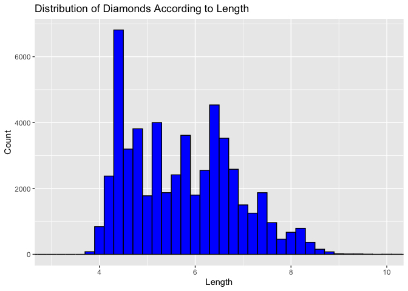
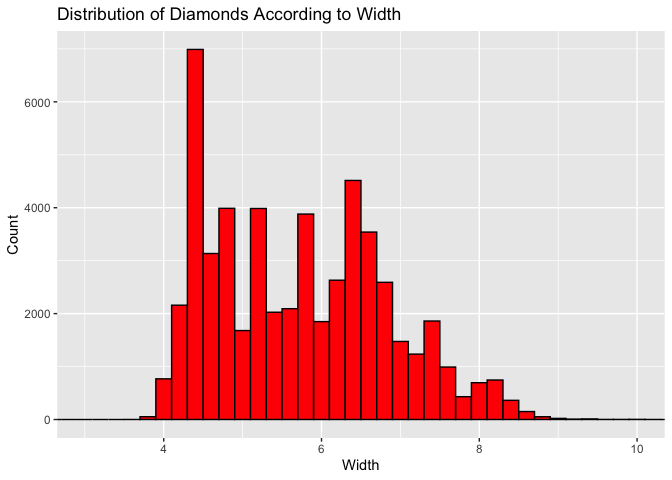
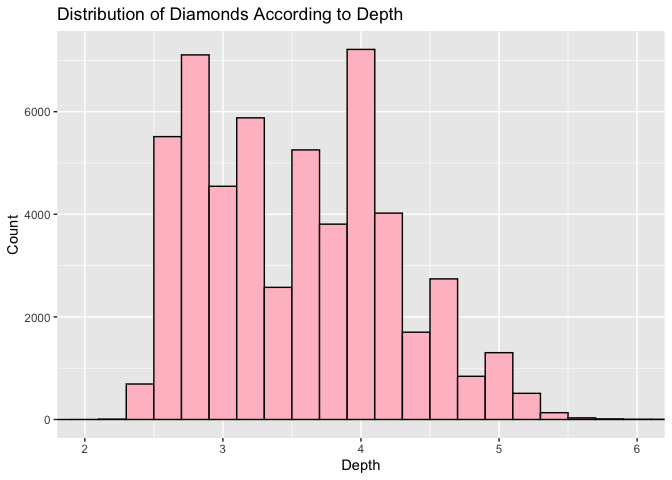
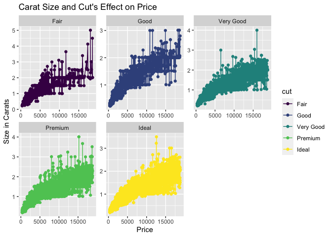
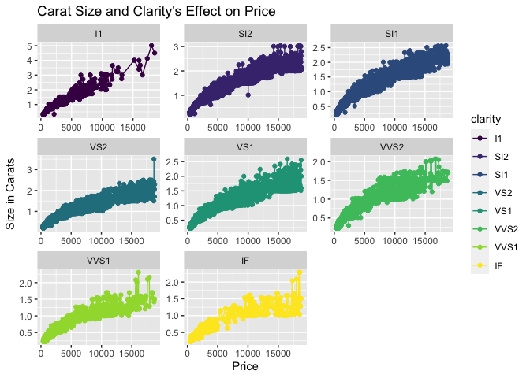
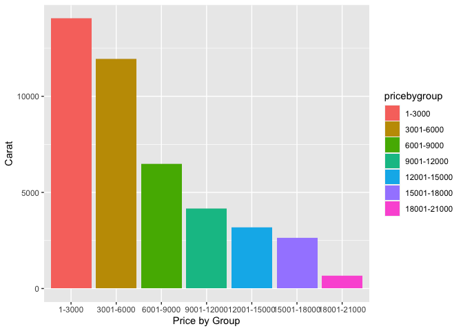
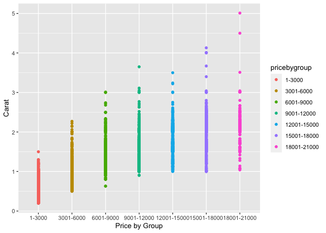
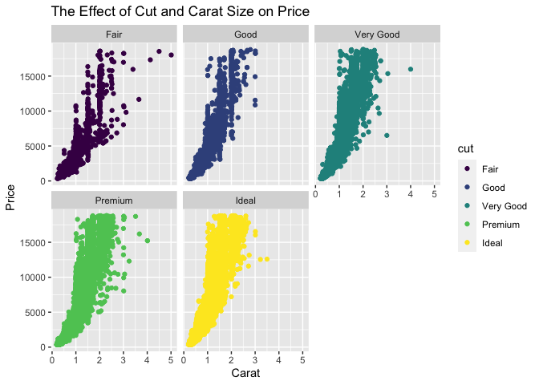
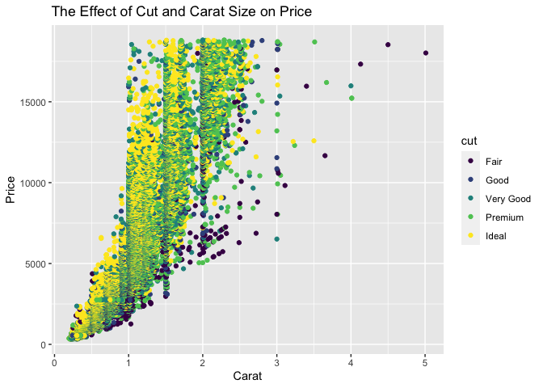

```r
library(ggplot2)
library(readr)
```

```
## Warning: package 'readr' was built under R version 4.0.5
```

```r
library(knitr)
library(tidyverse)
```

```
## ── Attaching packages ─────────────────────────────────────── tidyverse 1.3.2 ──
## ✔ tibble  3.1.8      ✔ dplyr   1.0.10
## ✔ tidyr   1.2.0      ✔ stringr 1.4.0 
## ✔ purrr   0.3.4      ✔ forcats 0.5.2
```

```
## Warning: package 'tidyr' was built under R version 4.0.5
```

```
## ── Conflicts ────────────────────────────────────────── tidyverse_conflicts() ──
## ✖ dplyr::filter() masks stats::filter()
## ✖ dplyr::lag()    masks stats::lag()
```

```r
library(dplyr)
library(forcats)
library(downloader)
library(corrplot)
```

```
## corrplot 0.92 loaded
```


```r
?diamonds
```

Make visualizations to give the distribution of each of the x, y, and z variables in the diamonds data set.

Graph for X 

```r
xdiamonds1 <- ggplot(data = diamonds, mapping = aes(x = x, color = 'black')) +
  geom_histogram(binwidth = .2, fill = 'blue', color = 'black') +
  coord_cartesian(xlim = c(3,10)) +
  labs(x = "Length", y = "Count", title = "Distribution of Diamonds According to Length")

xdiamonds1
```

<!-- -->

Graph for Y

```r
ydiamonds1 <- ggplot(data = diamonds, mapping = aes(x = y)) +
  geom_histogram(binwidth = .2, fill = 'red', color = 'black') +
  coord_cartesian(xlim = c(3,10)) +
  labs(x = "Width", y = "Count", title = "Distribution of Diamonds According to Width")

ydiamonds1
```

<!-- -->

Graph for Z 

```r
zdiamonds1 <- ggplot(data = diamonds, mapping = aes(x = z)) +
  geom_histogram(binwidth = .2, fill = 'pink', color = 'black') +
  coord_cartesian(xlim = c(2,6)) +
  labs(x = "Depth", y = "Count", title = "Distribution of Diamonds According to Depth")

zdiamonds1
```

<!-- -->


Explore the distribution of price. Is there anything unusal or surprising? 

```r
priceplot <- ggplot(data = diamonds, mapping = aes(x = price, y = carat, color = cut)) +
  geom_point() + 
  geom_line() +
  facet_wrap(~ cut, scales = "free") +
  labs(x = "Price", y = "Size in Carats", title = "Carat Size and Cut's Effect on Price")


priceplot
```

<!-- -->


```r
priceplot2 <- ggplot(data = diamonds, mapping = aes(x = price, y = carat, color = clarity)) +
  geom_point() + 
  geom_line() +
  facet_wrap(~ clarity, scales = "free") +
  labs(x = "Price", y = "Size in Carats", title = "Carat Size and Clarity's Effect on Price")


priceplot2
```

<!-- -->
Nothing was suprising. We can see that both cut and clarity have an effect on the price - it will take a larger carat size to be priced the same for diamonds with worse clarity and with a worse cut. 


Can you determine what variable in the diamonds dataset is most important for predicting the price of a diamond? How is that variable correlated with cut? Why does the combination of those two relationships lead to lower quality diamonds being more expensive?

It is hard to determine what exactly is the most important variable - however, we can say that clarity and cut both have an effect. However, I would say 


Make a visualization of carat partitioned by price.


```r
diamonds2 <- diamonds %>%
  mutate(pricebygroup = 
           case_when(
             price >= 0 & price <= 3000 ~ '1-3000',
             price >= 3001 & price <= 6000 ~ '3001-6000',
             price >= 6001 & price <= 9000 ~ '6001-9000',
             price >= 9001 & price <= 12000 ~ '9001-12000',
             price >= 12001 & price <= 15000 ~ '12001-15000',
             price >= 15001 & price <= 18000 ~ '15001-18000',
             price >= 18001 & price <= 21000 ~ '18001-21000'),
         pricebygroup = fct_relevel(pricebygroup, '1-3000', '3001-6000', '6001-9000', '9001-12000', '12001-15000', '15001-18000', '18001-21000'))

diamonds2
```

```
## # A tibble: 53,940 × 11
##    carat cut       color clarity depth table price     x     y     z pricebygr…¹
##    <dbl> <ord>     <ord> <ord>   <dbl> <dbl> <int> <dbl> <dbl> <dbl> <fct>      
##  1  0.23 Ideal     E     SI2      61.5    55   326  3.95  3.98  2.43 1-3000     
##  2  0.21 Premium   E     SI1      59.8    61   326  3.89  3.84  2.31 1-3000     
##  3  0.23 Good      E     VS1      56.9    65   327  4.05  4.07  2.31 1-3000     
##  4  0.29 Premium   I     VS2      62.4    58   334  4.2   4.23  2.63 1-3000     
##  5  0.31 Good      J     SI2      63.3    58   335  4.34  4.35  2.75 1-3000     
##  6  0.24 Very Good J     VVS2     62.8    57   336  3.94  3.96  2.48 1-3000     
##  7  0.24 Very Good I     VVS1     62.3    57   336  3.95  3.98  2.47 1-3000     
##  8  0.26 Very Good H     SI1      61.9    55   337  4.07  4.11  2.53 1-3000     
##  9  0.22 Fair      E     VS2      65.1    61   337  3.87  3.78  2.49 1-3000     
## 10  0.23 Very Good H     VS1      59.4    61   338  4     4.05  2.39 1-3000     
## # … with 53,930 more rows, and abbreviated variable name ¹​pricebygroup
```


```r
caratspartionprice <- ggplot(data = diamonds2, x = pricebygroup, y = carat) +
  geom_col(data = diamonds2, mapping = aes(x = pricebygroup, y = carat, fill = pricebygroup)) +
  labs(x = 'Price by Group', y = 'Carat')

caratspartionprice
```

<!-- -->


```r
caratspartionprice2 <- ggplot(data = diamonds2, x = pricebygroup, y = carat) +
  geom_point(data = diamonds2, mapping = aes(x = pricebygroup, y = carat, color = pricebygroup)) +
  labs(x = 'Price by Group', y = 'Carat')

caratspartionprice2
```

<!-- -->

How does the price distribution of very large diamonds compare to small diamonds? Does the data agree with your expectations?

From the graphs, we can see that diamonds that are larger typically cost more. However, some don't, and we could delve deeper into analysis too see if the cut or clarity also plays a role. However, we can see that there is a linear trend, and that it increase in size in each binwidth. There are some outliers on the trend for the two highest price groups, however, the trend is still noticable. The data does agree with expectations that price increases with size. 


Visualize a combined distribution of cut, carat, and price.


```r
cutcaratprice <- ggplot(data = diamonds, mapping = aes(x = carat, y = price, color = cut)) +
  geom_point() +
  facet_wrap(~cut) +
  labs(x = "Carat", y = "Price", title = "The Effect of Cut and Carat Size on Price")

cutcaratprice
```

<!-- -->


```r
cutcaratprice1 <- ggplot(data = diamonds, mapping = aes(x = carat, y = price, color = cut)) +
  geom_point() +
  labs(x = "Carat", y = "Price", title = "The Effect of Cut and Carat Size on Price")

cutcaratprice1
```

<!-- -->


