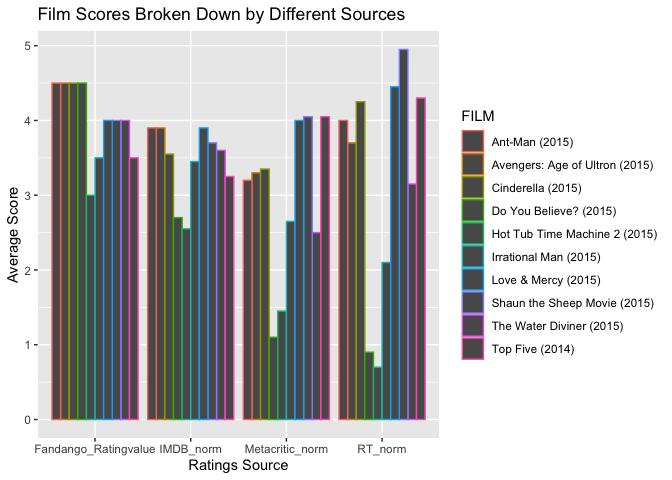

```r
library(ggplot2)
library(readr)
```

```
## Warning: package 'readr' was built under R version 4.0.5
```

```r
library(knitr)
library(tidyverse)
```

```
## ── Attaching packages ─────────────────────────────────────── tidyverse 1.3.2 ──
## ✔ tibble  3.1.8      ✔ dplyr   1.0.10
## ✔ tidyr   1.2.0      ✔ stringr 1.4.0 
## ✔ purrr   0.3.4      ✔ forcats 0.5.2
```

```
## Warning: package 'tidyr' was built under R version 4.0.5
```

```
## ── Conflicts ────────────────────────────────────────── tidyverse_conflicts() ──
## ✖ dplyr::filter() masks stats::filter()
## ✖ dplyr::lag()    masks stats::lag()
```

```r
library(dplyr)
library(forcats)
library(downloader)
library(corrplot)
```

```
## corrplot 0.92 loaded
```


```r
download.file("https://raw.githubusercontent.com/fivethirtyeight/data/master/fandango/fandango_score_comparison.csv", "fandango")
```


```r
movies <- read.csv('fandango')
```


```r
head(movies)
```

```
##                             FILM RottenTomatoes RottenTomatoes_User Metacritic
## 1 Avengers: Age of Ultron (2015)             74                  86         66
## 2              Cinderella (2015)             85                  80         67
## 3                 Ant-Man (2015)             80                  90         64
## 4         Do You Believe? (2015)             18                  84         22
## 5  Hot Tub Time Machine 2 (2015)             14                  28         29
## 6       The Water Diviner (2015)             63                  62         50
##   Metacritic_User IMDB Fandango_Stars Fandango_Ratingvalue RT_norm RT_user_norm
## 1             7.1  7.8            5.0                  4.5    3.70          4.3
## 2             7.5  7.1            5.0                  4.5    4.25          4.0
## 3             8.1  7.8            5.0                  4.5    4.00          4.5
## 4             4.7  5.4            5.0                  4.5    0.90          4.2
## 5             3.4  5.1            3.5                  3.0    0.70          1.4
## 6             6.8  7.2            4.5                  4.0    3.15          3.1
##   Metacritic_norm Metacritic_user_nom IMDB_norm RT_norm_round
## 1            3.30                3.55      3.90           3.5
## 2            3.35                3.75      3.55           4.5
## 3            3.20                4.05      3.90           4.0
## 4            1.10                2.35      2.70           1.0
## 5            1.45                1.70      2.55           0.5
## 6            2.50                3.40      3.60           3.0
##   RT_user_norm_round Metacritic_norm_round Metacritic_user_norm_round
## 1                4.5                   3.5                        3.5
## 2                4.0                   3.5                        4.0
## 3                4.5                   3.0                        4.0
## 4                4.0                   1.0                        2.5
## 5                1.5                   1.5                        1.5
## 6                3.0                   2.5                        3.5
##   IMDB_norm_round Metacritic_user_vote_count IMDB_user_vote_count
## 1             4.0                       1330               271107
## 2             3.5                        249                65709
## 3             4.0                        627               103660
## 4             2.5                         31                 3136
## 5             2.5                         88                19560
## 6             3.5                         34                39373
##   Fandango_votes Fandango_Difference
## 1          14846                 0.5
## 2          12640                 0.5
## 3          12055                 0.5
## 4           1793                 0.5
## 5           1021                 0.5
## 6            397                 0.5
```

```r
str(movies)
```

```
## 'data.frame':	146 obs. of  22 variables:
##  $ FILM                      : chr  "Avengers: Age of Ultron (2015)" "Cinderella (2015)" "Ant-Man (2015)" "Do You Believe? (2015)" ...
##  $ RottenTomatoes            : int  74 85 80 18 14 63 42 86 99 89 ...
##  $ RottenTomatoes_User       : int  86 80 90 84 28 62 53 64 82 87 ...
##  $ Metacritic                : int  66 67 64 22 29 50 53 81 81 80 ...
##  $ Metacritic_User           : num  7.1 7.5 8.1 4.7 3.4 6.8 7.6 6.8 8.8 8.5 ...
##  $ IMDB                      : num  7.8 7.1 7.8 5.4 5.1 7.2 6.9 6.5 7.4 7.8 ...
##  $ Fandango_Stars            : num  5 5 5 5 3.5 4.5 4 4 4.5 4.5 ...
##  $ Fandango_Ratingvalue      : num  4.5 4.5 4.5 4.5 3 4 3.5 3.5 4 4 ...
##  $ RT_norm                   : num  3.7 4.25 4 0.9 0.7 3.15 2.1 4.3 4.95 4.45 ...
##  $ RT_user_norm              : num  4.3 4 4.5 4.2 1.4 3.1 2.65 3.2 4.1 4.35 ...
##  $ Metacritic_norm           : num  3.3 3.35 3.2 1.1 1.45 2.5 2.65 4.05 4.05 4 ...
##  $ Metacritic_user_nom       : num  3.55 3.75 4.05 2.35 1.7 3.4 3.8 3.4 4.4 4.25 ...
##  $ IMDB_norm                 : num  3.9 3.55 3.9 2.7 2.55 3.6 3.45 3.25 3.7 3.9 ...
##  $ RT_norm_round             : num  3.5 4.5 4 1 0.5 3 2 4.5 5 4.5 ...
##  $ RT_user_norm_round        : num  4.5 4 4.5 4 1.5 3 2.5 3 4 4.5 ...
##  $ Metacritic_norm_round     : num  3.5 3.5 3 1 1.5 2.5 2.5 4 4 4 ...
##  $ Metacritic_user_norm_round: num  3.5 4 4 2.5 1.5 3.5 4 3.5 4.5 4.5 ...
##  $ IMDB_norm_round           : num  4 3.5 4 2.5 2.5 3.5 3.5 3.5 3.5 4 ...
##  $ Metacritic_user_vote_count: int  1330 249 627 31 88 34 17 124 62 54 ...
##  $ IMDB_user_vote_count      : int  271107 65709 103660 3136 19560 39373 2680 16876 12227 5367 ...
##  $ Fandango_votes            : int  14846 12640 12055 1793 1021 397 252 3223 896 864 ...
##  $ Fandango_Difference       : num  0.5 0.5 0.5 0.5 0.5 0.5 0.5 0.5 0.5 0.5 ...
```


```r
movieratings <- movies %>%
  select(FILM, Fandango_Ratingvalue, RT_norm, Metacritic_norm, IMDB_norm) %>%
  pivot_longer(2:5, names_to = "source", values_to = "score") %>%
  select(FILM, source, score) %>%
  head(n = 40)

movieratings
```

```
## # A tibble: 40 × 3
##    FILM                           source               score
##    <chr>                          <chr>                <dbl>
##  1 Avengers: Age of Ultron (2015) Fandango_Ratingvalue  4.5 
##  2 Avengers: Age of Ultron (2015) RT_norm               3.7 
##  3 Avengers: Age of Ultron (2015) Metacritic_norm       3.3 
##  4 Avengers: Age of Ultron (2015) IMDB_norm             3.9 
##  5 Cinderella (2015)              Fandango_Ratingvalue  4.5 
##  6 Cinderella (2015)              RT_norm               4.25
##  7 Cinderella (2015)              Metacritic_norm       3.35
##  8 Cinderella (2015)              IMDB_norm             3.55
##  9 Ant-Man (2015)                 Fandango_Ratingvalue  4.5 
## 10 Ant-Man (2015)                 RT_norm               4   
## # … with 30 more rows
```


```r
movieplot1 <- ggplot(data = movieratings, mapping = aes(x = source, y = score, color = FILM)) +
  geom_col(position = 'dodge') +
  labs(x = "Ratings Source", y = "Average Score", title = "Film Scores Broken Down by Different Sources")

movieplot1
```

<!-- -->


First 20 rows of the tidy'd table   

```r
head(movieratings, n = 20)
```

```
## # A tibble: 20 × 3
##    FILM                           source               score
##    <chr>                          <chr>                <dbl>
##  1 Avengers: Age of Ultron (2015) Fandango_Ratingvalue  4.5 
##  2 Avengers: Age of Ultron (2015) RT_norm               3.7 
##  3 Avengers: Age of Ultron (2015) Metacritic_norm       3.3 
##  4 Avengers: Age of Ultron (2015) IMDB_norm             3.9 
##  5 Cinderella (2015)              Fandango_Ratingvalue  4.5 
##  6 Cinderella (2015)              RT_norm               4.25
##  7 Cinderella (2015)              Metacritic_norm       3.35
##  8 Cinderella (2015)              IMDB_norm             3.55
##  9 Ant-Man (2015)                 Fandango_Ratingvalue  4.5 
## 10 Ant-Man (2015)                 RT_norm               4   
## 11 Ant-Man (2015)                 Metacritic_norm       3.2 
## 12 Ant-Man (2015)                 IMDB_norm             3.9 
## 13 Do You Believe? (2015)         Fandango_Ratingvalue  4.5 
## 14 Do You Believe? (2015)         RT_norm               0.9 
## 15 Do You Believe? (2015)         Metacritic_norm       1.1 
## 16 Do You Believe? (2015)         IMDB_norm             2.7 
## 17 Hot Tub Time Machine 2 (2015)  Fandango_Ratingvalue  3   
## 18 Hot Tub Time Machine 2 (2015)  RT_norm               0.7 
## 19 Hot Tub Time Machine 2 (2015)  Metacritic_norm       1.45
## 20 Hot Tub Time Machine 2 (2015)  IMDB_norm             2.55
```

I had to narrow the data down to only 20 rows because the entire data set makes my computer crash when creating a grahhic. From what we can see, Fandango_Ratingvalue has, overall, the highest scores, followed by RT_norm, then IMBD_norm and then Metacritic_norm. I used differing colors for FILMS so that it was clear to see how they compared, and the x-axis is broken down by the source of the ratings. Hot Tub Time Machine 2 consistently had the lowest rating. 


