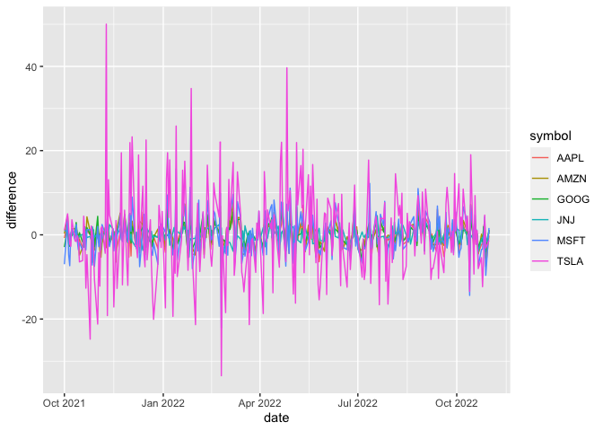
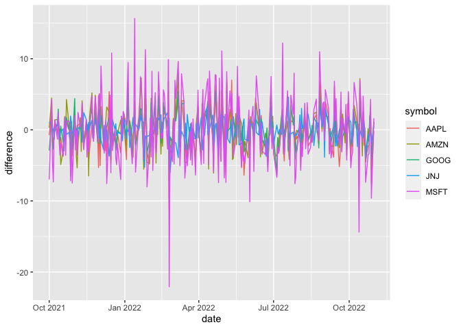

```r
library(ggplot2)
library(readr)
```

```
## Warning: package 'readr' was built under R version 4.0.5
```

```r
library(knitr)
library(tidyverse)
```

```
## ── Attaching packages ─────────────────────────────────────── tidyverse 1.3.2 ──
## ✔ tibble  3.1.8      ✔ dplyr   1.0.10
## ✔ tidyr   1.2.0      ✔ stringr 1.4.0 
## ✔ purrr   0.3.4      ✔ forcats 0.5.2
```

```
## Warning: package 'tidyr' was built under R version 4.0.5
```

```
## ── Conflicts ────────────────────────────────────────── tidyverse_conflicts() ──
## ✖ dplyr::filter() masks stats::filter()
## ✖ dplyr::lag()    masks stats::lag()
```

```r
library(dplyr)
library(forcats)
library(downloader)
library(corrplot)
```

```
## corrplot 0.92 loaded
```

```r
library(tidyquant)
```

```
## Loading required package: lubridate
## 
## Attaching package: 'lubridate'
## 
## The following objects are masked from 'package:base':
## 
##     date, intersect, setdiff, union
## 
## Loading required package: PerformanceAnalytics
## Loading required package: xts
## Loading required package: zoo
## 
## Attaching package: 'zoo'
## 
## The following objects are masked from 'package:base':
## 
##     as.Date, as.Date.numeric
## 
## 
## Attaching package: 'xts'
## 
## The following objects are masked from 'package:dplyr':
## 
##     first, last
## 
## 
## Attaching package: 'PerformanceAnalytics'
## 
## The following object is masked from 'package:graphics':
## 
##     legend
## 
## Loading required package: quantmod
## Loading required package: TTR
## Registered S3 method overwritten by 'quantmod':
##   method            from
##   as.zoo.data.frame zoo
```

```r
library(timetk)
library(dygraphs)
```

Stocks that my friend chose: AAPL, GOOG, and AMZN 

Stocks that I chose: MSFT, TSLA, JNJ 


```r
(Apple <- tq_get("AAPL", get = "stock.prices"))
```

```
## # A tibble: 2,726 × 8
##    symbol date        open  high   low close    volume adjusted
##    <chr>  <date>     <dbl> <dbl> <dbl> <dbl>     <dbl>    <dbl>
##  1 AAPL   2012-01-03  14.6  14.7  14.6  14.7 302220800     12.5
##  2 AAPL   2012-01-04  14.6  14.8  14.6  14.8 260022000     12.6
##  3 AAPL   2012-01-05  14.8  14.9  14.7  14.9 271269600     12.7
##  4 AAPL   2012-01-06  15.0  15.1  15.0  15.1 318292800     12.9
##  5 AAPL   2012-01-09  15.2  15.3  15.0  15.1 394024400     12.9
##  6 AAPL   2012-01-10  15.2  15.2  15.1  15.1 258196400     12.9
##  7 AAPL   2012-01-11  15.1  15.1  15.0  15.1 215084800     12.9
##  8 AAPL   2012-01-12  15.1  15.1  15.0  15.0 212587200     12.8
##  9 AAPL   2012-01-13  15.0  15.0  15.0  15.0 226021600     12.8
## 10 AAPL   2012-01-17  15.2  15.2  15.1  15.2 242897200     13.0
## # … with 2,716 more rows
```

```r
(Google <- tq_get("GOOG", get = "stock.prices"))
```

```
## # A tibble: 2,726 × 8
##    symbol date        open  high   low close    volume adjusted
##    <chr>  <date>     <dbl> <dbl> <dbl> <dbl>     <dbl>    <dbl>
##  1 GOOG   2012-01-03  16.3  16.6  16.2  16.6 147611217     16.6
##  2 GOOG   2012-01-04  16.6  16.7  16.5  16.6 114989399     16.6
##  3 GOOG   2012-01-05  16.5  16.5  16.3  16.4 131808205     16.4
##  4 GOOG   2012-01-06  16.4  16.4  16.2  16.2 108119746     16.2
##  5 GOOG   2012-01-09  16.1  16.1  15.5  15.5 233776981     15.5
##  6 GOOG   2012-01-10  15.7  15.8  15.4  15.5 176483032     15.5
##  7 GOOG   2012-01-11  15.5  15.7  15.5  15.6  96359832     15.6
##  8 GOOG   2012-01-12  15.7  15.8  15.6  15.7  75289148     15.7
##  9 GOOG   2012-01-13  15.6  15.6  15.5  15.6  92637933     15.6
## 10 GOOG   2012-01-17  15.7  15.7  15.6  15.7  76658261     15.7
## # … with 2,716 more rows
```

```r
(Amazon <- tq_get("AMZN", get = "stock.prices"))
```

```
## # A tibble: 2,726 × 8
##    symbol date        open  high   low close    volume adjusted
##    <chr>  <date>     <dbl> <dbl> <dbl> <dbl>     <dbl>    <dbl>
##  1 AMZN   2012-01-03  8.79  8.97  8.78  8.95 102216000     8.95
##  2 AMZN   2012-01-04  8.96  9.02  8.80  8.88  84104000     8.88
##  3 AMZN   2012-01-05  8.80  8.91  8.70  8.88  76182000     8.88
##  4 AMZN   2012-01-06  8.90  9.23  8.88  9.13 140168000     9.13
##  5 AMZN   2012-01-09  9.14  9.22  8.85  8.93 101138000     8.93
##  6 AMZN   2012-01-10  9.06  9.12  8.86  8.97  79716000     8.97
##  7 AMZN   2012-01-11  8.98  9.04  8.91  8.94  62054000     8.94
##  8 AMZN   2012-01-12  8.97  8.97  8.79  8.80 107716000     8.80
##  9 AMZN   2012-01-13  8.79  8.94  8.68  8.92  95070000     8.92
## 10 AMZN   2012-01-17  9.01  9.16  8.93  9.08 112890000     9.08
## # … with 2,716 more rows
```

```r
(Microsoft <- tq_get("MSFT", get = "stock.prices"))
```

```
## # A tibble: 2,726 × 8
##    symbol date        open  high   low close   volume adjusted
##    <chr>  <date>     <dbl> <dbl> <dbl> <dbl>    <dbl>    <dbl>
##  1 MSFT   2012-01-03  26.5  27.0  26.4  26.8 64731500     21.5
##  2 MSFT   2012-01-04  26.8  27.5  26.8  27.4 80516100     22.0
##  3 MSFT   2012-01-05  27.4  27.7  27.3  27.7 56081400     22.3
##  4 MSFT   2012-01-06  27.5  28.2  27.5  28.1 99455500     22.6
##  5 MSFT   2012-01-09  28.0  28.1  27.7  27.7 59706800     22.3
##  6 MSFT   2012-01-10  27.9  28.2  27.8  27.8 60014400     22.4
##  7 MSFT   2012-01-11  27.4  28.0  27.4  27.7 65582400     22.3
##  8 MSFT   2012-01-12  27.9  28.0  27.6  28   49370800     22.5
##  9 MSFT   2012-01-13  27.9  28.2  27.8  28.2 60196100     22.7
## 10 MSFT   2012-01-17  28.4  28.6  28.2  28.3 72395300     22.7
## # … with 2,716 more rows
```

```r
(Tesla <- tq_get("TSLA", get = "stock.prices"))
```

```
## # A tibble: 2,726 × 8
##    symbol date        open  high   low close   volume adjusted
##    <chr>  <date>     <dbl> <dbl> <dbl> <dbl>    <dbl>    <dbl>
##  1 TSLA   2012-01-03  1.93  1.97  1.84  1.87 13921500     1.87
##  2 TSLA   2012-01-04  1.88  1.91  1.83  1.85  9451500     1.85
##  3 TSLA   2012-01-05  1.85  1.86  1.79  1.81 15082500     1.81
##  4 TSLA   2012-01-06  1.81  1.85  1.76  1.79 14794500     1.79
##  5 TSLA   2012-01-09  1.8   1.83  1.74  1.82 13455000     1.82
##  6 TSLA   2012-01-10  1.83  1.85  1.82  1.84 10077000     1.84
##  7 TSLA   2012-01-11  1.84  1.89  1.82  1.88 10084500     1.88
##  8 TSLA   2012-01-12  1.90  1.91  1.85  1.88 10939500     1.88
##  9 TSLA   2012-01-13  1.89  1.9   1.51  1.52 82506000     1.52
## 10 TSLA   2012-01-17  1.77  1.82  1.76  1.77 69774000     1.77
## # … with 2,716 more rows
```

```r
(JNJ <- tq_get("JNJ", get = "stock.prices"))
```

```
## # A tibble: 2,726 × 8
##    symbol date        open  high   low close   volume adjusted
##    <chr>  <date>     <dbl> <dbl> <dbl> <dbl>    <dbl>    <dbl>
##  1 JNJ    2012-01-03  65.6  66    65.2  65.9 16116200     48.7
##  2 JNJ    2012-01-04  65.8  65.9  65.1  65.5  9243100     48.4
##  3 JNJ    2012-01-05  65.3  65.6  64.8  65.4 11886900     48.3
##  4 JNJ    2012-01-06  65.4  65.5  64.6  64.8 15359900     47.9
##  5 JNJ    2012-01-09  65.0  65.1  64.4  64.9  7934600     48.0
##  6 JNJ    2012-01-10  65.1  65.4  65    65.2  8476600     48.2
##  7 JNJ    2012-01-11  65.1  65.5  64.8  65.1  6784600     48.1
##  8 JNJ    2012-01-12  65.3  65.4  64.9  65.2  7402900     48.2
##  9 JNJ    2012-01-13  65.0  65.3  64.4  65.3  8978800     48.2
## 10 JNJ    2012-01-17  65.5  65.7  64.5  65.1  8359900     48.1
## # … with 2,716 more rows
```

Friends stock prices

```r
friend <- tq_get(c("AAPL", "GOOG", "AMZN"), get = "stock.prices", from = "2021-10-01", to = today())

head(friend)
```

```
## # A tibble: 6 × 8
##   symbol date        open  high   low close   volume adjusted
##   <chr>  <date>     <dbl> <dbl> <dbl> <dbl>    <dbl>    <dbl>
## 1 AAPL   2021-10-01  142.  143.  139.  143. 94639600     142.
## 2 AAPL   2021-10-04  142.  142.  138.  139. 98322000     138.
## 3 AAPL   2021-10-05  139.  142.  139.  141. 80861100     140.
## 4 AAPL   2021-10-06  139.  142.  138.  142  83221100     141.
## 5 AAPL   2021-10-07  143.  144.  143.  143. 61732700     142.
## 6 AAPL   2021-10-08  144.  144.  143.  143. 58773200     142.
```

```r
tail(friend)
```

```
## # A tibble: 6 × 8
##   symbol date        open  high   low close    volume adjusted
##   <chr>  <date>     <dbl> <dbl> <dbl> <dbl>     <dbl>    <dbl>
## 1 AMZN   2022-10-24 120.   120. 117.   120.  49531500     120.
## 2 AMZN   2022-10-25 120.   121. 119.   121.  50934600     121.
## 3 AMZN   2022-10-26 116    119. 115.   116.  68802300     116.
## 4 AMZN   2022-10-27 114.   114. 110.   111. 129605400     111.
## 5 AMZN   2022-10-28  97.9  104.  97.7  103. 223133400     103.
## 6 AMZN   2022-10-31 104.   105. 101.   102.  99139600     102.
```

My stock prices 

```r
mine <- tq_get(c("MSFT", "TSLA", "JNJ"), get = "stock.prices", from = "2021-10-01", to = today())
head(mine)
```

```
## # A tibble: 6 × 8
##   symbol date        open  high   low close   volume adjusted
##   <chr>  <date>     <dbl> <dbl> <dbl> <dbl>    <dbl>    <dbl>
## 1 MSFT   2021-10-01  282.  290.  281.  289. 30086300     287.
## 2 MSFT   2021-10-04  287.  288.  280.  283. 31350700     281.
## 3 MSFT   2021-10-05  284.  290.  284.  289. 24993000     286.
## 4 MSFT   2021-10-06  286.  294.  286.  293. 28002600     291.
## 5 MSFT   2021-10-07  295.  297.  294.  295. 20430500     292.
## 6 MSFT   2021-10-08  296.  297.  294.  295. 17685700     292.
```

```r
head(mine)
```

```
## # A tibble: 6 × 8
##   symbol date        open  high   low close   volume adjusted
##   <chr>  <date>     <dbl> <dbl> <dbl> <dbl>    <dbl>    <dbl>
## 1 MSFT   2021-10-01  282.  290.  281.  289. 30086300     287.
## 2 MSFT   2021-10-04  287.  288.  280.  283. 31350700     281.
## 3 MSFT   2021-10-05  284.  290.  284.  289. 24993000     286.
## 4 MSFT   2021-10-06  286.  294.  286.  293. 28002600     291.
## 5 MSFT   2021-10-07  295.  297.  294.  295. 20430500     292.
## 6 MSFT   2021-10-08  296.  297.  294.  295. 17685700     292.
```

```r
tail(mine)
```

```
## # A tibble: 6 × 8
##   symbol date        open  high   low close  volume adjusted
##   <chr>  <date>     <dbl> <dbl> <dbl> <dbl>   <dbl>    <dbl>
## 1 JNJ    2022-10-24  170.  172.  169.  171. 6855500     171.
## 2 JNJ    2022-10-25  170.  171.  169.  171. 5661900     171.
## 3 JNJ    2022-10-26  171.  173.  171.  172. 6123800     172.
## 4 JNJ    2022-10-27  172.  173.  172.  172. 5390900     172.
## 5 JNJ    2022-10-28  173   175.  173.  175. 6073900     175.
## 6 JNJ    2022-10-31  175.  175.  173.  174. 7809300     174.
```

Combining datasets 

```r
combined <- tq_get(c("AAPL", "GOOG", "AMZN","MSFT", "TSLA", "JNJ"), get = "stock.prices", from = "2021-10-01", to = today())

head(combined)
```

```
## # A tibble: 6 × 8
##   symbol date        open  high   low close   volume adjusted
##   <chr>  <date>     <dbl> <dbl> <dbl> <dbl>    <dbl>    <dbl>
## 1 AAPL   2021-10-01  142.  143.  139.  143. 94639600     142.
## 2 AAPL   2021-10-04  142.  142.  138.  139. 98322000     138.
## 3 AAPL   2021-10-05  139.  142.  139.  141. 80861100     140.
## 4 AAPL   2021-10-06  139.  142.  138.  142  83221100     141.
## 5 AAPL   2021-10-07  143.  144.  143.  143. 61732700     142.
## 6 AAPL   2021-10-08  144.  144.  143.  143. 58773200     142.
```

```r
tail(combined)
```

```
## # A tibble: 6 × 8
##   symbol date        open  high   low close  volume adjusted
##   <chr>  <date>     <dbl> <dbl> <dbl> <dbl>   <dbl>    <dbl>
## 1 JNJ    2022-10-24  170.  172.  169.  171. 6855500     171.
## 2 JNJ    2022-10-25  170.  171.  169.  171. 5661900     171.
## 3 JNJ    2022-10-26  171.  173.  171.  172. 6123800     172.
## 4 JNJ    2022-10-27  172.  173.  172.  172. 5390900     172.
## 5 JNJ    2022-10-28  173   175.  173.  175. 6073900     175.
## 6 JNJ    2022-10-31  175.  175.  173.  174. 7809300     174.
```

Who is winning each day? 

```r
stockprices <- ggplot(data = combined, mapping = aes(x = date, y = close, color = symbol)) +
  geom_line()
```

Difference in open and close each day

```r
openclose <- combined %>%
  select(symbol, open, close, date) %>%
  mutate(difference = open - close)

head(openclose)
```

```
## # A tibble: 6 × 5
##   symbol  open close date       difference
##   <chr>  <dbl> <dbl> <date>          <dbl>
## 1 AAPL    142.  143. 2021-10-01     -0.75 
## 2 AAPL    142.  139. 2021-10-04      2.62 
## 3 AAPL    139.  141. 2021-10-05     -1.62 
## 4 AAPL    139.  142  2021-10-06     -2.53 
## 5 AAPL    143.  143. 2021-10-07     -0.230
## 6 AAPL    144.  143. 2021-10-08      1.13
```


```r
stockpricedifference <- ggplot(data = openclose, mapping = aes(x = date, y = difference, color = symbol)) +
  geom_line()

stockpricedifference
```

<!-- -->

Same graph as above, but removed TSLA due to extreme variation

```r
notsla <- combined %>%
  select(symbol, open, close, date) %>%
  filter(symbol != "TSLA") %>% 
  mutate(difference = open - close)

head(notsla)
```

```
## # A tibble: 6 × 5
##   symbol  open close date       difference
##   <chr>  <dbl> <dbl> <date>          <dbl>
## 1 AAPL    142.  143. 2021-10-01     -0.75 
## 2 AAPL    142.  139. 2021-10-04      2.62 
## 3 AAPL    139.  141. 2021-10-05     -1.62 
## 4 AAPL    139.  142  2021-10-06     -2.53 
## 5 AAPL    143.  143. 2021-10-07     -0.230
## 6 AAPL    144.  143. 2021-10-08      1.13
```

```r
notslagraph <- ggplot(data = notsla, mapping = aes(x = date, y = difference, color = symbol)) +
  geom_line()

notslagraph
```

<!-- -->


```r
stockpriceadjusted <- combined %>%
  select(symbol, date, adjusted) %>%
  pivot_wider(names_from = symbol, values_from = adjusted) %>%
  tk_xts(date_var = date)
```

```
## Warning: Non-numeric columns being dropped: date
```

```r
head(stockpriceadjusted)
```

```
##                AAPL     GOOG     AMZN     MSFT     TSLA      JNJ
## 2021-10-01 141.8551 136.4625 164.1630 286.6989 258.4067 156.3470
## 2021-10-04 138.3647 133.7650 159.4890 280.7586 260.5100 155.1291
## 2021-10-05 140.3237 136.1770 161.0500 286.3617 260.1967 155.4798
## 2021-10-06 141.2087 137.3540 163.1005 290.6756 260.9167 155.8014
## 2021-10-07 142.4915 139.1855 165.1215 292.4011 264.5367 157.1946
## 2021-10-08 142.1037 140.0560 164.4310 292.4011 261.8300 156.7951
```

Interactive graph that shows the percent change over time

```r
dygraph(stockpriceadjusted, main = "Straw Broom Chart Percent") %>%
  dyRebase(percent = TRUE) %>%
  dyShading(from = "2021-10-01", to = today()) %>%
  dyRangeSelector()
```

```{=html}
<div id="htmlwidget-b2ff923e56b3c858004c" style="width:672px;height:480px;" class="dygraphs html-widget"></div>
<script type="application/json" data-for="htmlwidget-b2ff923e56b3c858004c">{"x":{"attrs":{"title":"Straw Broom Chart Percent","labels":["day","AAPL","GOOG","AMZN","MSFT","TSLA","JNJ"],"legend":"auto","retainDateWindow":false,"axes":{"x":{"pixelsPerLabel":60}},"showRangeSelector":true,"rangeSelectorHeight":40,"rangeSelectorPlotFillColor":" #A7B1C4","rangeSelectorPlotStrokeColor":"#808FAB","interactionModel":"Dygraph.Interaction.defaultModel"},"scale":"daily","annotations":[],"shadings":[{"from":"2021-10-01T00:00:00.000Z","to":"2022-11-01T00:00:00.000Z","color":"#EFEFEF","axis":"x"}],"events":[],"format":"date","data":[["2021-10-01T00:00:00.000Z","2021-10-04T00:00:00.000Z","2021-10-05T00:00:00.000Z","2021-10-06T00:00:00.000Z","2021-10-07T00:00:00.000Z","2021-10-08T00:00:00.000Z","2021-10-11T00:00:00.000Z","2021-10-12T00:00:00.000Z","2021-10-13T00:00:00.000Z","2021-10-14T00:00:00.000Z","2021-10-15T00:00:00.000Z","2021-10-18T00:00:00.000Z","2021-10-19T00:00:00.000Z","2021-10-20T00:00:00.000Z","2021-10-21T00:00:00.000Z","2021-10-22T00:00:00.000Z","2021-10-25T00:00:00.000Z","2021-10-26T00:00:00.000Z","2021-10-27T00:00:00.000Z","2021-10-28T00:00:00.000Z","2021-10-29T00:00:00.000Z","2021-11-01T00:00:00.000Z","2021-11-02T00:00:00.000Z","2021-11-03T00:00:00.000Z","2021-11-04T00:00:00.000Z","2021-11-05T00:00:00.000Z","2021-11-08T00:00:00.000Z","2021-11-09T00:00:00.000Z","2021-11-10T00:00:00.000Z","2021-11-11T00:00:00.000Z","2021-11-12T00:00:00.000Z","2021-11-15T00:00:00.000Z","2021-11-16T00:00:00.000Z","2021-11-17T00:00:00.000Z","2021-11-18T00:00:00.000Z","2021-11-19T00:00:00.000Z","2021-11-22T00:00:00.000Z","2021-11-23T00:00:00.000Z","2021-11-24T00:00:00.000Z","2021-11-26T00:00:00.000Z","2021-11-29T00:00:00.000Z","2021-11-30T00:00:00.000Z","2021-12-01T00:00:00.000Z","2021-12-02T00:00:00.000Z","2021-12-03T00:00:00.000Z","2021-12-06T00:00:00.000Z","2021-12-07T00:00:00.000Z","2021-12-08T00:00:00.000Z","2021-12-09T00:00:00.000Z","2021-12-10T00:00:00.000Z","2021-12-13T00:00:00.000Z","2021-12-14T00:00:00.000Z","2021-12-15T00:00:00.000Z","2021-12-16T00:00:00.000Z","2021-12-17T00:00:00.000Z","2021-12-20T00:00:00.000Z","2021-12-21T00:00:00.000Z","2021-12-22T00:00:00.000Z","2021-12-23T00:00:00.000Z","2021-12-27T00:00:00.000Z","2021-12-28T00:00:00.000Z","2021-12-29T00:00:00.000Z","2021-12-30T00:00:00.000Z","2021-12-31T00:00:00.000Z","2022-01-03T00:00:00.000Z","2022-01-04T00:00:00.000Z","2022-01-05T00:00:00.000Z","2022-01-06T00:00:00.000Z","2022-01-07T00:00:00.000Z","2022-01-10T00:00:00.000Z","2022-01-11T00:00:00.000Z","2022-01-12T00:00:00.000Z","2022-01-13T00:00:00.000Z","2022-01-14T00:00:00.000Z","2022-01-18T00:00:00.000Z","2022-01-19T00:00:00.000Z","2022-01-20T00:00:00.000Z","2022-01-21T00:00:00.000Z","2022-01-24T00:00:00.000Z","2022-01-25T00:00:00.000Z","2022-01-26T00:00:00.000Z","2022-01-27T00:00:00.000Z","2022-01-28T00:00:00.000Z","2022-01-31T00:00:00.000Z","2022-02-01T00:00:00.000Z","2022-02-02T00:00:00.000Z","2022-02-03T00:00:00.000Z","2022-02-04T00:00:00.000Z","2022-02-07T00:00:00.000Z","2022-02-08T00:00:00.000Z","2022-02-09T00:00:00.000Z","2022-02-10T00:00:00.000Z","2022-02-11T00:00:00.000Z","2022-02-14T00:00:00.000Z","2022-02-15T00:00:00.000Z","2022-02-16T00:00:00.000Z","2022-02-17T00:00:00.000Z","2022-02-18T00:00:00.000Z","2022-02-22T00:00:00.000Z","2022-02-23T00:00:00.000Z","2022-02-24T00:00:00.000Z","2022-02-25T00:00:00.000Z","2022-02-28T00:00:00.000Z","2022-03-01T00:00:00.000Z","2022-03-02T00:00:00.000Z","2022-03-03T00:00:00.000Z","2022-03-04T00:00:00.000Z","2022-03-07T00:00:00.000Z","2022-03-08T00:00:00.000Z","2022-03-09T00:00:00.000Z","2022-03-10T00:00:00.000Z","2022-03-11T00:00:00.000Z","2022-03-14T00:00:00.000Z","2022-03-15T00:00:00.000Z","2022-03-16T00:00:00.000Z","2022-03-17T00:00:00.000Z","2022-03-18T00:00:00.000Z","2022-03-21T00:00:00.000Z","2022-03-22T00:00:00.000Z","2022-03-23T00:00:00.000Z","2022-03-24T00:00:00.000Z","2022-03-25T00:00:00.000Z","2022-03-28T00:00:00.000Z","2022-03-29T00:00:00.000Z","2022-03-30T00:00:00.000Z","2022-03-31T00:00:00.000Z","2022-04-01T00:00:00.000Z","2022-04-04T00:00:00.000Z","2022-04-05T00:00:00.000Z","2022-04-06T00:00:00.000Z","2022-04-07T00:00:00.000Z","2022-04-08T00:00:00.000Z","2022-04-11T00:00:00.000Z","2022-04-12T00:00:00.000Z","2022-04-13T00:00:00.000Z","2022-04-14T00:00:00.000Z","2022-04-18T00:00:00.000Z","2022-04-19T00:00:00.000Z","2022-04-20T00:00:00.000Z","2022-04-21T00:00:00.000Z","2022-04-22T00:00:00.000Z","2022-04-25T00:00:00.000Z","2022-04-26T00:00:00.000Z","2022-04-27T00:00:00.000Z","2022-04-28T00:00:00.000Z","2022-04-29T00:00:00.000Z","2022-05-02T00:00:00.000Z","2022-05-03T00:00:00.000Z","2022-05-04T00:00:00.000Z","2022-05-05T00:00:00.000Z","2022-05-06T00:00:00.000Z","2022-05-09T00:00:00.000Z","2022-05-10T00:00:00.000Z","2022-05-11T00:00:00.000Z","2022-05-12T00:00:00.000Z","2022-05-13T00:00:00.000Z","2022-05-16T00:00:00.000Z","2022-05-17T00:00:00.000Z","2022-05-18T00:00:00.000Z","2022-05-19T00:00:00.000Z","2022-05-20T00:00:00.000Z","2022-05-23T00:00:00.000Z","2022-05-24T00:00:00.000Z","2022-05-25T00:00:00.000Z","2022-05-26T00:00:00.000Z","2022-05-27T00:00:00.000Z","2022-05-31T00:00:00.000Z","2022-06-01T00:00:00.000Z","2022-06-02T00:00:00.000Z","2022-06-03T00:00:00.000Z","2022-06-06T00:00:00.000Z","2022-06-07T00:00:00.000Z","2022-06-08T00:00:00.000Z","2022-06-09T00:00:00.000Z","2022-06-10T00:00:00.000Z","2022-06-13T00:00:00.000Z","2022-06-14T00:00:00.000Z","2022-06-15T00:00:00.000Z","2022-06-16T00:00:00.000Z","2022-06-17T00:00:00.000Z","2022-06-21T00:00:00.000Z","2022-06-22T00:00:00.000Z","2022-06-23T00:00:00.000Z","2022-06-24T00:00:00.000Z","2022-06-27T00:00:00.000Z","2022-06-28T00:00:00.000Z","2022-06-29T00:00:00.000Z","2022-06-30T00:00:00.000Z","2022-07-01T00:00:00.000Z","2022-07-05T00:00:00.000Z","2022-07-06T00:00:00.000Z","2022-07-07T00:00:00.000Z","2022-07-08T00:00:00.000Z","2022-07-11T00:00:00.000Z","2022-07-12T00:00:00.000Z","2022-07-13T00:00:00.000Z","2022-07-14T00:00:00.000Z","2022-07-15T00:00:00.000Z","2022-07-18T00:00:00.000Z","2022-07-19T00:00:00.000Z","2022-07-20T00:00:00.000Z","2022-07-21T00:00:00.000Z","2022-07-22T00:00:00.000Z","2022-07-25T00:00:00.000Z","2022-07-26T00:00:00.000Z","2022-07-27T00:00:00.000Z","2022-07-28T00:00:00.000Z","2022-07-29T00:00:00.000Z","2022-08-01T00:00:00.000Z","2022-08-02T00:00:00.000Z","2022-08-03T00:00:00.000Z","2022-08-04T00:00:00.000Z","2022-08-05T00:00:00.000Z","2022-08-08T00:00:00.000Z","2022-08-09T00:00:00.000Z","2022-08-10T00:00:00.000Z","2022-08-11T00:00:00.000Z","2022-08-12T00:00:00.000Z","2022-08-15T00:00:00.000Z","2022-08-16T00:00:00.000Z","2022-08-17T00:00:00.000Z","2022-08-18T00:00:00.000Z","2022-08-19T00:00:00.000Z","2022-08-22T00:00:00.000Z","2022-08-23T00:00:00.000Z","2022-08-24T00:00:00.000Z","2022-08-25T00:00:00.000Z","2022-08-26T00:00:00.000Z","2022-08-29T00:00:00.000Z","2022-08-30T00:00:00.000Z","2022-08-31T00:00:00.000Z","2022-09-01T00:00:00.000Z","2022-09-02T00:00:00.000Z","2022-09-06T00:00:00.000Z","2022-09-07T00:00:00.000Z","2022-09-08T00:00:00.000Z","2022-09-09T00:00:00.000Z","2022-09-12T00:00:00.000Z","2022-09-13T00:00:00.000Z","2022-09-14T00:00:00.000Z","2022-09-15T00:00:00.000Z","2022-09-16T00:00:00.000Z","2022-09-19T00:00:00.000Z","2022-09-20T00:00:00.000Z","2022-09-21T00:00:00.000Z","2022-09-22T00:00:00.000Z","2022-09-23T00:00:00.000Z","2022-09-26T00:00:00.000Z","2022-09-27T00:00:00.000Z","2022-09-28T00:00:00.000Z","2022-09-29T00:00:00.000Z","2022-09-30T00:00:00.000Z","2022-10-03T00:00:00.000Z","2022-10-04T00:00:00.000Z","2022-10-05T00:00:00.000Z","2022-10-06T00:00:00.000Z","2022-10-07T00:00:00.000Z","2022-10-10T00:00:00.000Z","2022-10-11T00:00:00.000Z","2022-10-12T00:00:00.000Z","2022-10-13T00:00:00.000Z","2022-10-14T00:00:00.000Z","2022-10-17T00:00:00.000Z","2022-10-18T00:00:00.000Z","2022-10-19T00:00:00.000Z","2022-10-20T00:00:00.000Z","2022-10-21T00:00:00.000Z","2022-10-24T00:00:00.000Z","2022-10-25T00:00:00.000Z","2022-10-26T00:00:00.000Z","2022-10-27T00:00:00.000Z","2022-10-28T00:00:00.000Z","2022-10-31T00:00:00.000Z"],[141.855103,138.364655,140.323685,141.208725,142.491547,142.103699,142.014221,140.721466,140.124802,142.958908,144.032883,145.733383,147.931061,148.428253,148.647034,147.86145,147.811722,148.487946,148.020569,151.719833,148.965256,148.129959,149.184036,150.645859,150.118805,150.65657,149.820038,150.188492,147.310425,147.26062,149.371902,149.381851,150.377716,152.857468,157.219406,159.888367,160.35643,160.744843,161.272644,156.163788,159.579651,164.618805,164.090988,163.085144,161.173065,164.638718,170.474564,174.35849,173.840637,178.71048,175.015778,173.611588,178.561111,171.550095,170.434723,169.050461,172.2771,174.916183,175.553543,179.586868,178.551132,178.640778,177.465637,176.838242,181.259933,178.959442,174.199158,171.291183,171.460495,171.480408,174.35849,174.806641,171.480408,172.356796,169.10025,165.544968,163.832047,161.740707,160.953964,159.121536,159.031921,158.563858,169.628082,174.059723,173.890427,175.115356,172.187469,171.898315,171.170395,174.33136,175.777206,171.629074,168.159012,168.398331,172.297165,172.057861,168.398331,166.82283,163.851334,159.613464,162.275848,164.379822,164.649048,162.734512,166.084946,165.755875,162.704605,158.845657,156.990952,162.485229,158.067886,154.288681,150.190399,154.647644,159.134811,160.16188,163.512283,164.90831,168.338501,169.724533,173.573532,174.221664,175.099167,178.44957,177.26297,174.111984,173.812836,177.931061,174.560699,171.33992,171.649017,169.604874,165.277252,167.181808,169.913986,164.818558,164.599197,166.922531,166.753021,165.945328,161.328537,162.415436,156.352783,156.123444,163.173264,157.200348,157.50946,159.025131,165.546494,156.322876,157.061829,151.849075,154.29567,146.296783,142.362244,146.905945,145.33812,149.03299,140.62468,137.159485,137.399139,142.911484,140.165298,140.325089,143.580551,149.432434,148.633545,148.503723,151.000259,145.178345,145.937286,148.503723,147.754776,142.442139,136.939789,131.697067,132.575836,135.242142,129.879593,131.377502,135.681534,135.162262,138.078201,141.463501,141.463501,137.249359,139.036865,136.53035,138.737274,141.363632,142.721756,146.147003,146.836029,144.669037,145.657669,145.288193,148.264053,149.9617,146.865997,150.790543,152.827713,155.134521,153.876251,152.737839,151.389725,156.57251,157.131744,162.284576,161.285965,159.78804,165.899567,165.580002,165.350006,164.869995,164.919998,169.240005,168.490005,172.100006,173.190002,173.029999,174.550003,174.149994,171.520004,167.570007,167.229996,167.529999,170.029999,163.619995,161.380005,158.910004,157.220001,157.960007,155.809998,154.529999,155.960007,154.460007,157.369995,163.429993,153.839996,155.309998,152.369995,150.699997,154.479996,156.899994,153.720001,152.740005,150.429993,150.770004,151.759995,149.839996,142.479996,138.199997,142.449997,146.100006,146.399994,145.429993,140.089996,140.419998,138.979996,138.339996,142.990005,138.380005,142.410004,143.75,143.860001,143.389999,147.270004,149.449997,152.339996,149.350006,144.800003,155.740005,153.339996],[136.462494,133.764999,136.177002,137.354004,139.185501,140.056,138.847504,136.712997,137.899994,141.412003,141.675003,142.960495,143.822006,142.414993,142.780502,138.625,138.772995,139.671997,146.427505,146.128998,148.270493,143.774002,145.863007,146.789993,148.682999,149.240997,149.351501,149.248505,146.626007,146.748001,149.645493,149.388,149.076004,149.061996,150.709,149.952499,147.078506,146.757004,146.717499,142.806,146.113998,142.451996,141.617996,143.776505,142.520493,143.796494,148.036499,148.720505,148.106003,148.675003,146.704498,144.970505,147.3685,144.838501,142.802994,142.401505,144.220505,146.949005,147.142502,148.063995,146.447998,146.504501,146.002502,144.679504,145.074493,144.416504,137.653503,137.550995,137.004501,138.574005,140.017502,141.647995,139.130997,139.786499,136.290497,135.651993,133.5065,130.091995,130.371994,126.735497,129.240005,129.121002,133.289505,135.698502,137.878494,148.036499,142.650497,143.016006,138.938004,139.212997,141.453003,138.602493,134.130005,135.300003,136.425507,137.487503,132.308502,130.467499,129.402496,127.584999,132.673492,134.519501,134.891006,134.167999,134.751495,134.307999,132.121994,126.4645,127.278503,133.865997,132.682007,130.475494,126.740997,129.660507,133.690506,134.600494,136.801498,136.4785,140.277496,138.503494,141.311996,141.5215,141.949997,143.25,142.644501,139.649506,140.699997,143.642502,141.063004,137.175995,136.464996,134.010498,129.796494,128.374496,130.285995,127.252998,127.960999,130.531006,128.245499,124.9375,119.613998,123.25,119.505997,115.0205,119.411499,114.966499,117.156998,118.129501,122.574997,116.746498,115.660004,113.084,114.584503,113.960999,113.161003,116.515503,114.792503,116.7015,112.401001,110.745499,109.313004,111.666496,105.926003,105.8395,108.295998,112.799004,114.039001,114.137001,117.746002,114.564003,117.010498,117.2295,117.237999,114.917999,111.427498,106.876503,107.194,110.390503,106.636002,107.865501,112.014999,112.033997,112.684502,118.538002,116.622498,112.571503,112.2565,109.372498,109.081001,113.887001,115.213501,119.306,120.168503,116.522499,114.849503,112.186996,111.440002,112.766998,109.910004,114.620003,114.699997,115.040001,108.360001,108.209999,105.440002,113.599998,114.589996,116.639999,115.480003,115.900002,118.779999,118.870003,118.220001,118.139999,117.5,120.650002,119.82,122.650002,122.879997,122.510002,120.32,120.860001,118.120003,115.07,114.769997,114.699997,117.699997,111.300003,110.339996,109.910004,109.150002,110.550003,108.68,107.480003,110.480003,109.419998,111.779999,111.870003,105.309998,105.870003,103.900002,103.629997,103.849998,101.830002,100.010002,100.57,99.169998,98.809998,98.089996,100.739998,98.089996,96.150002,99.300003,102.410004,102.220001,102.239998,99.57,98.709999,98.050003,98.300003,99.709999,97.18,100.779999,101.389999,100.290001,100.529999,101.480003,102.970001,104.93,94.82,92.599998,96.580002,94.660004],[164.162994,159.488998,161.050003,163.100494,165.121506,164.431,162.315002,162.366501,164.214005,164.992996,170.451004,172.337006,172.207504,170.753006,171.750504,166.777496,166.018494,168.803497,169.624496,172.328506,168.621506,165.905502,165.637497,169.199997,173.850006,175.949493,174.449005,178.811493,174.102493,173.625,176.257507,177.283997,177.035004,177.449997,184.802994,183.828506,178.628494,179.001999,179.020493,175.227997,178.078506,175.3535,172.186005,171.867996,169.489502,171.3685,176.164505,176.158005,174.171005,172.212006,169.567505,169.091507,173.315002,168.871002,170.017502,167.078995,170.417007,171.037003,171.068497,169.669495,170.660995,169.201004,168.644501,166.716995,170.404495,167.522003,164.356995,163.253998,162.554001,161.485992,165.362,165.207001,161.214005,162.138,158.917496,156.298996,151.667496,142.643005,144.544006,139.985992,138.872498,139.637497,143.977997,149.573502,151.193497,150.612503,138.845505,157.639496,157.935501,161.413498,161.189499,159.003494,153.293503,155.167007,156.510498,158.100494,154.652496,152.601501,150.197495,144.826996,151.358002,153.788498,153.563004,151.141998,152.052505,147.898499,145.641006,137.453003,136.014496,139.279007,146.817505,145.524506,141.852997,147.366501,153.104004,157.238998,161.250504,161.491501,164.889008,163.408005,163.649506,164.773499,168.990494,169.315002,166.300995,162.997498,163.559998,168.346497,164.054993,158.755997,157.7845,154.460495,151.121994,150.787506,155.541,151.706497,152.785004,158.115494,153.998001,148.296005,144.350006,146.074005,139.391006,138.167007,144.596497,124.281502,124.5,124.253502,125.928497,116.406998,114.772499,108.789001,108.859001,105.372002,106.930496,113.055,110.810501,115.3685,107.112503,107.319,107.591003,107.556999,104.099998,106.775002,111.077499,115.1465,120.209503,121.683998,125.511002,122.349998,124.790001,123,121.18,116.150002,109.650002,103.669998,102.309998,107.669998,103.660004,106.220001,108.68,108.949997,112.440002,116.459999,113.220001,107.400002,108.919998,106.209999,109.559998,113.5,114.330002,116.330002,115.540001,111.75,109.220001,110.400002,110.629997,113.550003,113.760002,118.209999,122.769997,124.629997,122.419998,121.139999,114.809998,120.970001,122.279999,134.949997,135.389999,134.160004,139.520004,142.570007,140.800003,139.410004,137.830002,142.690002,140.639999,143.550003,143.179993,144.779999,142.100006,142.300003,138.229996,133.220001,133.619995,133.800003,137.279999,130.75,129.789993,128.729996,126.769997,127.82,127.510002,126.110001,129.479996,129.820007,133.270004,136.449997,126.82,128.550003,126.279999,123.529999,124.660004,122.190002,118.540001,117.309998,113.779999,115.150002,114.410004,118.010002,114.800003,113,115.879997,121.089996,120.949997,120.300003,114.559998,113.669998,112.209999,112.900002,112.529999,106.900002,113.790001,116.360001,115.07,115.25,119.32,119.82,120.599998,115.660004,110.959999,103.410004,102.440002],[286.698883,280.758636,286.361725,290.675568,292.401093,292.401093,291.786255,290.44751,293.848969,300.235504,301.68335,304.737823,305.670013,304.856812,308.178986,306.592285,305.570862,307.534393,320.485931,321.656097,328.865753,326.63443,330.36322,331.225952,333.645691,333.268829,334.191162,333.159821,328.052551,329.668976,333.92337,333.278778,336.690247,336.918732,339.054749,340.882782,337.624054,335.488037,335.716583,327.539978,334.444885,328.444061,327.937408,327.351196,320.9133,324.072632,332.745972,332.795654,330.937775,340.316528,337.196869,326.208679,332.477722,322.790985,321.69812,317.833405,325.165497,331.03717,332.517456,340.227112,339.034882,339.730377,337.117432,334.136932,332.577057,326.874359,314.326324,311.842529,312.001495,312.230011,312.935425,316.204041,302.821472,308.186462,300.685425,301.361023,299.642273,294.108429,294.446228,286.617371,294.783997,297.893677,306.259033,308.961365,306.755798,311.425232,299.294525,303.954102,298.99649,302.583038,309.18988,300.417206,293.124847,293.085114,298.519592,298.171143,289.440063,286.652466,286.44342,279.026489,293.282928,295.990875,297.464294,293.641357,298.858093,294.607056,288.573914,277.672516,274.626099,287.219971,284.322845,278.827393,275.21347,285.875946,293.083832,293.910126,299.097015,297.832672,302.710907,298.161194,302.750763,302.332611,309.321503,314.010559,312.467438,306.942047,308.04715,313.57251,309.500671,298.171143,300.032867,295.652374,283.994354,280.808533,286.343872,278.588409,279.27533,284.034149,285.089447,279.564056,272.814178,279.474487,269.021088,281.963379,288.344971,276.288666,283.207855,280.529785,288.69339,276.119446,273.511047,263.406067,268.30426,259.393951,254.217056,259.961456,260.339752,265.636169,253.54184,252.603821,252.025055,260.0979,259.070099,261.963928,265.336792,272.661224,271.294159,271.842987,273.998383,269.448059,268.180756,271.922821,269.83725,264.229156,252.454147,241.746857,243.972153,251.226746,244.451126,247.125443,253.20256,252.593842,258.311676,267.132996,264.328949,255.936752,259.70874,256.28598,259.030182,262.293274,265.646118,267.831482,267.093079,263.949738,253.13269,252.184708,253.54184,256.176239,253.711472,258.980286,261.714478,264.279022,259.808502,258.281769,251.36644,268.170776,275.824524,280.145355,277.421143,274.237915,281.871704,283.049194,282.31076,279.726257,281.702057,288.547516,286.412048,291.291718,292.848389,292.089996,291.320007,290.170013,286.149994,277.75,276.440002,275.790009,278.850006,268.089996,265.230011,262.970001,261.470001,260.399994,256.059998,253.25,258.089996,258.519989,264.459991,266.649994,251.990005,252.220001,245.380005,244.740005,244.520004,242.449997,238.949997,240.979996,237.919998,237.449997,236.410004,241.070007,237.5,232.899994,240.740005,248.880005,249.199997,246.789993,234.240005,229.25,225.410004,225.75,234.240005,228.559998,237.529999,238.5,236.479996,236.149994,242.119995,247.25,250.660004,231.320007,226.75,235.869995,232.130005],[258.406677,260.51001,260.196655,260.916656,264.536682,261.829987,263.980011,268.573334,270.359985,272.773346,281.01001,290.036682,288.089996,288.600006,298,303.226654,341.619995,339.476654,345.953339,359.013336,371.333344,402.863342,390.666656,404.619995,409.970001,407.363342,387.646667,341.166656,355.983337,354.503326,344.473328,337.796661,351.57666,363.003326,365.459991,379.019989,385.623322,369.676666,372,360.640015,378.996674,381.58667,365,361.533325,338.323334,336.33667,350.583344,356.320007,334.600006,339.01001,322.136658,319.503326,325.329987,308.973328,310.856659,299.980011,312.843323,336.290009,355.666656,364.646667,362.823334,362.063324,356.779999,352.26001,399.926666,383.196655,362.706665,354.899994,342.320007,352.706665,354.799988,368.73999,343.853333,349.869995,343.503326,331.883331,332.089996,314.633331,310,306.133331,312.470001,276.366669,282.116669,312.23999,310.416656,301.886658,297.046661,307.773346,302.446655,307.333344,310.666656,301.516663,286.666656,291.920013,307.476654,307.796661,292.116669,285.660004,273.843323,254.679993,266.92334,269.956665,290.143341,288.123322,293.296661,279.763336,279.429993,268.193329,274.799988,286.323334,279.433319,265.116669,255.456665,267.296661,280.07666,290.533325,301.796661,307.053345,331.32666,333.036682,337.973328,336.880005,363.946655,366.523346,364.66333,359.200012,361.529999,381.816681,363.753326,348.58667,352.420013,341.829987,325.309998,328.983337,340.790009,328.333344,334.763336,342.716675,325.733337,336.26001,335.016663,332.67334,292.140015,293.83667,292.503326,290.253326,300.980011,303.083344,317.540009,291.093323,288.549988,262.369995,266.679993,244.666672,242.666672,256.529999,241.456665,253.869995,236.603333,236.473328,221.300003,224.96666,209.386673,219.600006,235.910004,253.210007,252.753326,246.789993,258.333344,234.516663,238.279999,238.886673,241.866669,239.706665,232.229996,215.736664,220.889999,233,213.100006,216.759995,237.036667,236.08667,235.070007,245.706665,244.919998,232.66333,228.490005,224.473328,227.263336,233.066666,231.733337,244.543335,250.763336,234.343338,233.070007,237.039993,238.313339,240.066666,240.546661,245.529999,247.5,271.706665,272.243347,268.433319,258.859985,274.820007,280.899994,297.149994,297.276672,300.58667,307.396667,308.633331,288.170013,290.42334,283.333344,294.356659,286.630005,300.029999,309.320007,306.563324,303.996674,302.869995,296.666656,289.91333,296.453339,297.09668,296.070007,288.089996,284.820007,277.700012,275.609985,277.160004,270.209991,274.420013,283.700012,289.26001,299.679993,304.420013,292.130005,302.609985,303.75,303.350006,309.070007,308.730011,300.799988,288.589996,275.329987,276.01001,282.940002,287.809998,268.209991,265.25,242.399994,249.440002,240.809998,238.130005,223.070007,222.960007,216.5,217.240005,221.720001,204.990005,219.350006,220.190002,222.039993,207.279999,214.440002,211.25,222.419998,224.639999,225.089996,228.520004,227.539993],[156.346985,155.129089,155.479843,155.801376,157.194611,156.795135,156.132629,153.638397,155.109604,155.996216,157.15564,156.005966,159.659622,159.571915,159.201675,159.513458,159.864227,161.491302,159.532959,158.665817,158.695068,158.831451,161.335419,160.819046,160.370865,159.230927,158.685303,158.334549,160.049347,158.870422,160.770325,159.318619,158.490433,159.084778,158.227356,158.704788,156.615906,157.586792,157.145493,156.12558,156.664978,152.918716,155.027206,154.05632,156.302094,159.79335,160.205261,161.166321,162.696198,162.294113,165.196945,167.001404,167.835007,169.668884,164.981186,164.510468,163.980911,164.686981,165.000809,166.393402,167.060257,168.237076,168.982391,167.766357,168.227264,167.776154,168.89415,168.315536,170.590744,169.747345,167.942886,166.511063,165.500961,164.598709,163.873032,163.363068,162.058746,161.686081,159.822784,164.392792,165.128296,167.295624,168.472427,168.962799,167.580017,169.433517,169.423721,168.315536,167.756546,168.197861,168.178253,166.148209,164.471237,162.402008,164.078964,163.980911,162.980606,161.233643,159.042526,159.12149,156.081573,163.839264,162.427887,161.865311,163.878738,166.286987,167.273972,169.968445,166.523865,167.155533,167.45163,167.145676,169.4552,173.84729,172.248367,174.498688,172.564194,173.541306,172.722107,172.070709,172.959,174.617111,175.515274,175.426468,177.25238,174.923096,175.870605,174.172974,175.298157,179.858002,179.394119,179.749435,177.499115,177.558334,178.308456,177.558334,175.347504,180.696945,181.496399,180.973312,179.176987,183.588806,182.276108,179.729706,181.072006,178.111053,176.314743,175.969284,177.854431,174.459198,174.07428,175.02179,174.784912,173.837418,175.554764,174.54805,175.762024,176.492401,173.215622,171.675919,174.676346,178.242386,180.189301,178.421173,178.262253,179.881378,178.331787,176.523941,175.967667,175.242538,175.222672,177.149719,176.096802,172.550644,171.398376,169.669983,167.067474,168.855469,168.944855,168.328995,171.855301,174.567093,178.460922,181.073364,180.904495,175.759079,175.808746,176.325256,178.321854,176.951065,177.110001,177.308655,177.090134,177.159668,174.676346,174.269089,174.507477,177.040451,173.067154,170.544113,169.570663,170.166641,170.971237,171.308975,172.520828,172.044037,173.037354,173.355225,172.749298,171.7659,173.424759,170.643433,169.967987,169.064056,169.044189,169.530914,166.024475,164.196762,164.981476,166.451614,166.461548,165.656952,168.179993,167.589996,166.130005,165.580002,167.130005,164.270004,163,162.429993,161.339996,165.339996,162.740005,163.179993,164.070007,165.389999,165.710007,165.639999,161.330002,164.660004,165.080002,167.600006,166.279999,164.970001,163.279999,166.179993,166.720001,165.699997,164.940002,166.360001,164.529999,163.360001,163.199997,165.619995,165.110001,161.910004,160.199997,160.410004,162.729996,162.690002,165.149994,164.460007,166.589996,166.009995,164.690002,165.110001,168.710007,170.979996,170.710007,172.210007,172.309998,174.869995,173.970001]],"plugins":{"Rebase":"percent"}},"evals":["attrs.interactionModel"],"jsHooks":[]}</script>
```

From these graphs, we can see, that typically, Tesla performs the best, followed by Apple. 
Amazon performs the worst, and Johnson and Johnson, Google, and Microsoft fall in the middle with little variation (depending on why you are investing, these stocks might be the best because they do not take drastic leaps or falls)

Interactive graph that shows prices over time 

```r
dygraph(stockpriceadjusted, main = "Straw Broom Chart") %>%
  dyRebase(value = 1000) %>% 
  dyAnnotation("2021-10-01", text = "A") %>%
  dyShading(from = "2021-10-01", to = today()) %>%
  dyRangeSelector()
```

```{=html}
<div id="htmlwidget-9c2fca7d6a8c2e90fb81" style="width:672px;height:480px;" class="dygraphs html-widget"></div>
<script type="application/json" data-for="htmlwidget-9c2fca7d6a8c2e90fb81">{"x":{"attrs":{"title":"Straw Broom Chart","labels":["day","AAPL","GOOG","AMZN","MSFT","TSLA","JNJ"],"legend":"auto","retainDateWindow":false,"axes":{"x":{"pixelsPerLabel":60}},"showRangeSelector":true,"rangeSelectorHeight":40,"rangeSelectorPlotFillColor":" #A7B1C4","rangeSelectorPlotStrokeColor":"#808FAB","interactionModel":"Dygraph.Interaction.defaultModel"},"scale":"daily","annotations":[{"x":"2021-10-01T00:00:00.000Z","shortText":"A","attachAtBottom":false,"series":"JNJ"}],"shadings":[{"from":"2021-10-01T00:00:00.000Z","to":"2022-11-01T00:00:00.000Z","color":"#EFEFEF","axis":"x"}],"events":[],"format":"date","data":[["2021-10-01T00:00:00.000Z","2021-10-04T00:00:00.000Z","2021-10-05T00:00:00.000Z","2021-10-06T00:00:00.000Z","2021-10-07T00:00:00.000Z","2021-10-08T00:00:00.000Z","2021-10-11T00:00:00.000Z","2021-10-12T00:00:00.000Z","2021-10-13T00:00:00.000Z","2021-10-14T00:00:00.000Z","2021-10-15T00:00:00.000Z","2021-10-18T00:00:00.000Z","2021-10-19T00:00:00.000Z","2021-10-20T00:00:00.000Z","2021-10-21T00:00:00.000Z","2021-10-22T00:00:00.000Z","2021-10-25T00:00:00.000Z","2021-10-26T00:00:00.000Z","2021-10-27T00:00:00.000Z","2021-10-28T00:00:00.000Z","2021-10-29T00:00:00.000Z","2021-11-01T00:00:00.000Z","2021-11-02T00:00:00.000Z","2021-11-03T00:00:00.000Z","2021-11-04T00:00:00.000Z","2021-11-05T00:00:00.000Z","2021-11-08T00:00:00.000Z","2021-11-09T00:00:00.000Z","2021-11-10T00:00:00.000Z","2021-11-11T00:00:00.000Z","2021-11-12T00:00:00.000Z","2021-11-15T00:00:00.000Z","2021-11-16T00:00:00.000Z","2021-11-17T00:00:00.000Z","2021-11-18T00:00:00.000Z","2021-11-19T00:00:00.000Z","2021-11-22T00:00:00.000Z","2021-11-23T00:00:00.000Z","2021-11-24T00:00:00.000Z","2021-11-26T00:00:00.000Z","2021-11-29T00:00:00.000Z","2021-11-30T00:00:00.000Z","2021-12-01T00:00:00.000Z","2021-12-02T00:00:00.000Z","2021-12-03T00:00:00.000Z","2021-12-06T00:00:00.000Z","2021-12-07T00:00:00.000Z","2021-12-08T00:00:00.000Z","2021-12-09T00:00:00.000Z","2021-12-10T00:00:00.000Z","2021-12-13T00:00:00.000Z","2021-12-14T00:00:00.000Z","2021-12-15T00:00:00.000Z","2021-12-16T00:00:00.000Z","2021-12-17T00:00:00.000Z","2021-12-20T00:00:00.000Z","2021-12-21T00:00:00.000Z","2021-12-22T00:00:00.000Z","2021-12-23T00:00:00.000Z","2021-12-27T00:00:00.000Z","2021-12-28T00:00:00.000Z","2021-12-29T00:00:00.000Z","2021-12-30T00:00:00.000Z","2021-12-31T00:00:00.000Z","2022-01-03T00:00:00.000Z","2022-01-04T00:00:00.000Z","2022-01-05T00:00:00.000Z","2022-01-06T00:00:00.000Z","2022-01-07T00:00:00.000Z","2022-01-10T00:00:00.000Z","2022-01-11T00:00:00.000Z","2022-01-12T00:00:00.000Z","2022-01-13T00:00:00.000Z","2022-01-14T00:00:00.000Z","2022-01-18T00:00:00.000Z","2022-01-19T00:00:00.000Z","2022-01-20T00:00:00.000Z","2022-01-21T00:00:00.000Z","2022-01-24T00:00:00.000Z","2022-01-25T00:00:00.000Z","2022-01-26T00:00:00.000Z","2022-01-27T00:00:00.000Z","2022-01-28T00:00:00.000Z","2022-01-31T00:00:00.000Z","2022-02-01T00:00:00.000Z","2022-02-02T00:00:00.000Z","2022-02-03T00:00:00.000Z","2022-02-04T00:00:00.000Z","2022-02-07T00:00:00.000Z","2022-02-08T00:00:00.000Z","2022-02-09T00:00:00.000Z","2022-02-10T00:00:00.000Z","2022-02-11T00:00:00.000Z","2022-02-14T00:00:00.000Z","2022-02-15T00:00:00.000Z","2022-02-16T00:00:00.000Z","2022-02-17T00:00:00.000Z","2022-02-18T00:00:00.000Z","2022-02-22T00:00:00.000Z","2022-02-23T00:00:00.000Z","2022-02-24T00:00:00.000Z","2022-02-25T00:00:00.000Z","2022-02-28T00:00:00.000Z","2022-03-01T00:00:00.000Z","2022-03-02T00:00:00.000Z","2022-03-03T00:00:00.000Z","2022-03-04T00:00:00.000Z","2022-03-07T00:00:00.000Z","2022-03-08T00:00:00.000Z","2022-03-09T00:00:00.000Z","2022-03-10T00:00:00.000Z","2022-03-11T00:00:00.000Z","2022-03-14T00:00:00.000Z","2022-03-15T00:00:00.000Z","2022-03-16T00:00:00.000Z","2022-03-17T00:00:00.000Z","2022-03-18T00:00:00.000Z","2022-03-21T00:00:00.000Z","2022-03-22T00:00:00.000Z","2022-03-23T00:00:00.000Z","2022-03-24T00:00:00.000Z","2022-03-25T00:00:00.000Z","2022-03-28T00:00:00.000Z","2022-03-29T00:00:00.000Z","2022-03-30T00:00:00.000Z","2022-03-31T00:00:00.000Z","2022-04-01T00:00:00.000Z","2022-04-04T00:00:00.000Z","2022-04-05T00:00:00.000Z","2022-04-06T00:00:00.000Z","2022-04-07T00:00:00.000Z","2022-04-08T00:00:00.000Z","2022-04-11T00:00:00.000Z","2022-04-12T00:00:00.000Z","2022-04-13T00:00:00.000Z","2022-04-14T00:00:00.000Z","2022-04-18T00:00:00.000Z","2022-04-19T00:00:00.000Z","2022-04-20T00:00:00.000Z","2022-04-21T00:00:00.000Z","2022-04-22T00:00:00.000Z","2022-04-25T00:00:00.000Z","2022-04-26T00:00:00.000Z","2022-04-27T00:00:00.000Z","2022-04-28T00:00:00.000Z","2022-04-29T00:00:00.000Z","2022-05-02T00:00:00.000Z","2022-05-03T00:00:00.000Z","2022-05-04T00:00:00.000Z","2022-05-05T00:00:00.000Z","2022-05-06T00:00:00.000Z","2022-05-09T00:00:00.000Z","2022-05-10T00:00:00.000Z","2022-05-11T00:00:00.000Z","2022-05-12T00:00:00.000Z","2022-05-13T00:00:00.000Z","2022-05-16T00:00:00.000Z","2022-05-17T00:00:00.000Z","2022-05-18T00:00:00.000Z","2022-05-19T00:00:00.000Z","2022-05-20T00:00:00.000Z","2022-05-23T00:00:00.000Z","2022-05-24T00:00:00.000Z","2022-05-25T00:00:00.000Z","2022-05-26T00:00:00.000Z","2022-05-27T00:00:00.000Z","2022-05-31T00:00:00.000Z","2022-06-01T00:00:00.000Z","2022-06-02T00:00:00.000Z","2022-06-03T00:00:00.000Z","2022-06-06T00:00:00.000Z","2022-06-07T00:00:00.000Z","2022-06-08T00:00:00.000Z","2022-06-09T00:00:00.000Z","2022-06-10T00:00:00.000Z","2022-06-13T00:00:00.000Z","2022-06-14T00:00:00.000Z","2022-06-15T00:00:00.000Z","2022-06-16T00:00:00.000Z","2022-06-17T00:00:00.000Z","2022-06-21T00:00:00.000Z","2022-06-22T00:00:00.000Z","2022-06-23T00:00:00.000Z","2022-06-24T00:00:00.000Z","2022-06-27T00:00:00.000Z","2022-06-28T00:00:00.000Z","2022-06-29T00:00:00.000Z","2022-06-30T00:00:00.000Z","2022-07-01T00:00:00.000Z","2022-07-05T00:00:00.000Z","2022-07-06T00:00:00.000Z","2022-07-07T00:00:00.000Z","2022-07-08T00:00:00.000Z","2022-07-11T00:00:00.000Z","2022-07-12T00:00:00.000Z","2022-07-13T00:00:00.000Z","2022-07-14T00:00:00.000Z","2022-07-15T00:00:00.000Z","2022-07-18T00:00:00.000Z","2022-07-19T00:00:00.000Z","2022-07-20T00:00:00.000Z","2022-07-21T00:00:00.000Z","2022-07-22T00:00:00.000Z","2022-07-25T00:00:00.000Z","2022-07-26T00:00:00.000Z","2022-07-27T00:00:00.000Z","2022-07-28T00:00:00.000Z","2022-07-29T00:00:00.000Z","2022-08-01T00:00:00.000Z","2022-08-02T00:00:00.000Z","2022-08-03T00:00:00.000Z","2022-08-04T00:00:00.000Z","2022-08-05T00:00:00.000Z","2022-08-08T00:00:00.000Z","2022-08-09T00:00:00.000Z","2022-08-10T00:00:00.000Z","2022-08-11T00:00:00.000Z","2022-08-12T00:00:00.000Z","2022-08-15T00:00:00.000Z","2022-08-16T00:00:00.000Z","2022-08-17T00:00:00.000Z","2022-08-18T00:00:00.000Z","2022-08-19T00:00:00.000Z","2022-08-22T00:00:00.000Z","2022-08-23T00:00:00.000Z","2022-08-24T00:00:00.000Z","2022-08-25T00:00:00.000Z","2022-08-26T00:00:00.000Z","2022-08-29T00:00:00.000Z","2022-08-30T00:00:00.000Z","2022-08-31T00:00:00.000Z","2022-09-01T00:00:00.000Z","2022-09-02T00:00:00.000Z","2022-09-06T00:00:00.000Z","2022-09-07T00:00:00.000Z","2022-09-08T00:00:00.000Z","2022-09-09T00:00:00.000Z","2022-09-12T00:00:00.000Z","2022-09-13T00:00:00.000Z","2022-09-14T00:00:00.000Z","2022-09-15T00:00:00.000Z","2022-09-16T00:00:00.000Z","2022-09-19T00:00:00.000Z","2022-09-20T00:00:00.000Z","2022-09-21T00:00:00.000Z","2022-09-22T00:00:00.000Z","2022-09-23T00:00:00.000Z","2022-09-26T00:00:00.000Z","2022-09-27T00:00:00.000Z","2022-09-28T00:00:00.000Z","2022-09-29T00:00:00.000Z","2022-09-30T00:00:00.000Z","2022-10-03T00:00:00.000Z","2022-10-04T00:00:00.000Z","2022-10-05T00:00:00.000Z","2022-10-06T00:00:00.000Z","2022-10-07T00:00:00.000Z","2022-10-10T00:00:00.000Z","2022-10-11T00:00:00.000Z","2022-10-12T00:00:00.000Z","2022-10-13T00:00:00.000Z","2022-10-14T00:00:00.000Z","2022-10-17T00:00:00.000Z","2022-10-18T00:00:00.000Z","2022-10-19T00:00:00.000Z","2022-10-20T00:00:00.000Z","2022-10-21T00:00:00.000Z","2022-10-24T00:00:00.000Z","2022-10-25T00:00:00.000Z","2022-10-26T00:00:00.000Z","2022-10-27T00:00:00.000Z","2022-10-28T00:00:00.000Z","2022-10-31T00:00:00.000Z"],[141.855103,138.364655,140.323685,141.208725,142.491547,142.103699,142.014221,140.721466,140.124802,142.958908,144.032883,145.733383,147.931061,148.428253,148.647034,147.86145,147.811722,148.487946,148.020569,151.719833,148.965256,148.129959,149.184036,150.645859,150.118805,150.65657,149.820038,150.188492,147.310425,147.26062,149.371902,149.381851,150.377716,152.857468,157.219406,159.888367,160.35643,160.744843,161.272644,156.163788,159.579651,164.618805,164.090988,163.085144,161.173065,164.638718,170.474564,174.35849,173.840637,178.71048,175.015778,173.611588,178.561111,171.550095,170.434723,169.050461,172.2771,174.916183,175.553543,179.586868,178.551132,178.640778,177.465637,176.838242,181.259933,178.959442,174.199158,171.291183,171.460495,171.480408,174.35849,174.806641,171.480408,172.356796,169.10025,165.544968,163.832047,161.740707,160.953964,159.121536,159.031921,158.563858,169.628082,174.059723,173.890427,175.115356,172.187469,171.898315,171.170395,174.33136,175.777206,171.629074,168.159012,168.398331,172.297165,172.057861,168.398331,166.82283,163.851334,159.613464,162.275848,164.379822,164.649048,162.734512,166.084946,165.755875,162.704605,158.845657,156.990952,162.485229,158.067886,154.288681,150.190399,154.647644,159.134811,160.16188,163.512283,164.90831,168.338501,169.724533,173.573532,174.221664,175.099167,178.44957,177.26297,174.111984,173.812836,177.931061,174.560699,171.33992,171.649017,169.604874,165.277252,167.181808,169.913986,164.818558,164.599197,166.922531,166.753021,165.945328,161.328537,162.415436,156.352783,156.123444,163.173264,157.200348,157.50946,159.025131,165.546494,156.322876,157.061829,151.849075,154.29567,146.296783,142.362244,146.905945,145.33812,149.03299,140.62468,137.159485,137.399139,142.911484,140.165298,140.325089,143.580551,149.432434,148.633545,148.503723,151.000259,145.178345,145.937286,148.503723,147.754776,142.442139,136.939789,131.697067,132.575836,135.242142,129.879593,131.377502,135.681534,135.162262,138.078201,141.463501,141.463501,137.249359,139.036865,136.53035,138.737274,141.363632,142.721756,146.147003,146.836029,144.669037,145.657669,145.288193,148.264053,149.9617,146.865997,150.790543,152.827713,155.134521,153.876251,152.737839,151.389725,156.57251,157.131744,162.284576,161.285965,159.78804,165.899567,165.580002,165.350006,164.869995,164.919998,169.240005,168.490005,172.100006,173.190002,173.029999,174.550003,174.149994,171.520004,167.570007,167.229996,167.529999,170.029999,163.619995,161.380005,158.910004,157.220001,157.960007,155.809998,154.529999,155.960007,154.460007,157.369995,163.429993,153.839996,155.309998,152.369995,150.699997,154.479996,156.899994,153.720001,152.740005,150.429993,150.770004,151.759995,149.839996,142.479996,138.199997,142.449997,146.100006,146.399994,145.429993,140.089996,140.419998,138.979996,138.339996,142.990005,138.380005,142.410004,143.75,143.860001,143.389999,147.270004,149.449997,152.339996,149.350006,144.800003,155.740005,153.339996],[136.462494,133.764999,136.177002,137.354004,139.185501,140.056,138.847504,136.712997,137.899994,141.412003,141.675003,142.960495,143.822006,142.414993,142.780502,138.625,138.772995,139.671997,146.427505,146.128998,148.270493,143.774002,145.863007,146.789993,148.682999,149.240997,149.351501,149.248505,146.626007,146.748001,149.645493,149.388,149.076004,149.061996,150.709,149.952499,147.078506,146.757004,146.717499,142.806,146.113998,142.451996,141.617996,143.776505,142.520493,143.796494,148.036499,148.720505,148.106003,148.675003,146.704498,144.970505,147.3685,144.838501,142.802994,142.401505,144.220505,146.949005,147.142502,148.063995,146.447998,146.504501,146.002502,144.679504,145.074493,144.416504,137.653503,137.550995,137.004501,138.574005,140.017502,141.647995,139.130997,139.786499,136.290497,135.651993,133.5065,130.091995,130.371994,126.735497,129.240005,129.121002,133.289505,135.698502,137.878494,148.036499,142.650497,143.016006,138.938004,139.212997,141.453003,138.602493,134.130005,135.300003,136.425507,137.487503,132.308502,130.467499,129.402496,127.584999,132.673492,134.519501,134.891006,134.167999,134.751495,134.307999,132.121994,126.4645,127.278503,133.865997,132.682007,130.475494,126.740997,129.660507,133.690506,134.600494,136.801498,136.4785,140.277496,138.503494,141.311996,141.5215,141.949997,143.25,142.644501,139.649506,140.699997,143.642502,141.063004,137.175995,136.464996,134.010498,129.796494,128.374496,130.285995,127.252998,127.960999,130.531006,128.245499,124.9375,119.613998,123.25,119.505997,115.0205,119.411499,114.966499,117.156998,118.129501,122.574997,116.746498,115.660004,113.084,114.584503,113.960999,113.161003,116.515503,114.792503,116.7015,112.401001,110.745499,109.313004,111.666496,105.926003,105.8395,108.295998,112.799004,114.039001,114.137001,117.746002,114.564003,117.010498,117.2295,117.237999,114.917999,111.427498,106.876503,107.194,110.390503,106.636002,107.865501,112.014999,112.033997,112.684502,118.538002,116.622498,112.571503,112.2565,109.372498,109.081001,113.887001,115.213501,119.306,120.168503,116.522499,114.849503,112.186996,111.440002,112.766998,109.910004,114.620003,114.699997,115.040001,108.360001,108.209999,105.440002,113.599998,114.589996,116.639999,115.480003,115.900002,118.779999,118.870003,118.220001,118.139999,117.5,120.650002,119.82,122.650002,122.879997,122.510002,120.32,120.860001,118.120003,115.07,114.769997,114.699997,117.699997,111.300003,110.339996,109.910004,109.150002,110.550003,108.68,107.480003,110.480003,109.419998,111.779999,111.870003,105.309998,105.870003,103.900002,103.629997,103.849998,101.830002,100.010002,100.57,99.169998,98.809998,98.089996,100.739998,98.089996,96.150002,99.300003,102.410004,102.220001,102.239998,99.57,98.709999,98.050003,98.300003,99.709999,97.18,100.779999,101.389999,100.290001,100.529999,101.480003,102.970001,104.93,94.82,92.599998,96.580002,94.660004],[164.162994,159.488998,161.050003,163.100494,165.121506,164.431,162.315002,162.366501,164.214005,164.992996,170.451004,172.337006,172.207504,170.753006,171.750504,166.777496,166.018494,168.803497,169.624496,172.328506,168.621506,165.905502,165.637497,169.199997,173.850006,175.949493,174.449005,178.811493,174.102493,173.625,176.257507,177.283997,177.035004,177.449997,184.802994,183.828506,178.628494,179.001999,179.020493,175.227997,178.078506,175.3535,172.186005,171.867996,169.489502,171.3685,176.164505,176.158005,174.171005,172.212006,169.567505,169.091507,173.315002,168.871002,170.017502,167.078995,170.417007,171.037003,171.068497,169.669495,170.660995,169.201004,168.644501,166.716995,170.404495,167.522003,164.356995,163.253998,162.554001,161.485992,165.362,165.207001,161.214005,162.138,158.917496,156.298996,151.667496,142.643005,144.544006,139.985992,138.872498,139.637497,143.977997,149.573502,151.193497,150.612503,138.845505,157.639496,157.935501,161.413498,161.189499,159.003494,153.293503,155.167007,156.510498,158.100494,154.652496,152.601501,150.197495,144.826996,151.358002,153.788498,153.563004,151.141998,152.052505,147.898499,145.641006,137.453003,136.014496,139.279007,146.817505,145.524506,141.852997,147.366501,153.104004,157.238998,161.250504,161.491501,164.889008,163.408005,163.649506,164.773499,168.990494,169.315002,166.300995,162.997498,163.559998,168.346497,164.054993,158.755997,157.7845,154.460495,151.121994,150.787506,155.541,151.706497,152.785004,158.115494,153.998001,148.296005,144.350006,146.074005,139.391006,138.167007,144.596497,124.281502,124.5,124.253502,125.928497,116.406998,114.772499,108.789001,108.859001,105.372002,106.930496,113.055,110.810501,115.3685,107.112503,107.319,107.591003,107.556999,104.099998,106.775002,111.077499,115.1465,120.209503,121.683998,125.511002,122.349998,124.790001,123,121.18,116.150002,109.650002,103.669998,102.309998,107.669998,103.660004,106.220001,108.68,108.949997,112.440002,116.459999,113.220001,107.400002,108.919998,106.209999,109.559998,113.5,114.330002,116.330002,115.540001,111.75,109.220001,110.400002,110.629997,113.550003,113.760002,118.209999,122.769997,124.629997,122.419998,121.139999,114.809998,120.970001,122.279999,134.949997,135.389999,134.160004,139.520004,142.570007,140.800003,139.410004,137.830002,142.690002,140.639999,143.550003,143.179993,144.779999,142.100006,142.300003,138.229996,133.220001,133.619995,133.800003,137.279999,130.75,129.789993,128.729996,126.769997,127.82,127.510002,126.110001,129.479996,129.820007,133.270004,136.449997,126.82,128.550003,126.279999,123.529999,124.660004,122.190002,118.540001,117.309998,113.779999,115.150002,114.410004,118.010002,114.800003,113,115.879997,121.089996,120.949997,120.300003,114.559998,113.669998,112.209999,112.900002,112.529999,106.900002,113.790001,116.360001,115.07,115.25,119.32,119.82,120.599998,115.660004,110.959999,103.410004,102.440002],[286.698883,280.758636,286.361725,290.675568,292.401093,292.401093,291.786255,290.44751,293.848969,300.235504,301.68335,304.737823,305.670013,304.856812,308.178986,306.592285,305.570862,307.534393,320.485931,321.656097,328.865753,326.63443,330.36322,331.225952,333.645691,333.268829,334.191162,333.159821,328.052551,329.668976,333.92337,333.278778,336.690247,336.918732,339.054749,340.882782,337.624054,335.488037,335.716583,327.539978,334.444885,328.444061,327.937408,327.351196,320.9133,324.072632,332.745972,332.795654,330.937775,340.316528,337.196869,326.208679,332.477722,322.790985,321.69812,317.833405,325.165497,331.03717,332.517456,340.227112,339.034882,339.730377,337.117432,334.136932,332.577057,326.874359,314.326324,311.842529,312.001495,312.230011,312.935425,316.204041,302.821472,308.186462,300.685425,301.361023,299.642273,294.108429,294.446228,286.617371,294.783997,297.893677,306.259033,308.961365,306.755798,311.425232,299.294525,303.954102,298.99649,302.583038,309.18988,300.417206,293.124847,293.085114,298.519592,298.171143,289.440063,286.652466,286.44342,279.026489,293.282928,295.990875,297.464294,293.641357,298.858093,294.607056,288.573914,277.672516,274.626099,287.219971,284.322845,278.827393,275.21347,285.875946,293.083832,293.910126,299.097015,297.832672,302.710907,298.161194,302.750763,302.332611,309.321503,314.010559,312.467438,306.942047,308.04715,313.57251,309.500671,298.171143,300.032867,295.652374,283.994354,280.808533,286.343872,278.588409,279.27533,284.034149,285.089447,279.564056,272.814178,279.474487,269.021088,281.963379,288.344971,276.288666,283.207855,280.529785,288.69339,276.119446,273.511047,263.406067,268.30426,259.393951,254.217056,259.961456,260.339752,265.636169,253.54184,252.603821,252.025055,260.0979,259.070099,261.963928,265.336792,272.661224,271.294159,271.842987,273.998383,269.448059,268.180756,271.922821,269.83725,264.229156,252.454147,241.746857,243.972153,251.226746,244.451126,247.125443,253.20256,252.593842,258.311676,267.132996,264.328949,255.936752,259.70874,256.28598,259.030182,262.293274,265.646118,267.831482,267.093079,263.949738,253.13269,252.184708,253.54184,256.176239,253.711472,258.980286,261.714478,264.279022,259.808502,258.281769,251.36644,268.170776,275.824524,280.145355,277.421143,274.237915,281.871704,283.049194,282.31076,279.726257,281.702057,288.547516,286.412048,291.291718,292.848389,292.089996,291.320007,290.170013,286.149994,277.75,276.440002,275.790009,278.850006,268.089996,265.230011,262.970001,261.470001,260.399994,256.059998,253.25,258.089996,258.519989,264.459991,266.649994,251.990005,252.220001,245.380005,244.740005,244.520004,242.449997,238.949997,240.979996,237.919998,237.449997,236.410004,241.070007,237.5,232.899994,240.740005,248.880005,249.199997,246.789993,234.240005,229.25,225.410004,225.75,234.240005,228.559998,237.529999,238.5,236.479996,236.149994,242.119995,247.25,250.660004,231.320007,226.75,235.869995,232.130005],[258.406677,260.51001,260.196655,260.916656,264.536682,261.829987,263.980011,268.573334,270.359985,272.773346,281.01001,290.036682,288.089996,288.600006,298,303.226654,341.619995,339.476654,345.953339,359.013336,371.333344,402.863342,390.666656,404.619995,409.970001,407.363342,387.646667,341.166656,355.983337,354.503326,344.473328,337.796661,351.57666,363.003326,365.459991,379.019989,385.623322,369.676666,372,360.640015,378.996674,381.58667,365,361.533325,338.323334,336.33667,350.583344,356.320007,334.600006,339.01001,322.136658,319.503326,325.329987,308.973328,310.856659,299.980011,312.843323,336.290009,355.666656,364.646667,362.823334,362.063324,356.779999,352.26001,399.926666,383.196655,362.706665,354.899994,342.320007,352.706665,354.799988,368.73999,343.853333,349.869995,343.503326,331.883331,332.089996,314.633331,310,306.133331,312.470001,276.366669,282.116669,312.23999,310.416656,301.886658,297.046661,307.773346,302.446655,307.333344,310.666656,301.516663,286.666656,291.920013,307.476654,307.796661,292.116669,285.660004,273.843323,254.679993,266.92334,269.956665,290.143341,288.123322,293.296661,279.763336,279.429993,268.193329,274.799988,286.323334,279.433319,265.116669,255.456665,267.296661,280.07666,290.533325,301.796661,307.053345,331.32666,333.036682,337.973328,336.880005,363.946655,366.523346,364.66333,359.200012,361.529999,381.816681,363.753326,348.58667,352.420013,341.829987,325.309998,328.983337,340.790009,328.333344,334.763336,342.716675,325.733337,336.26001,335.016663,332.67334,292.140015,293.83667,292.503326,290.253326,300.980011,303.083344,317.540009,291.093323,288.549988,262.369995,266.679993,244.666672,242.666672,256.529999,241.456665,253.869995,236.603333,236.473328,221.300003,224.96666,209.386673,219.600006,235.910004,253.210007,252.753326,246.789993,258.333344,234.516663,238.279999,238.886673,241.866669,239.706665,232.229996,215.736664,220.889999,233,213.100006,216.759995,237.036667,236.08667,235.070007,245.706665,244.919998,232.66333,228.490005,224.473328,227.263336,233.066666,231.733337,244.543335,250.763336,234.343338,233.070007,237.039993,238.313339,240.066666,240.546661,245.529999,247.5,271.706665,272.243347,268.433319,258.859985,274.820007,280.899994,297.149994,297.276672,300.58667,307.396667,308.633331,288.170013,290.42334,283.333344,294.356659,286.630005,300.029999,309.320007,306.563324,303.996674,302.869995,296.666656,289.91333,296.453339,297.09668,296.070007,288.089996,284.820007,277.700012,275.609985,277.160004,270.209991,274.420013,283.700012,289.26001,299.679993,304.420013,292.130005,302.609985,303.75,303.350006,309.070007,308.730011,300.799988,288.589996,275.329987,276.01001,282.940002,287.809998,268.209991,265.25,242.399994,249.440002,240.809998,238.130005,223.070007,222.960007,216.5,217.240005,221.720001,204.990005,219.350006,220.190002,222.039993,207.279999,214.440002,211.25,222.419998,224.639999,225.089996,228.520004,227.539993],[156.346985,155.129089,155.479843,155.801376,157.194611,156.795135,156.132629,153.638397,155.109604,155.996216,157.15564,156.005966,159.659622,159.571915,159.201675,159.513458,159.864227,161.491302,159.532959,158.665817,158.695068,158.831451,161.335419,160.819046,160.370865,159.230927,158.685303,158.334549,160.049347,158.870422,160.770325,159.318619,158.490433,159.084778,158.227356,158.704788,156.615906,157.586792,157.145493,156.12558,156.664978,152.918716,155.027206,154.05632,156.302094,159.79335,160.205261,161.166321,162.696198,162.294113,165.196945,167.001404,167.835007,169.668884,164.981186,164.510468,163.980911,164.686981,165.000809,166.393402,167.060257,168.237076,168.982391,167.766357,168.227264,167.776154,168.89415,168.315536,170.590744,169.747345,167.942886,166.511063,165.500961,164.598709,163.873032,163.363068,162.058746,161.686081,159.822784,164.392792,165.128296,167.295624,168.472427,168.962799,167.580017,169.433517,169.423721,168.315536,167.756546,168.197861,168.178253,166.148209,164.471237,162.402008,164.078964,163.980911,162.980606,161.233643,159.042526,159.12149,156.081573,163.839264,162.427887,161.865311,163.878738,166.286987,167.273972,169.968445,166.523865,167.155533,167.45163,167.145676,169.4552,173.84729,172.248367,174.498688,172.564194,173.541306,172.722107,172.070709,172.959,174.617111,175.515274,175.426468,177.25238,174.923096,175.870605,174.172974,175.298157,179.858002,179.394119,179.749435,177.499115,177.558334,178.308456,177.558334,175.347504,180.696945,181.496399,180.973312,179.176987,183.588806,182.276108,179.729706,181.072006,178.111053,176.314743,175.969284,177.854431,174.459198,174.07428,175.02179,174.784912,173.837418,175.554764,174.54805,175.762024,176.492401,173.215622,171.675919,174.676346,178.242386,180.189301,178.421173,178.262253,179.881378,178.331787,176.523941,175.967667,175.242538,175.222672,177.149719,176.096802,172.550644,171.398376,169.669983,167.067474,168.855469,168.944855,168.328995,171.855301,174.567093,178.460922,181.073364,180.904495,175.759079,175.808746,176.325256,178.321854,176.951065,177.110001,177.308655,177.090134,177.159668,174.676346,174.269089,174.507477,177.040451,173.067154,170.544113,169.570663,170.166641,170.971237,171.308975,172.520828,172.044037,173.037354,173.355225,172.749298,171.7659,173.424759,170.643433,169.967987,169.064056,169.044189,169.530914,166.024475,164.196762,164.981476,166.451614,166.461548,165.656952,168.179993,167.589996,166.130005,165.580002,167.130005,164.270004,163,162.429993,161.339996,165.339996,162.740005,163.179993,164.070007,165.389999,165.710007,165.639999,161.330002,164.660004,165.080002,167.600006,166.279999,164.970001,163.279999,166.179993,166.720001,165.699997,164.940002,166.360001,164.529999,163.360001,163.199997,165.619995,165.110001,161.910004,160.199997,160.410004,162.729996,162.690002,165.149994,164.460007,166.589996,166.009995,164.690002,165.110001,168.710007,170.979996,170.710007,172.210007,172.309998,174.869995,173.970001]],"plugins":{"Rebase":1000}},"evals":["attrs.interactionModel"],"jsHooks":[]}</script>
```

The same things are portrayed here as above. 

I chose these stocks because they are fairly common stock to invest in that typically don't see much variation (they are low risk stocks to invest in).

Overall, I would say that my stocks won the competition. I chose Tesla, which performed the best, and my friend chose Amazon, who performed the worst. My other two stocks, Microsoft and Johnson and Johnson (who performed 3rd best), performed better than my friends other stocks. 


