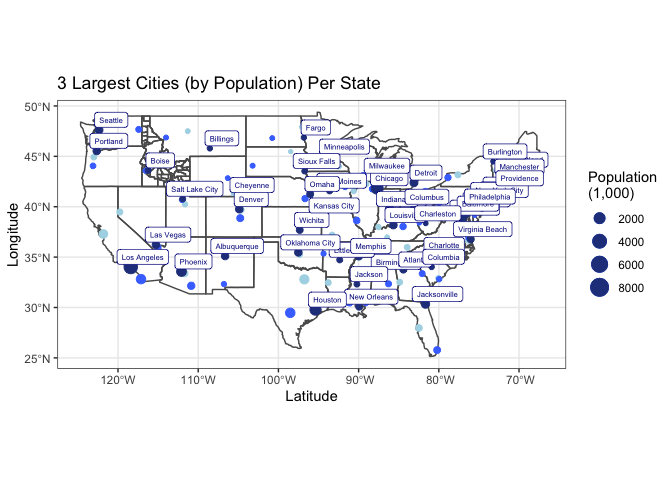

```r
library(tidyverse)
```

```
## ── Attaching packages ─────────────────────────────────────── tidyverse 1.3.2 ──
## ✔ ggplot2 3.3.6      ✔ purrr   0.3.4 
## ✔ tibble  3.1.8      ✔ dplyr   1.0.10
## ✔ tidyr   1.2.0      ✔ stringr 1.4.0 
## ✔ readr   2.1.2      ✔ forcats 0.5.2
```

```
## Warning: package 'tidyr' was built under R version 4.0.5
```

```
## Warning: package 'readr' was built under R version 4.0.5
```

```
## ── Conflicts ────────────────────────────────────────── tidyverse_conflicts() ──
## ✖ dplyr::filter() masks stats::filter()
## ✖ dplyr::lag()    masks stats::lag()
```

```r
library(remotes)

library(sf)
```

```
## Warning: package 'sf' was built under R version 4.0.5
```

```
## Linking to GEOS 3.9.1, GDAL 3.4.0, PROJ 8.1.1; sf_use_s2() is TRUE
```

```r
library(maps)
```

```
## 
## Attaching package: 'maps'
## 
## The following object is masked from 'package:purrr':
## 
##     map
```

```r
library(USAboundariesData)

library(USAboundaries)

#install.packages("ggrepel")
library(ggrepel)
#geom_label_repel()

library(ggplot2)
library(readr)
library(knitr)
library(tidyverse)
library(dplyr)
library(forcats)
library(downloader)
library(corrplot)
```

```
## corrplot 0.92 loaded
```

```r
library(tidyquant)
```

```
## Loading required package: lubridate
## 
## Attaching package: 'lubridate'
## 
## The following objects are masked from 'package:base':
## 
##     date, intersect, setdiff, union
## 
## Loading required package: PerformanceAnalytics
## Loading required package: xts
## Loading required package: zoo
## 
## Attaching package: 'zoo'
## 
## The following objects are masked from 'package:base':
## 
##     as.Date, as.Date.numeric
## 
## 
## Attaching package: 'xts'
## 
## The following objects are masked from 'package:dplyr':
## 
##     first, last
## 
## 
## Attaching package: 'PerformanceAnalytics'
## 
## The following object is masked from 'package:graphics':
## 
##     legend
## 
## Loading required package: quantmod
## Loading required package: TTR
## Registered S3 method overwritten by 'quantmod':
##   method            from
##   as.zoo.data.frame zoo
```

```r
library(timetk)
library(dygraphs)
```

Create dataframe for the cities data

```r
cities <- us_cities() 
```

```
## City populations for contemporary data come from the 2010 census.
```

```r
head(cities)
```

```
## Simple feature collection with 6 features and 12 fields
## Geometry type: POINT
## Dimension:     XY
## Bounding box:  xmin: -161.7934 ymin: 58.3727 xmax: -134.1788 ymax: 71.25408
## Geodetic CRS:  WGS 84
## # A tibble: 6 × 13
##   city    state…¹ state…² county count…³ stplf…⁴ name_…⁵ city_…⁶ popul…⁷ place…⁸
##   <chr>   <chr>   <chr>   <chr>  <chr>   <chr>   <chr>   <chr>   <chr>   <chr>  
## 1 Anchor… Alaska  AK      THIRD… Third … 0203000 Anchor… US Cen… US Cen… Incorp…
## 2 Barrow  Alaska  AK      North… North … 0205200 Barrow… US Cen… US Cen… Incorp…
## 3 Bethel  Alaska  AK      Bethe… Bethel… 0206520 Bethel… US Cen… US Cen… Incorp…
## 4 Fairba… Alaska  AK      FOURT… Fourth… 0224230 Fairba… US Cen… US Cen… Incorp…
## 5 Homer   Alaska  AK      Kenai… Kenai … 0233140 Homer … US Cen… US Cen… Incorp…
## 6 Juneau  Alaska  AK      FIRST… First … 0236400 Juneau… US Cen… US Cen… Incorp…
## # … with 3 more variables: year <int>, population <int>, geometry <POINT [°]>,
## #   and abbreviated variable names ¹​state_name, ²​state_abbr, ³​county_name,
## #   ⁴​stplfips_2010, ⁵​name_2010, ⁶​city_source, ⁷​population_source, ⁸​place_type
```

Create dataframe for the states data

```r
states <- us_states()

head(states)
```

```
## Simple feature collection with 6 features and 12 fields
## Geometry type: MULTIPOLYGON
## Dimension:     XY
## Bounding box:  xmin: -124.4096 ymin: 32.53416 xmax: -86.80587 ymax: 49.38436
## Geodetic CRS:  WGS 84
##   statefp  statens    affgeoid geoid stusps       name lsad        aland
## 1      06 01779778 0400000US06    06     CA California   00 403671196038
## 2      55 01779806 0400000US55    55     WI  Wisconsin   00 140292246684
## 3      16 01779783 0400000US16    16     ID      Idaho   00 214049923496
## 4      27 00662849 0400000US27    27     MN  Minnesota   00 206232157570
## 5      19 01779785 0400000US19    19     IA       Iowa   00 144659688848
## 6      29 01779791 0400000US29    29     MO   Missouri   00 178052563675
##        awater state_name state_abbr jurisdiction_type
## 1 20294133830 California         CA             state
## 2 29343721650  Wisconsin         WI             state
## 3  2391577745      Idaho         ID             state
## 4 18949864226  Minnesota         MN             state
## 5  1085996889       Iowa         IA             state
## 6  2487215790   Missouri         MO             state
##                         geometry
## 1 MULTIPOLYGON (((-118.594 33...
## 2 MULTIPOLYGON (((-86.93428 4...
## 3 MULTIPOLYGON (((-117.243 44...
## 4 MULTIPOLYGON (((-97.22904 4...
## 5 MULTIPOLYGON (((-96.62187 4...
## 6 MULTIPOLYGON (((-95.76564 4...
```

Create dataframe for the county data

```r
county <- us_counties()

head(county)
```

```
## Simple feature collection with 6 features and 15 fields
## Geometry type: MULTIPOLYGON
## Dimension:     XY
## Bounding box:  xmin: -102.8038 ymin: 30.99345 xmax: -74.76942 ymax: 45.32688
## Geodetic CRS:  WGS 84
##   statefp countyfp countyns       affgeoid geoid       name          namelsad
## 1      01      061 00161556 0500000US01061 01061     Geneva     Geneva County
## 2      08      125 00198178 0500000US08125 08125       Yuma       Yuma County
## 3      17      177 01785076 0500000US17177 17177 Stephenson Stephenson County
## 4      28      153 00695797 0500000US28153 28153      Wayne      Wayne County
## 5      34      041 00882237 0500000US34041 34041     Warren     Warren County
## 6      46      051 01265782 0500000US46051 46051      Grant      Grant County
##   stusps   state_name lsad      aland   awater   state_name state_abbr
## 1     AL      Alabama   06 1487908432 11567409      Alabama         AL
## 2     CO     Colorado   06 6123763559 11134665     Colorado         CO
## 3     IL     Illinois   06 1461392061  1350223     Illinois         IL
## 4     MS  Mississippi   06 2099745602  7255476  Mississippi         MS
## 5     NJ   New Jersey   06  923435921 15822933   New Jersey         NJ
## 6     SD South Dakota   06 1764937243 15765681 South Dakota         SD
##   jurisdiction_type                       geometry
## 1             state MULTIPOLYGON (((-86.19348 3...
## 2             state MULTIPOLYGON (((-102.8038 4...
## 3             state MULTIPOLYGON (((-89.92647 4...
## 4             state MULTIPOLYGON (((-88.94335 3...
## 5             state MULTIPOLYGON (((-75.19261 4...
## 6             state MULTIPOLYGON (((-97.22624 4...
```

Gets the county data for Idaho 

```r
idahocounties <- us_counties(states = "ID")
```

Create the dataframe with the state name and the geometry (the longitutde and latitude)

```r
statesmap <- sf::st_as_sf(map("state", plot = FALSE, fill = TRUE))

head(statesmap)
```

```
## Simple feature collection with 6 features and 1 field
## Geometry type: MULTIPOLYGON
## Dimension:     XY
## Bounding box:  xmin: -124.3834 ymin: 30.24071 xmax: -71.78015 ymax: 42.04937
## Geodetic CRS:  WGS 84
##            ID                           geom
## 1     alabama MULTIPOLYGON (((-87.46201 3...
## 2     arizona MULTIPOLYGON (((-114.6374 3...
## 3    arkansas MULTIPOLYGON (((-94.05103 3...
## 4  california MULTIPOLYGON (((-120.006 42...
## 5    colorado MULTIPOLYGON (((-102.0552 4...
## 6 connecticut MULTIPOLYGON (((-73.49902 4...
```

Filter out Alaska and Hawaii since they are not included in the map we are recreating 

```r
filteredcities <- cities %>%
  filter(state_name != 'Alaska', state_name != 'Hawaii')
```

Group the new dataset by state, and since we are looking for the 3 largest cities, we will arrange them by population from greatest to least

```r
top3cities <- filteredcities %>%
  group_by(state_name) %>%
  arrange(desc(population))

head(top3cities)
```

```
## Simple feature collection with 6 features and 12 fields
## Geometry type: POINT
## Dimension:     XY
## Bounding box:  xmin: -118.4108 ymin: 29.78047 xmax: -73.9385 ymax: 41.83755
## Geodetic CRS:  WGS 84
## # A tibble: 6 × 13
## # Groups:   state_name [6]
##   city    state…¹ state…² county count…³ stplf…⁴ name_…⁵ city_…⁶ popul…⁷ place…⁸
##   <chr>   <chr>   <chr>   <chr>  <chr>   <chr>   <chr>   <chr>   <chr>   <chr>  
## 1 New Yo… New Yo… NY      NEW Y… New Yo… 3651000 New Yo… US Cen… US Cen… Incorp…
## 2 Los An… Califo… CA      LOS A… Los An… 0644000 Los An… US Cen… US Cen… Incorp…
## 3 Chicago Illino… IL      COOK   Cook    1714000 Chicag… US Cen… US Cen… Incorp…
## 4 Houston Texas   TX      HARRIS Harris  4835000 Housto… US Cen… US Cen… Incorp…
## 5 Philad… Pennsy… PA      PHILA… Philad… 4260000 Philad… US Cen… US Cen… Incorp…
## 6 Phoenix Arizona AZ      MARIC… Marico… 0455000 Phoeni… US Cen… US Cen… Incorp…
## # … with 3 more variables: year <int>, population <int>, geometry <POINT [°]>,
## #   and abbreviated variable names ¹​state_name, ²​state_abbr, ³​county_name,
## #   ⁴​stplfips_2010, ⁵​name_2010, ⁶​city_source, ⁷​population_source, ⁸​place_type
```

Take the top 3 largest population cities in each state 

```r
threelargestcities <- top3cities %>%
  slice(1:3)

head(threelargestcities)
```

```
## Simple feature collection with 6 features and 12 fields
## Geometry type: POINT
## Dimension:     XY
## Bounding box:  xmin: -112.088 ymin: 30.66843 xmax: -86.26859 ymax: 33.57216
## Geodetic CRS:  WGS 84
## # A tibble: 6 × 13
## # Groups:   state_name [2]
##   city    state…¹ state…² county count…³ stplf…⁴ name_…⁵ city_…⁶ popul…⁷ place…⁸
##   <chr>   <chr>   <chr>   <chr>  <chr>   <chr>   <chr>   <chr>   <chr>   <chr>  
## 1 Birmin… Alabama AL      JEFFE… Jeffer… 0107000 Birmin… US Cen… US Cen… Incorp…
## 2 Montgo… Alabama AL      MONTG… Montgo… 0151000 Montgo… US Cen… US Cen… Incorp…
## 3 Mobile  Alabama AL      MOBILE Mobile  0150000 Mobile… US Cen… US Cen… Incorp…
## 4 Phoenix Arizona AZ      MARIC… Marico… 0455000 Phoeni… US Cen… US Cen… Incorp…
## 5 Tucson  Arizona AZ      PIMA   Pima    0477000 Tucson… US Cen… US Cen… Incorp…
## 6 Mesa    Arizona AZ      MARIC… Marico… 0446000 Mesa c… US Cen… US Cen… Incorp…
## # … with 3 more variables: year <int>, population <int>, geometry <POINT [°]>,
## #   and abbreviated variable names ¹​state_name, ²​state_abbr, ³​county_name,
## #   ⁴​stplfips_2010, ⁵​name_2010, ⁶​city_source, ⁷​population_source, ⁸​place_type
```

Create datasets that hold the largest, the middle, and the smallest populations for each state in the U.S.

```r
largest <- threelargestcities %>%
  slice(1:1)
middle <- threelargestcities %>%
  slice(2:2)
smallest <- threelargestcities %>%
  slice(3:3)

head(largest)
```

```
## Simple feature collection with 6 features and 12 fields
## Geometry type: POINT
## Dimension:     XY
## Bounding box:  xmin: -118.4108 ymin: 33.52744 xmax: -73.19573 ymax: 41.18739
## Geodetic CRS:  WGS 84
## # A tibble: 6 × 13
## # Groups:   state_name [6]
##   city    state…¹ state…² county count…³ stplf…⁴ name_…⁵ city_…⁶ popul…⁷ place…⁸
##   <chr>   <chr>   <chr>   <chr>  <chr>   <chr>   <chr>   <chr>   <chr>   <chr>  
## 1 Birmin… Alabama AL      JEFFE… Jeffer… 0107000 Birmin… US Cen… US Cen… Incorp…
## 2 Phoenix Arizona AZ      MARIC… Marico… 0455000 Phoeni… US Cen… US Cen… Incorp…
## 3 Little… Arkans… AR      PULAS… Pulaski 0541000 Little… US Cen… US Cen… Incorp…
## 4 Los An… Califo… CA      LOS A… Los An… 0644000 Los An… US Cen… US Cen… Incorp…
## 5 Denver  Colora… CO      ARAPA… Arapah… 0820000 Denver… US Cen… US Cen… Incorp…
## 6 Bridge… Connec… CT      FAIRF… Fairfi… 0908000 Bridge… US Cen… US Cen… Incorp…
## # … with 3 more variables: year <int>, population <int>, geometry <POINT [°]>,
## #   and abbreviated variable names ¹​state_name, ²​state_abbr, ³​county_name,
## #   ⁴​stplfips_2010, ⁵​name_2010, ⁶​city_source, ⁷​population_source, ⁸​place_type
```

Create the graphic that we were supposed to recreate

```r
ggplot() +
  geom_sf(data = statesmap, fill = NA) +
  geom_sf(data = idahocounties, fill = NA) +
  geom_sf(data = smallest, aes(size = population/1000), color = "lightblue") +
  geom_sf(data = middle, aes(size = population/1000), color = "royalblue1") +
  geom_sf(data = largest, aes(size = population/1000), color = "royalblue4") +
  geom_sf_label(data = largest, aes(label = city), color = "darkblue", nudge_x = 1.5, nudge_y = 1, size = 2) +
  scale_size_continuous(name = 'Population\n(1,000)') +
  labs(title="3 Largest Cities (by Population) Per State", x="Latitude",y="Longitude") +
  theme_bw()
```

```
## Warning in st_point_on_surface.sfc(sf::st_zm(x)): st_point_on_surface may not
## give correct results for longitude/latitude data
```

<!-- -->
Could not figure out how to get geom_label_repel to space the labels out better


