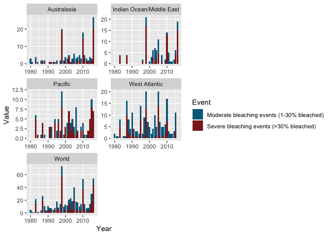
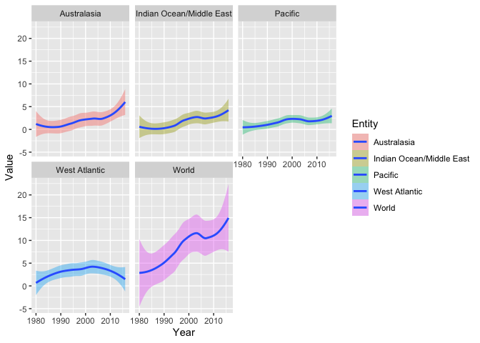

```r
library(tidyverse)
```

```
## ── Attaching packages ─────────────────────────────────────── tidyverse 1.3.0 ──
```

```
## ✔ ggplot2 3.3.3     ✔ purrr   0.3.4
## ✔ tibble  3.0.5     ✔ dplyr   1.0.3
## ✔ tidyr   1.1.2     ✔ stringr 1.4.0
## ✔ readr   1.4.0     ✔ forcats 0.5.0
```

```
## ── Conflicts ────────────────────────────────────────── tidyverse_conflicts() ──
## ✖ dplyr::filter() masks stats::filter()
## ✖ dplyr::lag()    masks stats::lag()
```

```r
urlfile = "https://github.com/WJC-Data-Science/DTS350/raw/master/coral.csv"
mydata <- read_csv(url(urlfile))
```

```
## 
## ── Column specification ────────────────────────────────────────────────────────
## cols(
##   Entity = col_character(),
##   Code = col_character(),
##   Year = col_double(),
##   Event = col_character(),
##   Value = col_double()
## )
```

```r
head(mydata)
```

```
## # A tibble: 6 x 5
##   Entity      Code   Year Event                                      Value
##   <chr>       <chr> <dbl> <chr>                                      <dbl>
## 1 Australasia <NA>   1980 Moderate bleaching events (1-30% bleached)     3
## 2 Australasia <NA>   1980 Severe bleaching events (>30% bleached)        0
## 3 Australasia <NA>   1981 Moderate bleaching events (1-30% bleached)     1
## 4 Australasia <NA>   1981 Severe bleaching events (>30% bleached)        0
## 5 Australasia <NA>   1982 Moderate bleaching events (1-30% bleached)     0
## 6 Australasia <NA>   1982 Severe bleaching events (>30% bleached)        0
```

```r
str(mydata)
```

```
## tibble [370 × 5] (S3: spec_tbl_df/tbl_df/tbl/data.frame)
##  $ Entity: chr [1:370] "Australasia" "Australasia" "Australasia" "Australasia" ...
##  $ Code  : chr [1:370] NA NA NA NA ...
##  $ Year  : num [1:370] 1980 1980 1981 1981 1982 ...
##  $ Event : chr [1:370] "Moderate bleaching events (1-30% bleached)" "Severe bleaching events (>30% bleached)" "Moderate bleaching events (1-30% bleached)" "Severe bleaching events (>30% bleached)" ...
##  $ Value : num [1:370] 3 0 1 0 0 0 3 1 1 0 ...
##  - attr(*, "spec")=
##   .. cols(
##   ..   Entity = col_character(),
##   ..   Code = col_character(),
##   ..   Year = col_double(),
##   ..   Event = col_character(),
##   ..   Value = col_double()
##   .. )
```

```r
tail(mydata)
```

```
## # A tibble: 6 x 5
##   Entity Code      Year Event                                      Value
##   <chr>  <chr>    <dbl> <chr>                                      <dbl>
## 1 World  OWID_WRL  2014 Moderate bleaching events (1-30% bleached)     9
## 2 World  OWID_WRL  2014 Severe bleaching events (>30% bleached)        5
## 3 World  OWID_WRL  2015 Moderate bleaching events (1-30% bleached)    14
## 4 World  OWID_WRL  2015 Severe bleaching events (>30% bleached)       16
## 5 World  OWID_WRL  2016 Moderate bleaching events (1-30% bleached)    11
## 6 World  OWID_WRL  2016 Severe bleaching events (>30% bleached)       43
```


```r
ggplot(data = mydata, aes(fill = Event, y = Value, x = Year)) +
  geom_bar(position = 'Stack', stat = 'identity') +
  facet_wrap(~Entity, nrow = 3, scales = 'free') +
  scale_fill_manual(values = c('deepskyblue4', 'brown4'))
```

<!-- -->


```r
ggplot(data = mydata) +
  geom_smooth(aes(x = Year, y = Value, fill = Entity)) +
  facet_wrap(~Entity)
```

```
## `geom_smooth()` using method = 'loess' and formula 'y ~ x'
```

<!-- -->

