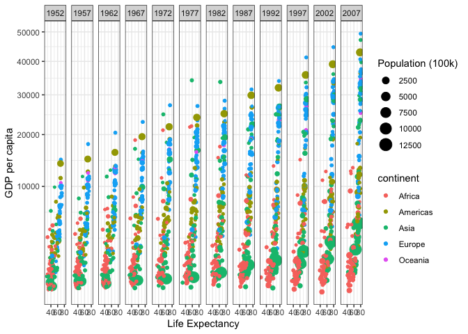
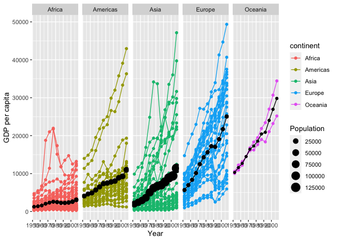

```r
#install.packages("gapminder")
#Had to comment out to get it to knit 
library(gapminder)
head(gapminder)
```

```
## # A tibble: 6 × 6
##   country     continent  year lifeExp      pop gdpPercap
##   <fct>       <fct>     <int>   <dbl>    <int>     <dbl>
## 1 Afghanistan Asia       1952    28.8  8425333      779.
## 2 Afghanistan Asia       1957    30.3  9240934      821.
## 3 Afghanistan Asia       1962    32.0 10267083      853.
## 4 Afghanistan Asia       1967    34.0 11537966      836.
## 5 Afghanistan Asia       1972    36.1 13079460      740.
## 6 Afghanistan Asia       1977    38.4 14880372      786.
```

```r
library(readr)
```

```
## Warning: package 'readr' was built under R version 4.0.5
```

```r
library(tidyverse)
```

```
## ── Attaching packages ─────────────────────────────────────── tidyverse 1.3.2 ──
## ✔ ggplot2 3.3.6      ✔ dplyr   1.0.10
## ✔ tibble  3.1.8      ✔ stringr 1.4.0 
## ✔ tidyr   1.2.0      ✔ forcats 0.5.2 
## ✔ purrr   0.3.4
```

```
## Warning: package 'tidyr' was built under R version 4.0.5
```

```
## ── Conflicts ────────────────────────────────────────── tidyverse_conflicts() ──
## ✖ dplyr::filter() masks stats::filter()
## ✖ dplyr::lag()    masks stats::lag()
```

```r
library(knitr)
library(downloader)
library(dplyr)
```


```r
gapminder_edit <- filter(gapminder, country != "Kuwait")
head(gapminder_edit)
```

```
## # A tibble: 6 × 6
##   country     continent  year lifeExp      pop gdpPercap
##   <fct>       <fct>     <int>   <dbl>    <int>     <dbl>
## 1 Afghanistan Asia       1952    28.8  8425333      779.
## 2 Afghanistan Asia       1957    30.3  9240934      821.
## 3 Afghanistan Asia       1962    32.0 10267083      853.
## 4 Afghanistan Asia       1967    34.0 11537966      836.
## 5 Afghanistan Asia       1972    36.1 13079460      740.
## 6 Afghanistan Asia       1977    38.4 14880372      786.
```


```r
ggplot(data = gapminder_edit) +
  geom_point(mapping = aes(size = pop/100000, x = lifeExp, y = gdpPercap, color = continent, group = year)) +
  facet_wrap(~ year, nrow = 1) +
  scale_y_continuous(trans = "sqrt") +
  scale_size_continuous(name = "Population (100k)") +
  xlab("Life Expectancy") +
  ylab("GDP per capita") +
  theme_bw()
```

<!-- -->


```r
weighted_GDP1 <- gapminder_edit 
weighted_GDP2 <- group_by(weighted_GDP1, continent, year) 
weighted_GDP <- summarise(weighted_GDP2, weightedGDP_percap = weighted.mean(gdpPercap), Population=pop/10000)
```

```
## `summarise()` has grouped output by 'continent', 'year'. You can override using
## the `.groups` argument.
```


```r
ggplot(data = gapminder_edit) +
  geom_point(aes(x = year, y = gdpPercap, color = continent)) +
  geom_line(aes(x = year, y = gdpPercap, color = continent, group = country)) +
  geom_point(data=weighted_GDP,aes(x = year, y = weightedGDP_percap, size = Population)) +
  geom_line(data=weighted_GDP,aes(x = year, y = weightedGDP_percap)) +
  facet_wrap(~ continent, nrow = 1) +
  xlab("Year") +
  ylab("GDP per capita")  
```

<!-- -->


