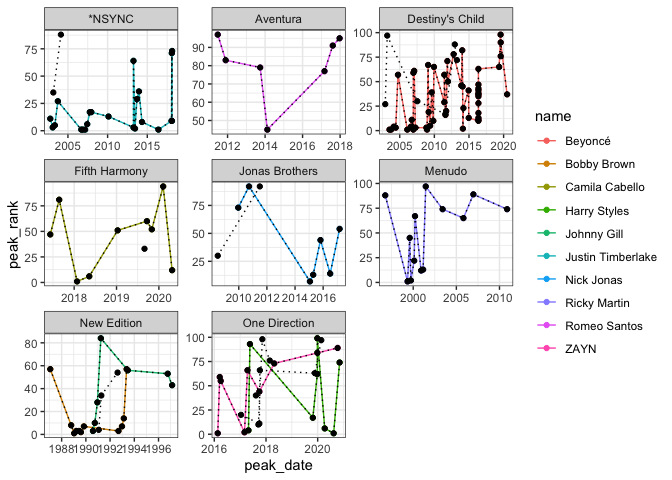

```r
library(tidyverse)
```

```
## ── Attaching packages ─────────────────────────────────────── tidyverse 1.3.2 ──
## ✔ ggplot2 3.3.6      ✔ purrr   0.3.4 
## ✔ tibble  3.1.8      ✔ dplyr   1.0.10
## ✔ tidyr   1.2.0      ✔ stringr 1.4.0 
## ✔ readr   2.1.2      ✔ forcats 0.5.2
```

```
## Warning: package 'tidyr' was built under R version 4.0.5
```

```
## Warning: package 'readr' was built under R version 4.0.5
```

```
## ── Conflicts ────────────────────────────────────────── tidyverse_conflicts() ──
## ✖ dplyr::filter() masks stats::filter()
## ✖ dplyr::lag()    masks stats::lag()
```

```r
library(knitr)
library(downloader)
```


All data imported correctly as characters. All data imported was of charachter type

```r
SoloData <- read_csv("solo-artist-followers.csv")
```

```
## Rows: 139 Columns: 5
## ── Column specification ────────────────────────────────────────────────────────
## Delimiter: ","
## chr (5): name, band, followers, band_followers, follower_difference
## 
## ℹ Use `spec()` to retrieve the full column specification for this data.
## ℹ Specify the column types or set `show_col_types = FALSE` to quiet this message.
```

```r
SoloData
```

```
## # A tibble: 139 × 5
##    name              band                followers band_followers follower_dif…¹
##    <chr>             <chr>               <chr>     <chr>          <chr>         
##  1 Daron Jones       112                 1.28k     783k           −782k         
##  2 Slim              112                 2.14k     783k           −781k         
##  3 Q Parker          112                 3.51k     783k           −780k         
##  4 JC Chasez         *NSYNC              30.8k     1.44M          −1.41M        
##  5 Joey Fatone       *NSYNC              1.13k     1.44M          −1.44M        
##  6 Justin Timberlake *NSYNC              10.3M     1.44M          8.90M         
##  7 Ashton Irwin      5 Seconds of Summer 130k      7.14M          −7.01M        
##  8 Abz Love          5ive                223       19.0k          −18.7k        
##  9 Jeff Timmons      98º                 111       302k           −302k         
## 10 Nick Lachey       98º                 142k      302k           −160k         
## # … with 129 more rows, and abbreviated variable name ¹​follower_difference
```

```r
str(SoloData)
```

```
## spec_tbl_df [139 × 5] (S3: spec_tbl_df/tbl_df/tbl/data.frame)
##  $ name               : chr [1:139] "Daron Jones" "Slim" "Q Parker" "JC Chasez" ...
##  $ band               : chr [1:139] "112" "112" "112" "*NSYNC" ...
##  $ followers          : chr [1:139] "1.28k" "2.14k" "3.51k" "30.8k" ...
##  $ band_followers     : chr [1:139] "783k" "783k" "783k" "1.44M" ...
##  $ follower_difference: chr [1:139] "−782k" "−781k" "−780k" "−1.41M" ...
##  - attr(*, "spec")=
##   .. cols(
##   ..   name = col_character(),
##   ..   band = col_character(),
##   ..   followers = col_character(),
##   ..   band_followers = col_character(),
##   ..   follower_difference = col_character()
##   .. )
##  - attr(*, "problems")=<externalptr>
```


Data imported correctly - date type for date, charachter for titles, names, and bands. 

```r
BillboardData <- read_csv("billboard-hits.csv")
```

```
## Rows: 456 Columns: 5
## ── Column specification ────────────────────────────────────────────────────────
## Delimiter: ","
## chr  (3): name, band, title
## dbl  (1): peak_rank
## date (1): peak_date
## 
## ℹ Use `spec()` to retrieve the full column specification for this data.
## ℹ Specify the column types or set `show_col_types = FALSE` to quiet this message.
```

```r
str(BillboardData)
```

```
## spec_tbl_df [456 × 5] (S3: spec_tbl_df/tbl_df/tbl/data.frame)
##  $ name     : chr [1:456] "*NSYNC" "*NSYNC" "*NSYNC" "*NSYNC" ...
##  $ band     : chr [1:456] NA NA NA NA ...
##  $ title    : chr [1:456] "It's Gonna Be Me" "Music Of My Heart" "Bye Bye Bye" "This I Promise You" ...
##  $ peak_date: Date[1:456], format: "2000-07-28" "1999-10-15" ...
##  $ peak_rank: num [1:456] 1 2 4 5 5 8 11 13 19 59 ...
##  - attr(*, "spec")=
##   .. cols(
##   ..   name = col_character(),
##   ..   band = col_character(),
##   ..   title = col_character(),
##   ..   peak_date = col_date(format = ""),
##   ..   peak_rank = col_double()
##   .. )
##  - attr(*, "problems")=<externalptr>
```

```r
head(BillboardData)
```

```
## # A tibble: 6 × 5
##   name   band  title                     peak_date  peak_rank
##   <chr>  <chr> <chr>                     <date>         <dbl>
## 1 *NSYNC <NA>  It's Gonna Be Me          2000-07-28         1
## 2 *NSYNC <NA>  Music Of My Heart         1999-10-15         2
## 3 *NSYNC <NA>  Bye Bye Bye               2000-04-14         4
## 4 *NSYNC <NA>  This I Promise You        2000-12-01         5
## 5 *NSYNC <NA>  Girlfriend                2002-04-05         5
## 6 *NSYNC <NA>  A Little More Time On You 1999-02-26         8
```

In BillboardData remove all singers who do not have at least 6 times they had a top 100 hit.

```r
sixtop100 <- BillboardData %>%
  group_by(name) %>%
  filter(n() > 6, band != "", !is.na(band))
head(sixtop100)
```

```
## # A tibble: 6 × 5
## # Groups:   name [1]
##   name              band   title                           peak_date  peak_rank
##   <chr>             <chr>  <chr>                           <date>         <dbl>
## 1 Justin Timberlake *NSYNC SexyBack                        2006-09-08         1
## 2 Justin Timberlake *NSYNC My Love                         2006-11-10         1
## 3 Justin Timberlake *NSYNC What Goes Around...Comes Around 2007-03-02         1
## 4 Justin Timberlake *NSYNC Can't Stop The Feeling!         2016-05-27         1
## 5 Justin Timberlake *NSYNC Mirrors                         2013-06-14         2
## 6 Justin Timberlake *NSYNC Cry Me A River                  2003-01-31         3
```
Left me with 144 entries 


```r
sixtopbands <- BillboardData %>%
  group_by(band) %>%
  filter(band %in% sixtop100$band)
head(sixtopbands)
```

```
## # A tibble: 6 × 5
## # Groups:   band [1]
##   name              band   title                           peak_date  peak_rank
##   <chr>             <chr>  <chr>                           <date>         <dbl>
## 1 JC Chasez         *NSYNC Blowin' Me Up                   2003-02-28        35
## 2 JC Chasez         *NSYNC Some Girls                      2004-02-13        88
## 3 Justin Timberlake *NSYNC SexyBack                        2006-09-08         1
## 4 Justin Timberlake *NSYNC My Love                         2006-11-10         1
## 5 Justin Timberlake *NSYNC What Goes Around...Comes Around 2007-03-02         1
## 6 Justin Timberlake *NSYNC Can't Stop The Feeling!         2016-05-27         1
```


```r
ggplot(data = sixtop100, aes(x = peak_date, y = peak_rank, color = name, group = name)) +
  geom_point() +
  geom_line() +
  geom_point(data = sixtopbands, color ="black") +
  geom_line(data = sixtopbands, color = "black", linetype = "dotted") +
  facet_wrap(~ band, scales = "free") +
  xlab("peak_date") + ylab("peak_rank") +
  theme_bw() 
```

<!-- -->
Observations made:
One Direction artists had different paths to success. ZAYN was mostly upwards while Harry Styles was all over the place
None saw linear success - NSYNC had a lot of hits compared to Destiny's Child who had both lots of top 10 hits and lots of hits over 50 ranking
None see prolonged success in terms of ranking - almost none have multiple songs back to back to back
Destiny's Child had the most top 100 hits 
Aventura had the least amount of top 100 hits. 


https://www.kaggle.com/datasets/migeruj/videogames-predictive-model
Info: includes platform, genre, publisher, North American sales, Europe sales, Japan sales, other sales, global sales, and rating

```r
videogames <- read_csv("videogamesales.csv")
```

```
## Rows: 7112 Columns: 10
## ── Column specification ────────────────────────────────────────────────────────
## Delimiter: ","
## chr (10): Platform, Genre, Publisher, NA_Sales, EU_Sales, JP_Sales, Other_Sa...
## 
## ℹ Use `spec()` to retrieve the full column specification for this data.
## ℹ Specify the column types or set `show_col_types = FALSE` to quiet this message.
```

```r
videogames
```

```
## # A tibble: 7,112 × 10
##    Platform Genre Publi…¹ NA_Sa…² EU_Sa…³ JP_Sa…⁴ Other…⁵ Globa…⁶ Rating Criti…⁷
##    <chr>    <chr> <chr>   <chr>   <chr>   <chr>   <chr>   <chr>   <chr>  <chr>  
##  1 Wii      Spor… Ninten… 41,36   28,96   3,77    8,45    82,54   E      Bueno  
##  2 Wii      Raci… Ninten… 15,68   12,8    3,79    3,29    35,57   E      Excele…
##  3 Wii      Spor… Ninten… 15,61   10,95   3,28    2,95    32,78   E      Excele…
##  4 DS       Plat… Ninten… 11,28   9,15    6,5     2,88    29,81   E      Excele…
##  5 Wii      Misc  Ninten… 13,96   9,18    2,93    2,84    28,92   E      Malo   
##  6 Wii      Plat… Ninten… 14,48   6,95    4,7     2,25    28,38   E      Excele…
##  7 DS       Raci… Ninten… 9,71    7,48    4,13    1,9     23,22   E      Excele…
##  8 Wii      Spor… Ninten… 8,92    8,03    3,6     2,15    22,7    E      Excele…
##  9 X360     Misc  Micros… 15,02   4,91    0,24    1,69    21,86   E      Acepta…
## 10 Wii      Spor… Ninten… 9,01    8,49    2,53    1,77    21,79   E      Excele…
## # … with 7,102 more rows, and abbreviated variable names ¹​Publisher, ²​NA_Sales,
## #   ³​EU_Sales, ⁴​JP_Sales, ⁵​Other_Sales, ⁶​Global_Sales, ⁷​Critic_Score_Class
```

```r
str(videogames)
```

```
## spec_tbl_df [7,112 × 10] (S3: spec_tbl_df/tbl_df/tbl/data.frame)
##  $ Platform          : chr [1:7112] "Wii" "Wii" "Wii" "DS" ...
##  $ Genre             : chr [1:7112] "Sports" "Racing" "Sports" "Platform" ...
##  $ Publisher         : chr [1:7112] "Nintendo" "Nintendo" "Nintendo" "Nintendo" ...
##  $ NA_Sales          : chr [1:7112] "41,36" "15,68" "15,61" "11,28" ...
##  $ EU_Sales          : chr [1:7112] "28,96" "12,8" "10,95" "9,15" ...
##  $ JP_Sales          : chr [1:7112] "3,77" "3,79" "3,28" "6,5" ...
##  $ Other_Sales       : chr [1:7112] "8,45" "3,29" "2,95" "2,88" ...
##  $ Global_Sales      : chr [1:7112] "82,54" "35,57" "32,78" "29,81" ...
##  $ Rating            : chr [1:7112] "E" "E" "E" "E" ...
##  $ Critic_Score_Class: chr [1:7112] "Bueno" "Excelente" "Excelente" "Excelente" ...
##  - attr(*, "spec")=
##   .. cols(
##   ..   Platform = col_character(),
##   ..   Genre = col_character(),
##   ..   Publisher = col_character(),
##   ..   NA_Sales = col_character(),
##   ..   EU_Sales = col_character(),
##   ..   JP_Sales = col_character(),
##   ..   Other_Sales = col_character(),
##   ..   Global_Sales = col_character(),
##   ..   Rating = col_character(),
##   ..   Critic_Score_Class = col_character()
##   .. )
##  - attr(*, "problems")=<externalptr>
```
Are data types correct? 
Yes - all character values 

https://www.kaggle.com/datasets/dtrade84/us-state-life-expectancy-by-sex-2020
Info: Life expecatnacy data broken down by state. Looks at different genders as well. 

```r
lifeexpectancy <- read_csv("life-expectancy.csv")
```

```
## Rows: 156 Columns: 5
## ── Column specification ────────────────────────────────────────────────────────
## Delimiter: ","
## chr (3): State, Sex, Quartile
## dbl (2): LE, SE
## 
## ℹ Use `spec()` to retrieve the full column specification for this data.
## ℹ Specify the column types or set `show_col_types = FALSE` to quiet this message.
```

```r
lifeexpectancy
```

```
## # A tibble: 156 × 5
##    State                Sex      LE    SE Quartile   
##    <chr>                <chr> <dbl> <dbl> <chr>      
##  1 Alabama              Total  73.2 0.067 71.9 - 75.3
##  2 Alaska               Total  76.6 0.176 75.4 - 76.8
##  3 Arizona              Total  76.3 0.055 75.4 - 76.8
##  4 Arkansas             Total  73.8 0.086 71.9 - 75.3
##  5 California           Total  79   0.022 78.1 - 80.7
##  6 Colorado             Total  78.3 0.058 78.1 - 80.7
##  7 Connecticut          Total  78.4 0.073 78.1 - 80.7
##  8 Delaware             Total  76.7 0.147 75.4 - 76.8
##  9 District of Columbia Total  75.3 0.179 71.9 - 75.3
## 10 Florida              Total  77.5 0.032 76.9 - 78.0
## # … with 146 more rows
```

```r
str(lifeexpectancy)
```

```
## spec_tbl_df [156 × 5] (S3: spec_tbl_df/tbl_df/tbl/data.frame)
##  $ State   : chr [1:156] "Alabama" "Alaska" "Arizona" "Arkansas" ...
##  $ Sex     : chr [1:156] "Total" "Total" "Total" "Total" ...
##  $ LE      : num [1:156] 73.2 76.6 76.3 73.8 79 78.3 78.4 76.7 75.3 77.5 ...
##  $ SE      : num [1:156] 0.067 0.176 0.055 0.086 0.022 0.058 0.073 0.147 0.179 0.032 ...
##  $ Quartile: chr [1:156] "71.9 - 75.3" "75.4 - 76.8" "75.4 - 76.8" "71.9 - 75.3" ...
##  - attr(*, "spec")=
##   .. cols(
##   ..   State = col_character(),
##   ..   Sex = col_character(),
##   ..   LE = col_double(),
##   ..   SE = col_double(),
##   ..   Quartile = col_character()
##   .. )
##  - attr(*, "problems")=<externalptr>
```
Are the data types correct? 
Yes - character values for what is needed (sex), and number values for where they are needed (life expectancy)


https://github.com/owid/covid-19-data/tree/master/public/data
Info: Covid data that includes location, date, total cases, new cases, reporduction, icu patients, hospital admissions and more

```r
coviddata <- read_csv("owid-covid-data.csv")
```

```
## Rows: 215400 Columns: 67
## ── Column specification ────────────────────────────────────────────────────────
## Delimiter: ","
## chr   (4): iso_code, continent, location, tests_units
## dbl  (62): total_cases, new_cases, new_cases_smoothed, total_deaths, new_dea...
## date  (1): date
## 
## ℹ Use `spec()` to retrieve the full column specification for this data.
## ℹ Specify the column types or set `show_col_types = FALSE` to quiet this message.
```

```r
coviddata
```

```
## # A tibble: 215,400 × 67
##    iso_code continent locat…¹ date       total…² new_c…³ new_c…⁴ total…⁵ new_d…⁶
##    <chr>    <chr>     <chr>   <date>       <dbl>   <dbl>   <dbl>   <dbl>   <dbl>
##  1 AFG      Asia      Afghan… 2020-02-24       5       5  NA          NA      NA
##  2 AFG      Asia      Afghan… 2020-02-25       5       0  NA          NA      NA
##  3 AFG      Asia      Afghan… 2020-02-26       5       0  NA          NA      NA
##  4 AFG      Asia      Afghan… 2020-02-27       5       0  NA          NA      NA
##  5 AFG      Asia      Afghan… 2020-02-28       5       0  NA          NA      NA
##  6 AFG      Asia      Afghan… 2020-02-29       5       0   0.714      NA      NA
##  7 AFG      Asia      Afghan… 2020-03-01       5       0   0.714      NA      NA
##  8 AFG      Asia      Afghan… 2020-03-02       5       0   0          NA      NA
##  9 AFG      Asia      Afghan… 2020-03-03       5       0   0          NA      NA
## 10 AFG      Asia      Afghan… 2020-03-04       5       0   0          NA      NA
## # … with 215,390 more rows, 58 more variables: new_deaths_smoothed <dbl>,
## #   total_cases_per_million <dbl>, new_cases_per_million <dbl>,
## #   new_cases_smoothed_per_million <dbl>, total_deaths_per_million <dbl>,
## #   new_deaths_per_million <dbl>, new_deaths_smoothed_per_million <dbl>,
## #   reproduction_rate <dbl>, icu_patients <dbl>,
## #   icu_patients_per_million <dbl>, hosp_patients <dbl>,
## #   hosp_patients_per_million <dbl>, weekly_icu_admissions <dbl>, …
```

```r
str(coviddata)
```

```
## spec_tbl_df [215,400 × 67] (S3: spec_tbl_df/tbl_df/tbl/data.frame)
##  $ iso_code                                  : chr [1:215400] "AFG" "AFG" "AFG" "AFG" ...
##  $ continent                                 : chr [1:215400] "Asia" "Asia" "Asia" "Asia" ...
##  $ location                                  : chr [1:215400] "Afghanistan" "Afghanistan" "Afghanistan" "Afghanistan" ...
##  $ date                                      : Date[1:215400], format: "2020-02-24" "2020-02-25" ...
##  $ total_cases                               : num [1:215400] 5 5 5 5 5 5 5 5 5 5 ...
##  $ new_cases                                 : num [1:215400] 5 0 0 0 0 0 0 0 0 0 ...
##  $ new_cases_smoothed                        : num [1:215400] NA NA NA NA NA 0.714 0.714 0 0 0 ...
##  $ total_deaths                              : num [1:215400] NA NA NA NA NA NA NA NA NA NA ...
##  $ new_deaths                                : num [1:215400] NA NA NA NA NA NA NA NA NA NA ...
##  $ new_deaths_smoothed                       : num [1:215400] NA NA NA NA NA NA NA NA NA NA ...
##  $ total_cases_per_million                   : num [1:215400] 0.125 0.125 0.125 0.125 0.125 0.125 0.125 0.125 0.125 0.125 ...
##  $ new_cases_per_million                     : num [1:215400] 0.125 0 0 0 0 0 0 0 0 0 ...
##  $ new_cases_smoothed_per_million            : num [1:215400] NA NA NA NA NA 0.018 0.018 0 0 0 ...
##  $ total_deaths_per_million                  : num [1:215400] NA NA NA NA NA NA NA NA NA NA ...
##  $ new_deaths_per_million                    : num [1:215400] NA NA NA NA NA NA NA NA NA NA ...
##  $ new_deaths_smoothed_per_million           : num [1:215400] NA NA NA NA NA NA NA NA NA NA ...
##  $ reproduction_rate                         : num [1:215400] NA NA NA NA NA NA NA NA NA NA ...
##  $ icu_patients                              : num [1:215400] NA NA NA NA NA NA NA NA NA NA ...
##  $ icu_patients_per_million                  : num [1:215400] NA NA NA NA NA NA NA NA NA NA ...
##  $ hosp_patients                             : num [1:215400] NA NA NA NA NA NA NA NA NA NA ...
##  $ hosp_patients_per_million                 : num [1:215400] NA NA NA NA NA NA NA NA NA NA ...
##  $ weekly_icu_admissions                     : num [1:215400] NA NA NA NA NA NA NA NA NA NA ...
##  $ weekly_icu_admissions_per_million         : num [1:215400] NA NA NA NA NA NA NA NA NA NA ...
##  $ weekly_hosp_admissions                    : num [1:215400] NA NA NA NA NA NA NA NA NA NA ...
##  $ weekly_hosp_admissions_per_million        : num [1:215400] NA NA NA NA NA NA NA NA NA NA ...
##  $ total_tests                               : num [1:215400] NA NA NA NA NA NA NA NA NA NA ...
##  $ new_tests                                 : num [1:215400] NA NA NA NA NA NA NA NA NA NA ...
##  $ total_tests_per_thousand                  : num [1:215400] NA NA NA NA NA NA NA NA NA NA ...
##  $ new_tests_per_thousand                    : num [1:215400] NA NA NA NA NA NA NA NA NA NA ...
##  $ new_tests_smoothed                        : num [1:215400] NA NA NA NA NA NA NA NA NA NA ...
##  $ new_tests_smoothed_per_thousand           : num [1:215400] NA NA NA NA NA NA NA NA NA NA ...
##  $ positive_rate                             : num [1:215400] NA NA NA NA NA NA NA NA NA NA ...
##  $ tests_per_case                            : num [1:215400] NA NA NA NA NA NA NA NA NA NA ...
##  $ tests_units                               : chr [1:215400] NA NA NA NA ...
##  $ total_vaccinations                        : num [1:215400] NA NA NA NA NA NA NA NA NA NA ...
##  $ people_vaccinated                         : num [1:215400] NA NA NA NA NA NA NA NA NA NA ...
##  $ people_fully_vaccinated                   : num [1:215400] NA NA NA NA NA NA NA NA NA NA ...
##  $ total_boosters                            : num [1:215400] NA NA NA NA NA NA NA NA NA NA ...
##  $ new_vaccinations                          : num [1:215400] NA NA NA NA NA NA NA NA NA NA ...
##  $ new_vaccinations_smoothed                 : num [1:215400] NA NA NA NA NA NA NA NA NA NA ...
##  $ total_vaccinations_per_hundred            : num [1:215400] NA NA NA NA NA NA NA NA NA NA ...
##  $ people_vaccinated_per_hundred             : num [1:215400] NA NA NA NA NA NA NA NA NA NA ...
##  $ people_fully_vaccinated_per_hundred       : num [1:215400] NA NA NA NA NA NA NA NA NA NA ...
##  $ total_boosters_per_hundred                : num [1:215400] NA NA NA NA NA NA NA NA NA NA ...
##  $ new_vaccinations_smoothed_per_million     : num [1:215400] NA NA NA NA NA NA NA NA NA NA ...
##  $ new_people_vaccinated_smoothed            : num [1:215400] NA NA NA NA NA NA NA NA NA NA ...
##  $ new_people_vaccinated_smoothed_per_hundred: num [1:215400] NA NA NA NA NA NA NA NA NA NA ...
##  $ stringency_index                          : num [1:215400] 8.33 8.33 8.33 8.33 8.33 ...
##  $ population                                : num [1:215400] 40099462 40099462 40099462 40099462 40099462 ...
##  $ population_density                        : num [1:215400] 54.4 54.4 54.4 54.4 54.4 ...
##  $ median_age                                : num [1:215400] 18.6 18.6 18.6 18.6 18.6 18.6 18.6 18.6 18.6 18.6 ...
##  $ aged_65_older                             : num [1:215400] 2.58 2.58 2.58 2.58 2.58 ...
##  $ aged_70_older                             : num [1:215400] 1.34 1.34 1.34 1.34 1.34 ...
##  $ gdp_per_capita                            : num [1:215400] 1804 1804 1804 1804 1804 ...
##  $ extreme_poverty                           : num [1:215400] NA NA NA NA NA NA NA NA NA NA ...
##  $ cardiovasc_death_rate                     : num [1:215400] 597 597 597 597 597 ...
##  $ diabetes_prevalence                       : num [1:215400] 9.59 9.59 9.59 9.59 9.59 9.59 9.59 9.59 9.59 9.59 ...
##  $ female_smokers                            : num [1:215400] NA NA NA NA NA NA NA NA NA NA ...
##  $ male_smokers                              : num [1:215400] NA NA NA NA NA NA NA NA NA NA ...
##  $ handwashing_facilities                    : num [1:215400] 37.7 37.7 37.7 37.7 37.7 ...
##  $ hospital_beds_per_thousand                : num [1:215400] 0.5 0.5 0.5 0.5 0.5 0.5 0.5 0.5 0.5 0.5 ...
##  $ life_expectancy                           : num [1:215400] 64.8 64.8 64.8 64.8 64.8 ...
##  $ human_development_index                   : num [1:215400] 0.511 0.511 0.511 0.511 0.511 0.511 0.511 0.511 0.511 0.511 ...
##  $ excess_mortality_cumulative_absolute      : num [1:215400] NA NA NA NA NA NA NA NA NA NA ...
##  $ excess_mortality_cumulative               : num [1:215400] NA NA NA NA NA NA NA NA NA NA ...
##  $ excess_mortality                          : num [1:215400] NA NA NA NA NA NA NA NA NA NA ...
##  $ excess_mortality_cumulative_per_million   : num [1:215400] NA NA NA NA NA NA NA NA NA NA ...
##  - attr(*, "spec")=
##   .. cols(
##   ..   iso_code = col_character(),
##   ..   continent = col_character(),
##   ..   location = col_character(),
##   ..   date = col_date(format = ""),
##   ..   total_cases = col_double(),
##   ..   new_cases = col_double(),
##   ..   new_cases_smoothed = col_double(),
##   ..   total_deaths = col_double(),
##   ..   new_deaths = col_double(),
##   ..   new_deaths_smoothed = col_double(),
##   ..   total_cases_per_million = col_double(),
##   ..   new_cases_per_million = col_double(),
##   ..   new_cases_smoothed_per_million = col_double(),
##   ..   total_deaths_per_million = col_double(),
##   ..   new_deaths_per_million = col_double(),
##   ..   new_deaths_smoothed_per_million = col_double(),
##   ..   reproduction_rate = col_double(),
##   ..   icu_patients = col_double(),
##   ..   icu_patients_per_million = col_double(),
##   ..   hosp_patients = col_double(),
##   ..   hosp_patients_per_million = col_double(),
##   ..   weekly_icu_admissions = col_double(),
##   ..   weekly_icu_admissions_per_million = col_double(),
##   ..   weekly_hosp_admissions = col_double(),
##   ..   weekly_hosp_admissions_per_million = col_double(),
##   ..   total_tests = col_double(),
##   ..   new_tests = col_double(),
##   ..   total_tests_per_thousand = col_double(),
##   ..   new_tests_per_thousand = col_double(),
##   ..   new_tests_smoothed = col_double(),
##   ..   new_tests_smoothed_per_thousand = col_double(),
##   ..   positive_rate = col_double(),
##   ..   tests_per_case = col_double(),
##   ..   tests_units = col_character(),
##   ..   total_vaccinations = col_double(),
##   ..   people_vaccinated = col_double(),
##   ..   people_fully_vaccinated = col_double(),
##   ..   total_boosters = col_double(),
##   ..   new_vaccinations = col_double(),
##   ..   new_vaccinations_smoothed = col_double(),
##   ..   total_vaccinations_per_hundred = col_double(),
##   ..   people_vaccinated_per_hundred = col_double(),
##   ..   people_fully_vaccinated_per_hundred = col_double(),
##   ..   total_boosters_per_hundred = col_double(),
##   ..   new_vaccinations_smoothed_per_million = col_double(),
##   ..   new_people_vaccinated_smoothed = col_double(),
##   ..   new_people_vaccinated_smoothed_per_hundred = col_double(),
##   ..   stringency_index = col_double(),
##   ..   population = col_double(),
##   ..   population_density = col_double(),
##   ..   median_age = col_double(),
##   ..   aged_65_older = col_double(),
##   ..   aged_70_older = col_double(),
##   ..   gdp_per_capita = col_double(),
##   ..   extreme_poverty = col_double(),
##   ..   cardiovasc_death_rate = col_double(),
##   ..   diabetes_prevalence = col_double(),
##   ..   female_smokers = col_double(),
##   ..   male_smokers = col_double(),
##   ..   handwashing_facilities = col_double(),
##   ..   hospital_beds_per_thousand = col_double(),
##   ..   life_expectancy = col_double(),
##   ..   human_development_index = col_double(),
##   ..   excess_mortality_cumulative_absolute = col_double(),
##   ..   excess_mortality_cumulative = col_double(),
##   ..   excess_mortality = col_double(),
##   ..   excess_mortality_cumulative_per_million = col_double()
##   .. )
##  - attr(*, "problems")=<externalptr>
```
Are the data types correct? 
Yes. All numbers are labeled correctly, all words are labeled correctly 


