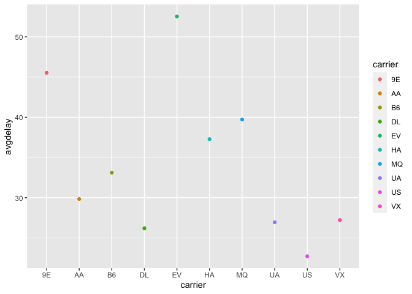
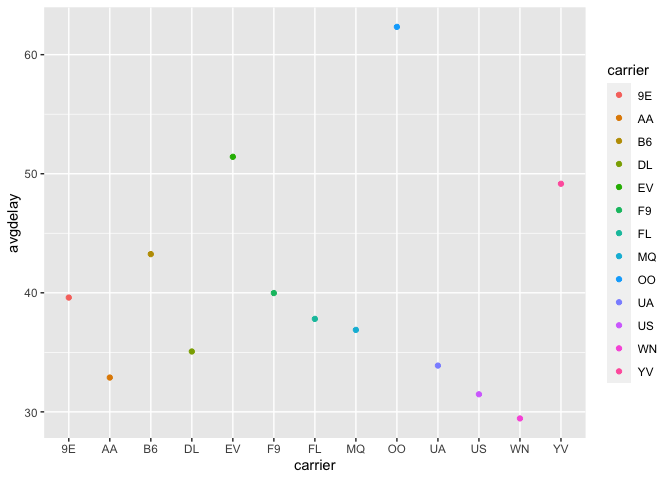
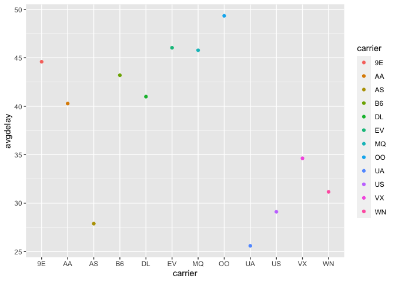
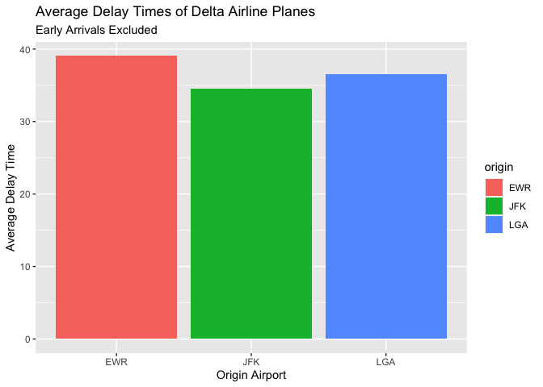

```r
library(ggplot2)
library(readr)
```

```
## Warning: package 'readr' was built under R version 4.0.5
```

```r
library(knitr)
library(tidyverse)
```

```
## ── Attaching packages ─────────────────────────────────────── tidyverse 1.3.2 ──
## ✔ tibble  3.1.8      ✔ dplyr   1.0.10
## ✔ tidyr   1.2.0      ✔ stringr 1.4.0 
## ✔ purrr   0.3.4      ✔ forcats 0.5.2
```

```
## Warning: package 'tidyr' was built under R version 4.0.5
```

```
## ── Conflicts ────────────────────────────────────────── tidyverse_conflicts() ──
## ✖ dplyr::filter() masks stats::filter()
## ✖ dplyr::lag()    masks stats::lag()
```

```r
library(dplyr)
library(forcats)
library(downloader)

#install.packages("nycflights13")
library(nycflights13)
```


```r
flights
```

```
## # A tibble: 336,776 × 19
##     year month   day dep_time sched_de…¹ dep_d…² arr_t…³ sched…⁴ arr_d…⁵ carrier
##    <int> <int> <int>    <int>      <int>   <dbl>   <int>   <int>   <dbl> <chr>  
##  1  2013     1     1      517        515       2     830     819      11 UA     
##  2  2013     1     1      533        529       4     850     830      20 UA     
##  3  2013     1     1      542        540       2     923     850      33 AA     
##  4  2013     1     1      544        545      -1    1004    1022     -18 B6     
##  5  2013     1     1      554        600      -6     812     837     -25 DL     
##  6  2013     1     1      554        558      -4     740     728      12 UA     
##  7  2013     1     1      555        600      -5     913     854      19 B6     
##  8  2013     1     1      557        600      -3     709     723     -14 EV     
##  9  2013     1     1      557        600      -3     838     846      -8 B6     
## 10  2013     1     1      558        600      -2     753     745       8 AA     
## # … with 336,766 more rows, 9 more variables: flight <int>, tailnum <chr>,
## #   origin <chr>, dest <chr>, air_time <dbl>, distance <dbl>, hour <dbl>,
## #   minute <dbl>, time_hour <dttm>, and abbreviated variable names
## #   ¹​sched_dep_time, ²​dep_delay, ³​arr_time, ⁴​sched_arr_time, ⁵​arr_delay
```

SECTION 1 

If I am leaving before noon, which two airlines do you recommend at each airport (JFK, LGA, EWR) that will have the lowest delay time at the 75th percentile?

Only JFK data 

```r
jfkdata <- flights %>%
  filter(origin == "JFK")

jfkdata
```

```
## # A tibble: 111,279 × 19
##     year month   day dep_time sched_de…¹ dep_d…² arr_t…³ sched…⁴ arr_d…⁵ carrier
##    <int> <int> <int>    <int>      <int>   <dbl>   <int>   <int>   <dbl> <chr>  
##  1  2013     1     1      542        540       2     923     850      33 AA     
##  2  2013     1     1      544        545      -1    1004    1022     -18 B6     
##  3  2013     1     1      557        600      -3     838     846      -8 B6     
##  4  2013     1     1      558        600      -2     849     851      -2 B6     
##  5  2013     1     1      558        600      -2     853     856      -3 B6     
##  6  2013     1     1      558        600      -2     924     917       7 UA     
##  7  2013     1     1      559        559       0     702     706      -4 B6     
##  8  2013     1     1      606        610      -4     837     845      -8 DL     
##  9  2013     1     1      611        600      11     945     931      14 UA     
## 10  2013     1     1      613        610       3     925     921       4 B6     
## # … with 111,269 more rows, 9 more variables: flight <int>, tailnum <chr>,
## #   origin <chr>, dest <chr>, air_time <dbl>, distance <dbl>, hour <dbl>,
## #   minute <dbl>, time_hour <dttm>, and abbreviated variable names
## #   ¹​sched_dep_time, ²​dep_delay, ³​arr_time, ⁴​sched_arr_time, ⁵​arr_delay
```


```r
jfkavg <- jfkdata %>%
  filter(dep_delay >= 0) %>%
  summarise(avgdelay = mean(dep_delay))

jfkavg
```

```
## # A tibble: 1 × 1
##   avgdelay
##      <dbl>
## 1     33.1
```

Filtered JFK Data

```r
jfkavg <- jfkdata %>%
  group_by(carrier) %>%
  filter(dep_delay >= 0) %>%
  summarise(avgdelay = mean(dep_delay))

jfkavg
```

```
## # A tibble: 10 × 2
##    carrier avgdelay
##    <chr>      <dbl>
##  1 9E          45.5
##  2 AA          29.8
##  3 B6          33.1
##  4 DL          26.2
##  5 EV          52.5
##  6 HA          37.3
##  7 MQ          39.7
##  8 UA          26.9
##  9 US          22.7
## 10 VX          27.2
```

JFK Graph

```r
jfkgraph <- ggplot(data = jfkavg, mapping = aes(x = carrier, y = avgdelay, color = carrier)) +
  geom_point() 

jfkgraph
```

<!-- -->

```r
airlines
```

```
## # A tibble: 16 × 2
##    carrier name                       
##    <chr>   <chr>                      
##  1 9E      Endeavor Air Inc.          
##  2 AA      American Airlines Inc.     
##  3 AS      Alaska Airlines Inc.       
##  4 B6      JetBlue Airways            
##  5 DL      Delta Air Lines Inc.       
##  6 EV      ExpressJet Airlines Inc.   
##  7 F9      Frontier Airlines Inc.     
##  8 FL      AirTran Airways Corporation
##  9 HA      Hawaiian Airlines Inc.     
## 10 MQ      Envoy Air                  
## 11 OO      SkyWest Airlines Inc.      
## 12 UA      United Air Lines Inc.      
## 13 US      US Airways Inc.            
## 14 VX      Virgin America             
## 15 WN      Southwest Airlines Co.     
## 16 YV      Mesa Airlines Inc.
```
At JFK, the airlines with the two highest departure delays are EV (ExpressJet Airlines Inc.) and 9E (Endeavor Air Inc.)

The airlines with the two lowest average departure delays are US (US Airways Inc.) and DL (Delta Air Lines Inc.)


Only LGA data 

```r
lgadata <- flights %>%
  filter(origin == "LGA")

lgadata
```

```
## # A tibble: 104,662 × 19
##     year month   day dep_time sched_de…¹ dep_d…² arr_t…³ sched…⁴ arr_d…⁵ carrier
##    <int> <int> <int>    <int>      <int>   <dbl>   <int>   <int>   <dbl> <chr>  
##  1  2013     1     1      533        529       4     850     830      20 UA     
##  2  2013     1     1      554        600      -6     812     837     -25 DL     
##  3  2013     1     1      557        600      -3     709     723     -14 EV     
##  4  2013     1     1      558        600      -2     753     745       8 AA     
##  5  2013     1     1      559        600      -1     941     910      31 AA     
##  6  2013     1     1      600        600       0     851     858      -7 B6     
##  7  2013     1     1      600        600       0     837     825      12 MQ     
##  8  2013     1     1      602        610      -8     812     820      -8 DL     
##  9  2013     1     1      602        605      -3     821     805      16 MQ     
## 10  2013     1     1      623        610      13     920     915       5 AA     
## # … with 104,652 more rows, 9 more variables: flight <int>, tailnum <chr>,
## #   origin <chr>, dest <chr>, air_time <dbl>, distance <dbl>, hour <dbl>,
## #   minute <dbl>, time_hour <dttm>, and abbreviated variable names
## #   ¹​sched_dep_time, ²​dep_delay, ³​arr_time, ⁴​sched_arr_time, ⁵​arr_delay
```


Filtered LGA Data

```r
lgaavg <- lgadata %>%
  group_by(carrier) %>%
  filter(dep_delay >= 0) %>%
  summarise(avgdelay = mean(dep_delay))

lgaavg
```

```
## # A tibble: 13 × 2
##    carrier avgdelay
##    <chr>      <dbl>
##  1 9E          39.6
##  2 AA          32.9
##  3 B6          43.2
##  4 DL          35.1
##  5 EV          51.4
##  6 F9          40.0
##  7 FL          37.8
##  8 MQ          36.9
##  9 OO          62.3
## 10 UA          33.9
## 11 US          31.5
## 12 WN          29.4
## 13 YV          49.2
```


LGA Graph

```r
lgagraph <- ggplot(data = lgaavg, mapping = aes(x = carrier, y = avgdelay, color = carrier)) +
  geom_point() 

lgagraph
```

<!-- -->
At LGA, the airlines with the two highest departure delays are EV (ExpressJet Airlines Inc.) and OO (Skywest Airlines Inc.)

The airlines with the two lowest average departure delays are WN (Southwest Airlines Co.) and US (Us Airways Inc.)


Only EWR data 

```r
ewrdata <- flights %>%
  filter(origin == "EWR")

ewrdata
```

```
## # A tibble: 120,835 × 19
##     year month   day dep_time sched_de…¹ dep_d…² arr_t…³ sched…⁴ arr_d…⁵ carrier
##    <int> <int> <int>    <int>      <int>   <dbl>   <int>   <int>   <dbl> <chr>  
##  1  2013     1     1      517        515       2     830     819      11 UA     
##  2  2013     1     1      554        558      -4     740     728      12 UA     
##  3  2013     1     1      555        600      -5     913     854      19 B6     
##  4  2013     1     1      558        600      -2     923     937     -14 UA     
##  5  2013     1     1      559        600      -1     854     902      -8 UA     
##  6  2013     1     1      601        600       1     844     850      -6 B6     
##  7  2013     1     1      606        610      -4     858     910     -12 AA     
##  8  2013     1     1      607        607       0     858     915     -17 UA     
##  9  2013     1     1      608        600       8     807     735      32 MQ     
## 10  2013     1     1      615        615       0     833     842      -9 DL     
## # … with 120,825 more rows, 9 more variables: flight <int>, tailnum <chr>,
## #   origin <chr>, dest <chr>, air_time <dbl>, distance <dbl>, hour <dbl>,
## #   minute <dbl>, time_hour <dttm>, and abbreviated variable names
## #   ¹​sched_dep_time, ²​dep_delay, ³​arr_time, ⁴​sched_arr_time, ⁵​arr_delay
```

Filtered EWR Data

```r
ewravg <- ewrdata %>%
  group_by(carrier) %>%
  filter(dep_delay >= 0) %>%
  summarise(avgdelay = mean(dep_delay))

ewravg
```

```
## # A tibble: 12 × 2
##    carrier avgdelay
##    <chr>      <dbl>
##  1 9E          44.6
##  2 AA          40.3
##  3 AS          27.9
##  4 B6          43.2
##  5 DL          41.0
##  6 EV          46.0
##  7 MQ          45.8
##  8 OO          49.3
##  9 UA          25.6
## 10 US          29.1
## 11 VX          34.6
## 12 WN          31.2
```


```r
ewrgraph <- ggplot(data = ewravg, mapping = aes(x = carrier, y = avgdelay, color = carrier)) +
  geom_point() 

ewrgraph
```

<!-- -->
At EWR, the airlines with the two highest departure delays are OO (SkyWest Airlines Inc.) and EV (ExpressJet Airlines Inc.)

The airlines with the two lowest average departure delays are UA (United Air Lines Inc.) and AS (Alaska Airlines Inc.)


SECTION 2 


Which origin airport is best to minimize my chances of a late arrival when I am using Delta Airlines?

```r
avgorigindelay <- flights %>%
  group_by(origin) %>%
  filter(arr_delay >= 0, carrier == "DL") %>%
  summarise(avgdelay = mean(arr_delay))

avgorigindelay
```

```
## # A tibble: 3 × 2
##   origin avgdelay
##   <chr>     <dbl>
## 1 EWR        39.1
## 2 JFK        34.5
## 3 LGA        36.5
```


```r
delayplot <- ggplot(data = avgorigindelay, mapping = aes(x = origin, y = avgdelay, fill = origin)) +
  geom_bar(stat = "identity", position = "dodge") +
  labs(x = "Origin Airport", y = "Average Delay Time", title = "Average Delay Times of Delta Airline Planes", subtitle = "Early Arrivals Excluded")

delayplot
```

<!-- -->
When using Delta Airlines, coming out of JFK provides the best chances, on average, to avoid a late arrival. 


