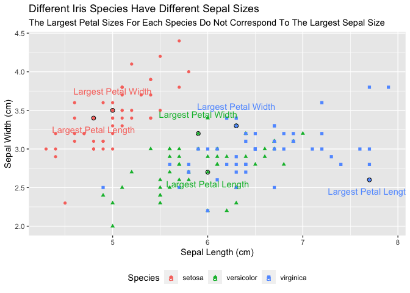
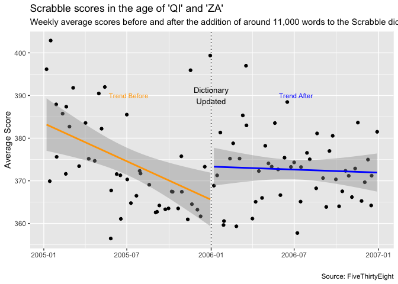

```r
#install.packages("ggrepel")
library(ggrepel)
```

```
## Loading required package: ggplot2
```

```r
library(knitr)
library(tidyverse)
```

```
## ── Attaching packages ─────────────────────────────────────── tidyverse 1.3.2 ──
```

```
## ✔ tibble  3.1.8      ✔ dplyr   1.0.10
## ✔ tidyr   1.2.0      ✔ stringr 1.4.0 
## ✔ readr   2.1.2      ✔ forcats 0.5.2 
## ✔ purrr   0.3.4
```

```
## Warning: package 'tidyr' was built under R version 4.0.5
```

```
## Warning: package 'readr' was built under R version 4.0.5
```

```
## ── Conflicts ────────────────────────────────────────── tidyverse_conflicts() ──
## ✖ dplyr::filter() masks stats::filter()
## ✖ dplyr::lag()    masks stats::lag()
```

```r
library(ggplot2)
library(readr)
library(downloader)
library(dplyr)
library(lubridate)
```

```
## 
## Attaching package: 'lubridate'
## 
## The following objects are masked from 'package:base':
## 
##     date, intersect, setdiff, union
```

```r
library(ggrepel)
```


```r
iris_data <- iris
head(iris_data)
```

```
##   Sepal.Length Sepal.Width Petal.Length Petal.Width Species
## 1          5.1         3.5          1.4         0.2  setosa
## 2          4.9         3.0          1.4         0.2  setosa
## 3          4.7         3.2          1.3         0.2  setosa
## 4          4.6         3.1          1.5         0.2  setosa
## 5          5.0         3.6          1.4         0.2  setosa
## 6          5.4         3.9          1.7         0.4  setosa
```

```r
iris_data
```

```
##     Sepal.Length Sepal.Width Petal.Length Petal.Width    Species
## 1            5.1         3.5          1.4         0.2     setosa
## 2            4.9         3.0          1.4         0.2     setosa
## 3            4.7         3.2          1.3         0.2     setosa
## 4            4.6         3.1          1.5         0.2     setosa
## 5            5.0         3.6          1.4         0.2     setosa
## 6            5.4         3.9          1.7         0.4     setosa
## 7            4.6         3.4          1.4         0.3     setosa
## 8            5.0         3.4          1.5         0.2     setosa
## 9            4.4         2.9          1.4         0.2     setosa
## 10           4.9         3.1          1.5         0.1     setosa
## 11           5.4         3.7          1.5         0.2     setosa
## 12           4.8         3.4          1.6         0.2     setosa
## 13           4.8         3.0          1.4         0.1     setosa
## 14           4.3         3.0          1.1         0.1     setosa
## 15           5.8         4.0          1.2         0.2     setosa
## 16           5.7         4.4          1.5         0.4     setosa
## 17           5.4         3.9          1.3         0.4     setosa
## 18           5.1         3.5          1.4         0.3     setosa
## 19           5.7         3.8          1.7         0.3     setosa
## 20           5.1         3.8          1.5         0.3     setosa
## 21           5.4         3.4          1.7         0.2     setosa
## 22           5.1         3.7          1.5         0.4     setosa
## 23           4.6         3.6          1.0         0.2     setosa
## 24           5.1         3.3          1.7         0.5     setosa
## 25           4.8         3.4          1.9         0.2     setosa
## 26           5.0         3.0          1.6         0.2     setosa
## 27           5.0         3.4          1.6         0.4     setosa
## 28           5.2         3.5          1.5         0.2     setosa
## 29           5.2         3.4          1.4         0.2     setosa
## 30           4.7         3.2          1.6         0.2     setosa
## 31           4.8         3.1          1.6         0.2     setosa
## 32           5.4         3.4          1.5         0.4     setosa
## 33           5.2         4.1          1.5         0.1     setosa
## 34           5.5         4.2          1.4         0.2     setosa
## 35           4.9         3.1          1.5         0.2     setosa
## 36           5.0         3.2          1.2         0.2     setosa
## 37           5.5         3.5          1.3         0.2     setosa
## 38           4.9         3.6          1.4         0.1     setosa
## 39           4.4         3.0          1.3         0.2     setosa
## 40           5.1         3.4          1.5         0.2     setosa
## 41           5.0         3.5          1.3         0.3     setosa
## 42           4.5         2.3          1.3         0.3     setosa
## 43           4.4         3.2          1.3         0.2     setosa
## 44           5.0         3.5          1.6         0.6     setosa
## 45           5.1         3.8          1.9         0.4     setosa
## 46           4.8         3.0          1.4         0.3     setosa
## 47           5.1         3.8          1.6         0.2     setosa
## 48           4.6         3.2          1.4         0.2     setosa
## 49           5.3         3.7          1.5         0.2     setosa
## 50           5.0         3.3          1.4         0.2     setosa
## 51           7.0         3.2          4.7         1.4 versicolor
## 52           6.4         3.2          4.5         1.5 versicolor
## 53           6.9         3.1          4.9         1.5 versicolor
## 54           5.5         2.3          4.0         1.3 versicolor
## 55           6.5         2.8          4.6         1.5 versicolor
## 56           5.7         2.8          4.5         1.3 versicolor
## 57           6.3         3.3          4.7         1.6 versicolor
## 58           4.9         2.4          3.3         1.0 versicolor
## 59           6.6         2.9          4.6         1.3 versicolor
## 60           5.2         2.7          3.9         1.4 versicolor
## 61           5.0         2.0          3.5         1.0 versicolor
## 62           5.9         3.0          4.2         1.5 versicolor
## 63           6.0         2.2          4.0         1.0 versicolor
## 64           6.1         2.9          4.7         1.4 versicolor
## 65           5.6         2.9          3.6         1.3 versicolor
## 66           6.7         3.1          4.4         1.4 versicolor
## 67           5.6         3.0          4.5         1.5 versicolor
## 68           5.8         2.7          4.1         1.0 versicolor
## 69           6.2         2.2          4.5         1.5 versicolor
## 70           5.6         2.5          3.9         1.1 versicolor
## 71           5.9         3.2          4.8         1.8 versicolor
## 72           6.1         2.8          4.0         1.3 versicolor
## 73           6.3         2.5          4.9         1.5 versicolor
## 74           6.1         2.8          4.7         1.2 versicolor
## 75           6.4         2.9          4.3         1.3 versicolor
## 76           6.6         3.0          4.4         1.4 versicolor
## 77           6.8         2.8          4.8         1.4 versicolor
## 78           6.7         3.0          5.0         1.7 versicolor
## 79           6.0         2.9          4.5         1.5 versicolor
## 80           5.7         2.6          3.5         1.0 versicolor
## 81           5.5         2.4          3.8         1.1 versicolor
## 82           5.5         2.4          3.7         1.0 versicolor
## 83           5.8         2.7          3.9         1.2 versicolor
## 84           6.0         2.7          5.1         1.6 versicolor
## 85           5.4         3.0          4.5         1.5 versicolor
## 86           6.0         3.4          4.5         1.6 versicolor
## 87           6.7         3.1          4.7         1.5 versicolor
## 88           6.3         2.3          4.4         1.3 versicolor
## 89           5.6         3.0          4.1         1.3 versicolor
## 90           5.5         2.5          4.0         1.3 versicolor
## 91           5.5         2.6          4.4         1.2 versicolor
## 92           6.1         3.0          4.6         1.4 versicolor
## 93           5.8         2.6          4.0         1.2 versicolor
## 94           5.0         2.3          3.3         1.0 versicolor
## 95           5.6         2.7          4.2         1.3 versicolor
## 96           5.7         3.0          4.2         1.2 versicolor
## 97           5.7         2.9          4.2         1.3 versicolor
## 98           6.2         2.9          4.3         1.3 versicolor
## 99           5.1         2.5          3.0         1.1 versicolor
## 100          5.7         2.8          4.1         1.3 versicolor
## 101          6.3         3.3          6.0         2.5  virginica
## 102          5.8         2.7          5.1         1.9  virginica
## 103          7.1         3.0          5.9         2.1  virginica
## 104          6.3         2.9          5.6         1.8  virginica
## 105          6.5         3.0          5.8         2.2  virginica
## 106          7.6         3.0          6.6         2.1  virginica
## 107          4.9         2.5          4.5         1.7  virginica
## 108          7.3         2.9          6.3         1.8  virginica
## 109          6.7         2.5          5.8         1.8  virginica
## 110          7.2         3.6          6.1         2.5  virginica
## 111          6.5         3.2          5.1         2.0  virginica
## 112          6.4         2.7          5.3         1.9  virginica
## 113          6.8         3.0          5.5         2.1  virginica
## 114          5.7         2.5          5.0         2.0  virginica
## 115          5.8         2.8          5.1         2.4  virginica
## 116          6.4         3.2          5.3         2.3  virginica
## 117          6.5         3.0          5.5         1.8  virginica
## 118          7.7         3.8          6.7         2.2  virginica
## 119          7.7         2.6          6.9         2.3  virginica
## 120          6.0         2.2          5.0         1.5  virginica
## 121          6.9         3.2          5.7         2.3  virginica
## 122          5.6         2.8          4.9         2.0  virginica
## 123          7.7         2.8          6.7         2.0  virginica
## 124          6.3         2.7          4.9         1.8  virginica
## 125          6.7         3.3          5.7         2.1  virginica
## 126          7.2         3.2          6.0         1.8  virginica
## 127          6.2         2.8          4.8         1.8  virginica
## 128          6.1         3.0          4.9         1.8  virginica
## 129          6.4         2.8          5.6         2.1  virginica
## 130          7.2         3.0          5.8         1.6  virginica
## 131          7.4         2.8          6.1         1.9  virginica
## 132          7.9         3.8          6.4         2.0  virginica
## 133          6.4         2.8          5.6         2.2  virginica
## 134          6.3         2.8          5.1         1.5  virginica
## 135          6.1         2.6          5.6         1.4  virginica
## 136          7.7         3.0          6.1         2.3  virginica
## 137          6.3         3.4          5.6         2.4  virginica
## 138          6.4         3.1          5.5         1.8  virginica
## 139          6.0         3.0          4.8         1.8  virginica
## 140          6.9         3.1          5.4         2.1  virginica
## 141          6.7         3.1          5.6         2.4  virginica
## 142          6.9         3.1          5.1         2.3  virginica
## 143          5.8         2.7          5.1         1.9  virginica
## 144          6.8         3.2          5.9         2.3  virginica
## 145          6.7         3.3          5.7         2.5  virginica
## 146          6.7         3.0          5.2         2.3  virginica
## 147          6.3         2.5          5.0         1.9  virginica
## 148          6.5         3.0          5.2         2.0  virginica
## 149          6.2         3.4          5.4         2.3  virginica
## 150          5.9         3.0          5.1         1.8  virginica
```


```r
largest_petal_width <- iris_data %>%
  group_by(Species) %>%
  filter(row_number(desc(Petal.Width)) == 1)

largest_petal_width
```

```
## # A tibble: 3 × 5
## # Groups:   Species [3]
##   Sepal.Length Sepal.Width Petal.Length Petal.Width Species   
##          <dbl>       <dbl>        <dbl>       <dbl> <fct>     
## 1          5           3.5          1.6         0.6 setosa    
## 2          5.9         3.2          4.8         1.8 versicolor
## 3          6.3         3.3          6           2.5 virginica
```


```r
largest_petal_length <- iris_data %>%
  group_by(Species) %>%
 filter(row_number(desc(Petal.Length)) == 1)

largest_petal_length
```

```
## # A tibble: 3 × 5
## # Groups:   Species [3]
##   Sepal.Length Sepal.Width Petal.Length Petal.Width Species   
##          <dbl>       <dbl>        <dbl>       <dbl> <fct>     
## 1          4.8         3.4          1.9         0.2 setosa    
## 2          6           2.7          5.1         1.6 versicolor
## 3          7.7         2.6          6.9         2.3 virginica
```


```r
plot1 <- ggplot(data = iris_data, mapping = aes(x = Sepal.Length, y = Sepal.Width, color = Species, shape = Species)) + 
  geom_point() + 
  geom_text(aes(color = Species, label = "Largest Petal Length"), data = largest_petal_length, nudge_y = -.15) +
  geom_point(size = 2, shape = 1, color = "black", data = largest_petal_length) +
  geom_text(aes(color = Species, label = "Largest Petal Width"), data = largest_petal_width, nudge_y = .25) +
  geom_point(size = 2, shape = 1, color = "black", data = largest_petal_width) +
   labs (x = "Sepal Length (cm)",
        y = "Sepal Width (cm)",
        title = "Different Iris Species Have Different Sepal Sizes",
        subtitle = "The Largest Petal Sizes For Each Species Do Not Correspond To The Largest Sepal Size") +
  theme(legend.position = "bottom")


plot1
```

<!-- -->


```r
scrabble <- tempfile()

download.file("https://github.com/fivethirtyeight/data/raw/master/scrabble-games/scrabble_games.csv", scrabble, mode = "wd")

Scrabble_data <- read_csv(scrabble)
```

```
## Rows: 1542642 Columns: 19
## ── Column specification ────────────────────────────────────────────────────────
## Delimiter: ","
## chr   (2): winnername, losername
## dbl  (14): gameid, tourneyid, winnerid, winnerscore, winneroldrating, winner...
## lgl   (2): tie, lexicon
## date  (1): date
## 
## ℹ Use `spec()` to retrieve the full column specification for this data.
## ℹ Specify the column types or set `show_col_types = FALSE` to quiet this message.
```

```r
head(Scrabble_data)
```

```
## # A tibble: 6 × 19
##   gameid tourneyid tie   winne…¹ winne…² winne…³ winne…⁴ winne…⁵ winne…⁶ loserid
##    <dbl>     <dbl> <lgl>   <dbl> <chr>     <dbl>   <dbl>   <dbl>   <dbl>   <dbl>
## 1      1         1 FALSE     268 Harrie…       0    1568    1684       1     429
## 2      2         1 FALSE     268 Harrie…       0    1568    1684       1     435
## 3      3         1 FALSE     268 Harrie…       0    1568    1684       1     441
## 4      4         1 FALSE     268 Harrie…       0    1568    1684       1     456
## 5      5         1 FALSE     268 Harrie…       0    1568    1684       1    1334
## 6      6         1 FALSE     268 Harrie…       0    1568    1684       1     454
## # … with 9 more variables: losername <chr>, loserscore <dbl>,
## #   loseroldrating <dbl>, losernewrating <dbl>, loserpos <dbl>, round <dbl>,
## #   division <dbl>, date <date>, lexicon <lgl>, and abbreviated variable names
## #   ¹​winnerid, ²​winnername, ³​winnerscore, ⁴​winneroldrating, ⁵​winnernewrating,
## #   ⁶​winnerpos
```


```r
ScrabbleAll <- Scrabble_data %>%
  select(date, winnerscore, loserscore) %>%
  pivot_longer(c("winnerscore","loserscore"), names_to = "win-loss", values_to = "score") %>%
  filter(score > 0) %>%
  mutate(year = year(date),
         week = week(date)
  )

head(ScrabbleAll)
```

```
## # A tibble: 6 × 5
##   date       `win-loss`  score  year  week
##   <date>     <chr>       <dbl> <dbl> <dbl>
## 1 1999-01-15 winnerscore   521  1999     3
## 2 1999-01-15 loserscore    237  1999     3
## 3 1999-01-15 winnerscore   488  1999     3
## 4 1999-01-15 loserscore    262  1999     3
## 5 1999-01-15 winnerscore   465  1999     3
## 6 1999-01-15 loserscore    330  1999     3
```


```r
avgscore <- ScrabbleAll %>%
  filter(year == 2005 | year == 2006) %>%
  group_by(year, week) %>%
  summarise(averagescore = mean(score), date = max(date))
```

```
## `summarise()` has grouped output by 'year'. You can override using the
## `.groups` argument.
```

```r
avgscore
```

```
## # A tibble: 97 × 4
## # Groups:   year [2]
##     year  week averagescore date      
##    <dbl> <dbl>        <dbl> <date>    
##  1  2005     1         396. 2005-01-07
##  2  2005     2         370. 2005-01-14
##  3  2005     3         403. 2005-01-16
##  4  2005     4         388. 2005-01-28
##  5  2005     5         376. 2005-01-29
##  6  2005     6         386. 2005-02-11
##  7  2005     7         372. 2005-02-18
##  8  2005     8         387. 2005-02-19
##  9  2005     9         383. 2005-02-26
## 10  2005    10         392. 2005-03-06
## # … with 87 more rows
```


```r
earlyaverage <- avgscore %>%
  filter(year == "2005")

earlyaverage
```

```
## # A tibble: 46 × 4
## # Groups:   year [1]
##     year  week averagescore date      
##    <dbl> <dbl>        <dbl> <date>    
##  1  2005     1         396. 2005-01-07
##  2  2005     2         370. 2005-01-14
##  3  2005     3         403. 2005-01-16
##  4  2005     4         388. 2005-01-28
##  5  2005     5         376. 2005-01-29
##  6  2005     6         386. 2005-02-11
##  7  2005     7         372. 2005-02-18
##  8  2005     8         387. 2005-02-19
##  9  2005     9         383. 2005-02-26
## 10  2005    10         392. 2005-03-06
## # … with 36 more rows
```


```r
lateaverage <- avgscore %>%
  filter(year == "2006") 
  
lateaverage
```

```
## # A tibble: 51 × 4
## # Groups:   year [1]
##     year  week averagescore date      
##    <dbl> <dbl>        <dbl> <date>    
##  1  2006     1         369. 2006-01-07
##  2  2006     2         371. 2006-01-14
##  3  2006     3         381. 2006-01-21
##  4  2006     4         360. 2006-01-28
##  5  2006     5         361. 2006-01-29
##  6  2006     6         375. 2006-02-11
##  7  2006     7         379. 2006-02-18
##  8  2006     8         359. 2006-02-25
##  9  2006     9         375. 2006-03-04
## 10  2006    10         385. 2006-03-11
## # … with 41 more rows
```


```r
plot2 <- ggplot(data = avgscore, mapping = aes(x = date, y = averagescore)) + 
  geom_point() +
  geom_smooth(data = earlyaverage, method = 'lm', color = "orange") + 
  annotate ("text", x = as.Date("2005-07-05"), y = 390, label = "Trend Before", size = 3, color = "orange") +
  geom_smooth(data = lateaverage, method = 'lm', color = "blue") +
  annotate ("text", x = as.Date("2006-07-05"), y = 390, label = "Trend After", size = 3, color = "blue") +
  geom_vline(xintercept=as.Date("2006-01-01"), linetype = "dotted") + 
  labs (x = "", y = "Average Score", title = "Scrabble scores in the age of 'QI' and 'ZA'", subtitle = "Weekly average scores before and after the addition of around 11,000 words to the Scrabble dictionary", caption = "Source: FiveThirtyEight") +
  annotate("text", x = as.Date("2006-01-01"), y = 390, label = "Dictionary\nUpdated", size = 3.5)

plot2
```

```
## `geom_smooth()` using formula 'y ~ x'
## `geom_smooth()` using formula 'y ~ x'
```

<!-- -->
