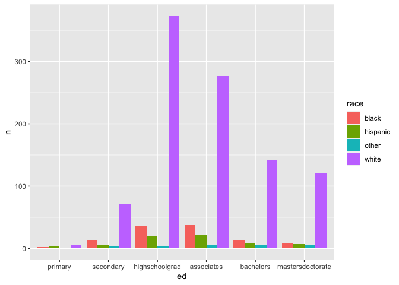
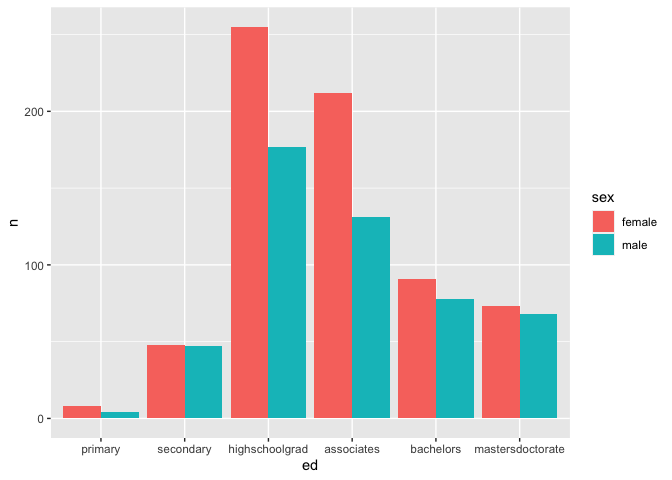
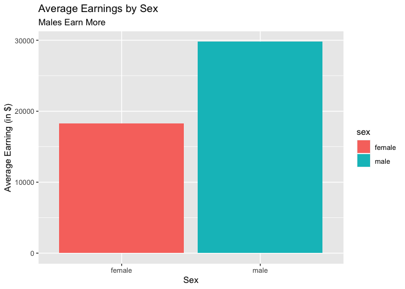

```r
library(ggplot2)
library(readr)
```

```
## Warning: package 'readr' was built under R version 4.0.5
```

```r
library(knitr)
library(tidyverse)
```

```
## ── Attaching packages ─────────────────────────────────────── tidyverse 1.3.2 ──
## ✔ tibble  3.1.8      ✔ dplyr   1.0.10
## ✔ tidyr   1.2.0      ✔ stringr 1.4.0 
## ✔ purrr   0.3.4      ✔ forcats 0.5.2
```

```
## Warning: package 'tidyr' was built under R version 4.0.5
```

```
## ── Conflicts ────────────────────────────────────────── tidyverse_conflicts() ──
## ✖ dplyr::filter() masks stats::filter()
## ✖ dplyr::lag()    masks stats::lag()
```

```r
library(dplyr)
library(forcats)
library(downloader)
```


```r
download.file("https://raw.githubusercontent.com/hadley/r4ds/master/data/heights.csv", "heights")
```


```r
Height <- read_csv("heights")
```

```
## Rows: 1192 Columns: 6
## ── Column specification ────────────────────────────────────────────────────────
## Delimiter: ","
## chr (2): sex, race
## dbl (4): earn, height, ed, age
## 
## ℹ Use `spec()` to retrieve the full column specification for this data.
## ℹ Specify the column types or set `show_col_types = FALSE` to quiet this message.
```

```r
Height
```

```
## # A tibble: 1,192 × 6
##     earn height sex       ed   age race    
##    <dbl>  <dbl> <chr>  <dbl> <dbl> <chr>   
##  1 50000   74.4 male      16    45 white   
##  2 60000   65.5 female    16    58 white   
##  3 30000   63.6 female    16    29 white   
##  4 50000   63.1 female    16    91 other   
##  5 51000   63.4 female    17    39 white   
##  6  9000   64.4 female    15    26 white   
##  7 29000   61.7 female    12    49 white   
##  8 32000   72.7 male      17    46 white   
##  9  2000   72.0 male      15    21 hispanic
## 10 27000   72.2 male      12    26 white   
## # … with 1,182 more rows
```


```r
HeightEd <- Height %>%
  mutate(ed = as.factor(ed)) %>%
  mutate(ed = fct_recode(ed,
                         "primary" = "3",
                         "primary" = "4",
                         "primary" = "5",
                         "primary" = "6",
                         "secondary" = "7",
                         "secondary" = "8",
                         "secondary" = "9",
                         "secondary" = "10",
                         "secondary" = "11",
                         "highschoolgrad" = "12",
                         "associates" = "13",
                         "associates" = "14",
                         "associates" = "15",
                         "bachelors" =  "16",
                         "mastersdoctorate" = "17",
                         "mastersdoctorate" = "18"))

HeightEd
```

```
## # A tibble: 1,192 × 6
##     earn height sex    ed                 age race    
##    <dbl>  <dbl> <chr>  <fct>            <dbl> <chr>   
##  1 50000   74.4 male   bachelors           45 white   
##  2 60000   65.5 female bachelors           58 white   
##  3 30000   63.6 female bachelors           29 white   
##  4 50000   63.1 female bachelors           91 other   
##  5 51000   63.4 female mastersdoctorate    39 white   
##  6  9000   64.4 female associates          26 white   
##  7 29000   61.7 female highschoolgrad      49 white   
##  8 32000   72.7 male   mastersdoctorate    46 white   
##  9  2000   72.0 male   associates          21 hispanic
## 10 27000   72.2 male   highschoolgrad      26 white   
## # … with 1,182 more rows
```


```r
HeightEd1 <- HeightEd %>%
  group_by(race) %>%
  count(ed) 

HeightEd1
```

```
## # A tibble: 24 × 3
## # Groups:   race [4]
##    race     ed                   n
##    <chr>    <fct>            <int>
##  1 black    primary              2
##  2 black    secondary           14
##  3 black    highschoolgrad      36
##  4 black    associates          38
##  5 black    bachelors           13
##  6 black    mastersdoctorate     9
##  7 hispanic primary              3
##  8 hispanic secondary            6
##  9 hispanic highschoolgrad      19
## 10 hispanic associates          22
## # … with 14 more rows
```


```r
edrace <- ggplot(data = HeightEd1, aes(x = ed, y = n, fill = race)) +
  geom_bar(stat = "identity", position = "dodge")


edrace
```

<!-- -->


```r
HeightEd2 <- HeightEd %>%
  group_by(sex) %>%
  count(ed) 

HeightEd2
```

```
## # A tibble: 12 × 3
## # Groups:   sex [2]
##    sex    ed                   n
##    <chr>  <fct>            <int>
##  1 female primary              8
##  2 female secondary           48
##  3 female highschoolgrad     255
##  4 female associates         212
##  5 female bachelors           91
##  6 female mastersdoctorate    73
##  7 male   primary              4
##  8 male   secondary           47
##  9 male   highschoolgrad     177
## 10 male   associates         131
## 11 male   bachelors           78
## 12 male   mastersdoctorate    68
```


```r
edsex <- ggplot(data = HeightEd2, aes(x = ed, y = n, fill = sex)) +
  geom_bar(stat = "identity", position = "dodge")

edsex
```

<!-- -->


```r
meanearn <- HeightEd %>%
  group_by(sex) %>%
  mean(earn)
```

```
## Warning in mean.default(., earn): argument is not numeric or logical: returning
## NA
```

```r
meanearn <- HeightEd %>%
  group_by(sex) %>%
  summarise(averageearn = mean(earn))

meanearn
```

```
## # A tibble: 2 × 2
##   sex    averageearn
##   <chr>        <dbl>
## 1 female      18280.
## 2 male        29786.
```

```r
extra <- ggplot(data = meanearn, aes(x = sex, y = averageearn, fill = sex)) +
  geom_bar(stat = "identity", position = "dodge") +
  labs(x = "Sex", y = "Average Earning (in $)", title = "Average Earnings by Sex", subtitle = "Males Earn More") 


extra
```

<!-- -->

From this graph, it is very easy to tell that men get paid more, on average, than women do. Of course there will be women who make more than some men, but, in general, we can say that men make more than women. We could delve further into the analysis, and see the breakdown of male vs female by race and the earnings they make if we wanted to as well. 
