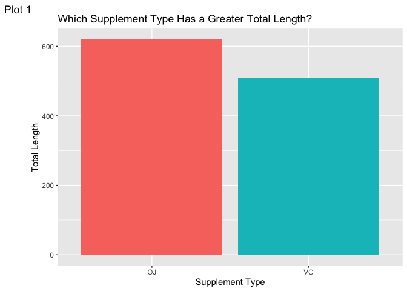
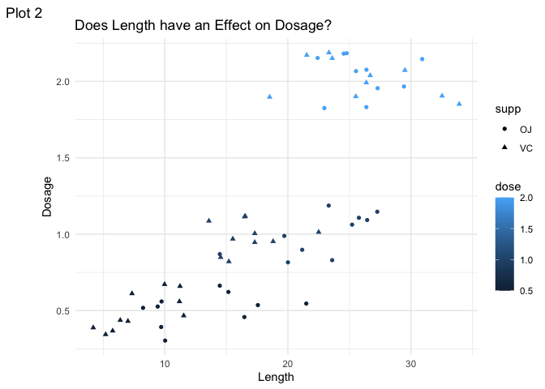
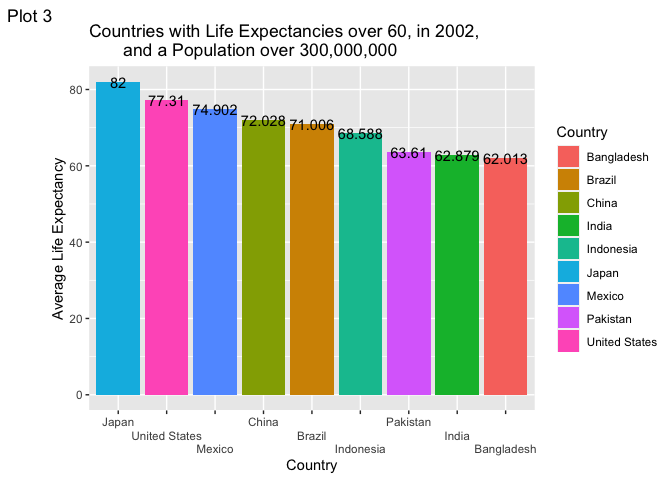
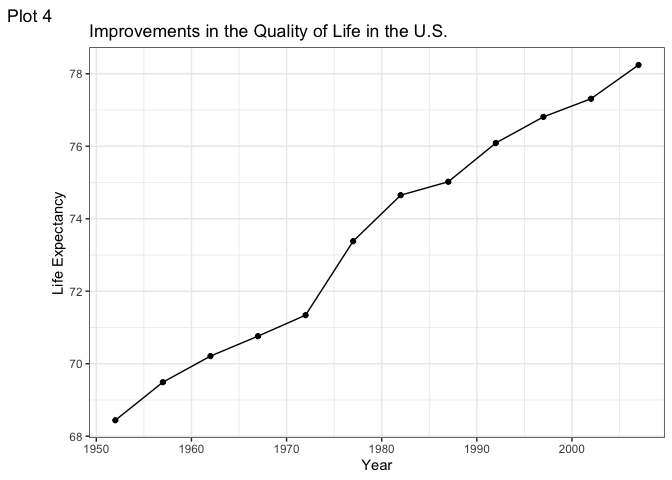

```r
?ToothGrowth
```


```r
library(ggplot2)
library(readr)
```

```
## Warning: package 'readr' was built under R version 4.0.5
```

```r
library(knitr)
library(tidyverse)
```

```
## ── Attaching packages ─────────────────────────────────────── tidyverse 1.3.2 ──
## ✔ tibble  3.1.8      ✔ dplyr   1.0.10
## ✔ tidyr   1.2.0      ✔ stringr 1.4.0 
## ✔ purrr   0.3.4      ✔ forcats 0.5.2
```

```
## Warning: package 'tidyr' was built under R version 4.0.5
```

```
## ── Conflicts ────────────────────────────────────────── tidyverse_conflicts() ──
## ✖ dplyr::filter() masks stats::filter()
## ✖ dplyr::lag()    masks stats::lag()
```

```r
library(dplyr)
library(forcats)
library(downloader)
```

Does Supplement Type VC or OJ have a greater total length? 

```r
plot1 <- ggplot(data = ToothGrowth, mapping = aes(y = len, x = supp, fill = supp)) +
  geom_col() +
  labs(x = 'Supplement Type', y = 'Total Length', title = 'Which Supplement Type Has a Greater Total Length?', tag = "Plot 1") +
  theme(legend.position = "none")
  
plot1
```

<!-- -->
When added up, we can see that the supplement OJ has a greater total length than its counterpart, VC. We can assime that those with longer teeth, will be given OJ as opposed to VC. 

I used a bar chart to convey this because I was looking at OJ vs VC. I filled them by supplement so that it would be very easy to tell which one exactly was which. I added labels to make the graph easier to understand, and removed the legend because it is clearly labeled underneath it. 


Does Length have an effect on Dosage? 

```r
plot2 <- ggplot(data = ToothGrowth) +
  geom_point(data = ToothGrowth, mapping = aes(y = dose, x = len, color = dose, shape = supp)) +
  theme_minimal() +
  labs(y = 'Dosage', x = 'Length', title = 'Does Length have an Effect on Dosage?', tag = "Plot 2") 
  
  
plot2
```

<!-- -->
We can see that tooth legnth DOES have an effect on dosage. Individuals that were given a doage of .5 milligrams/day had a lot of data points under 10, and the rest under 20 (except for the one outlier). At a dosage of 1, length varied but sat between 14 and 26. At a dosage of 2, we can see, clearly, that length is the greatest here, and we find most the data points fall between 22 and 30, although there are some that tricke into the 30's as well.

I used geom point to represent how many indiivudals were examined at each dosage, and added the shape feature so that we can distinguish between supplement type OJ and VC. I addded theme_minimal to make the lines behind the data not as harsh, allowing us to be able to see the circle and triangles better. I added labels, to describe what was happening in the graph, and the different colors make it very easy to see the difference in dosages. Looking back, a bar graph might have been a better option, as we would have just been looking at the different doages. 


```r
library(gapminder)

?gapminder
```

Which countries have a life expectancy over 60 in 2002 and a population over 300,000,000? What are their life expectancies? 

```r
data60 <- gapminder %>%
  filter(lifeExp >= 60, year == 2002, pop >= 100000000)

data60
```

```
## # A tibble: 9 × 6
##   country       continent  year lifeExp        pop gdpPercap
##   <fct>         <fct>     <int>   <dbl>      <int>     <dbl>
## 1 Bangladesh    Asia       2002    62.0  135656790     1136.
## 2 Brazil        Americas   2002    71.0  179914212     8131.
## 3 China         Asia       2002    72.0 1280400000     3119.
## 4 India         Asia       2002    62.9 1034172547     1747.
## 5 Indonesia     Asia       2002    68.6  211060000     2874.
## 6 Japan         Asia       2002    82    127065841    28605.
## 7 Mexico        Americas   2002    74.9  102479927    10742.
## 8 Pakistan      Asia       2002    63.6  153403524     2093.
## 9 United States Americas   2002    77.3  287675526    39097.
```

```r
plot3 <- ggplot(data = data60, mapping = aes(x = reorder(country, -lifeExp), y = lifeExp, fill = country)) +
  geom_col() +
  geom_text(aes(label = lifeExp)) +
  scale_x_discrete(guide = guide_axis(n.dodge=3)) +
  labs(x = "Country", y = "Average Life Expectancy", title = "Countries with Life Expectancies over 60, in 2002, 
       and a Population over 300,000,000", fill = "Country", tag = "Plot 3")

plot3 
```

<!-- -->

This plot shows us the countries who have a life expectancy over 60, in the year 2002, and only includes those with a population over 300,000,000. There were 9 countries in total who fit the criteria, and you can clearly see that through the labels and the differing colors in the plot. It is ordered in descending order, just to make the graph cleaner and easier to read and compare with other values. I chose a bar chart because only 9 countries fit the criteria, and it would be clear to my audience which countries were "better" than others. I labeled them as well, so that it was not up to interpretation what the exact values were. I repositioned the labels on the x-axis so that they did not overlap, and labeled the graph accordingly.


Has the Life Expectancy in the U.S. continuously gotten better, year after year? 

```r
gapminderus <- gapminder %>%
  filter(country == "United States")
gapminderus
```

```
## # A tibble: 12 × 6
##    country       continent  year lifeExp       pop gdpPercap
##    <fct>         <fct>     <int>   <dbl>     <int>     <dbl>
##  1 United States Americas   1952    68.4 157553000    13990.
##  2 United States Americas   1957    69.5 171984000    14847.
##  3 United States Americas   1962    70.2 186538000    16173.
##  4 United States Americas   1967    70.8 198712000    19530.
##  5 United States Americas   1972    71.3 209896000    21806.
##  6 United States Americas   1977    73.4 220239000    24073.
##  7 United States Americas   1982    74.6 232187835    25010.
##  8 United States Americas   1987    75.0 242803533    29884.
##  9 United States Americas   1992    76.1 256894189    32004.
## 10 United States Americas   1997    76.8 272911760    35767.
## 11 United States Americas   2002    77.3 287675526    39097.
## 12 United States Americas   2007    78.2 301139947    42952.
```

```r
plot4 <- ggplot(gapminderus, mapping = aes(x = year, y = lifeExp)) +
  geom_point() +
  geom_line() +
  labs(x = "Year", y = "Life Expectancy", title = "Improvements in the Quality of Life in the U.S.", tag = 'Plot 4') +
  theme_bw()


plot4  
```

<!-- -->

This graph looks at all the U.S. data, from 1952 to 2007, incremented by 5 years. We can clearly see that year after year (or every 5 years) the life expectancy does improve. In 1952, we had a life expectancy of 68.4 years, and over the course of 55 years, we improved that by just about 10 years, all the way to 78.2. I chose a scatter plot and added a line so that it was easy to follow and clear that this trend is occurring. I added labels, accordingly, and added a theme to make the graph pop a little more. I did not feel there was a need for color on this graph. 


