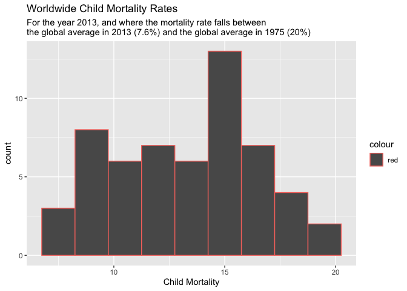

```r
library(ggplot2)
library(readr)
```

```
## Warning: package 'readr' was built under R version 4.0.5
```

```r
library(knitr)
library(tidyverse)
```

```
## ── Attaching packages ─────────────────────────────────────── tidyverse 1.3.2 ──
## ✔ tibble  3.1.8      ✔ dplyr   1.0.10
## ✔ tidyr   1.2.0      ✔ stringr 1.4.0 
## ✔ purrr   0.3.4      ✔ forcats 0.5.2
```

```
## Warning: package 'tidyr' was built under R version 4.0.5
```

```
## ── Conflicts ────────────────────────────────────────── tidyverse_conflicts() ──
## ✖ dplyr::filter() masks stats::filter()
## ✖ dplyr::lag()    masks stats::lag()
```

```r
library(dplyr)
library(forcats)
library(downloader)
library(corrplot)
```

```
## corrplot 0.92 loaded
```


```r
download.file('https://raw.githubusercontent.com/martinerin/myrepo/master/financing_healthcare.csv', 'finance')
```


```r
finance <- read.csv('finance') 
summary(finance)
```

```
##       year        country           continent         health_exp_total 
##  Min.   :1761   Length:36873       Length:36873       Min.   :   4.93  
##  1st Qu.:1859   Class :character   Class :character   1st Qu.:  93.05  
##  Median :1921   Mode  :character   Mode  :character   Median : 298.79  
##  Mean   :1917                                         Mean   : 653.20  
##  3rd Qu.:1977                                         3rd Qu.: 828.20  
##  Max.   :2015                                         Max.   :6863.65  
##                                                       NA's   :33311    
##  health_exp_public health_insurance    nhs_exp      health_exp_private
##  Min.   :0.00      Min.   :  6.00   Min.   :3.36    Min.   :3.03      
##  1st Qu.:0.48      1st Qu.: 34.00   1st Qu.:5.42    1st Qu.:3.27      
##  Median :2.55      Median : 54.00   Median :5.69    Median :4.58      
##  Mean   :3.14      Mean   : 58.18   Mean   :6.16    Mean   :5.38      
##  3rd Qu.:5.80      3rd Qu.: 88.75   3rd Qu.:7.54    3rd Qu.:7.23      
##  Max.   :8.80      Max.   :100.00   Max.   :9.10    Max.   :9.05      
##  NA's   :36775     NA's   :36845    NA's   :36846   NA's   :36856     
##  health_insurance_govt health_insurance_private health_insurance_any
##  Min.   :23.30         Min.   :63.90            Min.   :83.70       
##  1st Qu.:24.77         1st Qu.:67.30            1st Qu.:84.60       
##  Median :26.40         Median :70.30            Median :84.85       
##  Mean   :27.25         Mean   :69.49            Mean   :85.31       
##  3rd Qu.:28.10         3rd Qu.:71.65            3rd Qu.:86.03       
##  Max.   :36.50         Max.   :75.50            Max.   :89.60       
##  NA's   :36845         NA's   :36845            NA's   :36845       
##  health_exp_public_percent health_exp_oop_percent no_health_insurance
##  Min.   : 0.33             Min.   : 0.03          Min.   : 9.10      
##  1st Qu.:42.08             1st Qu.:17.62          1st Qu.:13.25      
##  Median :57.77             Median :31.56          Median :14.60      
##  Mean   :57.26             Mean   :34.13          Mean   :14.29      
##  3rd Qu.:73.31             3rd Qu.:49.08          3rd Qu.:14.90      
##  Max.   :99.97             Max.   :99.67          Max.   :24.30      
##  NA's   :33330             NA's   :33330          NA's   :36834      
##       gdp           life_expectancy   child_mort   
##  Min.   :   246.7   Min.   :19.50   Min.   :  2.0  
##  1st Qu.:  2897.2   1st Qu.:54.98   1st Qu.:124.8  
##  Median :  8348.8   Median :66.32   Median :369.2  
##  Mean   : 14733.5   Mean   :63.26   Mean   :293.6  
##  3rd Qu.: 20018.4   3rd Qu.:71.81   3rd Qu.:425.2  
##  Max.   :136135.5   Max.   :83.83   Max.   :756.3  
##  NA's   :31510      NA's   :24569   NA's   :3632
```

```r
head(finance)
```

```
##   year     country continent health_exp_total health_exp_public
## 1 2015    Abkhazia      <NA>               NA                NA
## 2 1800 Afghanistan      Asia               NA                NA
## 3 1801 Afghanistan      Asia               NA                NA
## 4 1802 Afghanistan      Asia               NA                NA
## 5 1803 Afghanistan      Asia               NA                NA
## 6 1804 Afghanistan      Asia               NA                NA
##   health_insurance nhs_exp health_exp_private health_insurance_govt
## 1               NA      NA                 NA                    NA
## 2               NA      NA                 NA                    NA
## 3               NA      NA                 NA                    NA
## 4               NA      NA                 NA                    NA
## 5               NA      NA                 NA                    NA
## 6               NA      NA                 NA                    NA
##   health_insurance_private health_insurance_any health_exp_public_percent
## 1                       NA                   NA                        NA
## 2                       NA                   NA                        NA
## 3                       NA                   NA                        NA
## 4                       NA                   NA                        NA
## 5                       NA                   NA                        NA
## 6                       NA                   NA                        NA
##   health_exp_oop_percent no_health_insurance gdp life_expectancy child_mort
## 1                     NA                  NA  NA              NA         NA
## 2                     NA                  NA  NA              NA     468.58
## 3                     NA                  NA  NA              NA     468.58
## 4                     NA                  NA  NA              NA     468.58
## 5                     NA                  NA  NA              NA     468.58
## 6                     NA                  NA  NA              NA     468.58
```


```r
childmort <- finance %>%
  select(year, country, child_mort) %>%
  filter(country == 'United States') %>%
  drop_na(child_mort)

childmort
```

```
##     year       country child_mort
## 1   1800 United States     329.04
## 2   1801 United States     329.04
## 3   1802 United States     329.04
## 4   1803 United States     329.04
## 5   1804 United States     329.04
## 6   1805 United States     329.04
## 7   1806 United States     329.04
## 8   1807 United States     329.04
## 9   1808 United States     329.04
## 10  1809 United States     329.04
## 11  1810 United States     329.04
## 12  1811 United States     329.04
## 13  1812 United States     329.04
## 14  1813 United States     329.04
## 15  1814 United States     329.04
## 16  1815 United States     329.04
## 17  1816 United States     329.04
## 18  1817 United States     329.04
## 19  1818 United States     329.04
## 20  1819 United States     329.04
## 21  1820 United States     329.04
## 22  1821 United States     329.04
## 23  1822 United States     329.04
## 24  1823 United States     329.04
## 25  1824 United States     329.04
## 26  1825 United States     329.04
## 27  1826 United States     329.04
## 28  1827 United States     329.04
## 29  1828 United States     329.04
## 30  1829 United States     329.04
## 31  1830 United States     329.04
## 32  1831 United States     329.04
## 33  1832 United States     329.04
## 34  1833 United States     329.04
## 35  1834 United States     329.04
## 36  1835 United States     329.04
## 37  1836 United States     329.04
## 38  1837 United States     329.04
## 39  1838 United States     329.04
## 40  1839 United States     329.04
## 41  1840 United States     329.04
## 42  1841 United States     329.04
## 43  1842 United States     329.04
## 44  1843 United States     329.04
## 45  1844 United States     329.04
## 46  1845 United States     329.04
## 47  1846 United States     329.04
## 48  1847 United States     329.04
## 49  1848 United States     329.04
## 50  1849 United States     329.04
## 51  1850 United States     329.04
## 52  1851 United States     329.04
## 53  1852 United States     329.04
## 54  1853 United States     329.04
## 55  1854 United States     329.04
## 56  1855 United States     329.04
## 57  1856 United States     329.04
## 58  1857 United States     329.04
## 59  1858 United States     329.04
## 60  1859 United States     329.04
## 61  1860 United States     329.04
## 62  1861 United States     329.04
## 63  1862 United States     329.04
## 64  1863 United States     329.04
## 65  1864 United States     329.04
## 66  1865 United States     329.04
## 67  1866 United States     329.04
## 68  1867 United States     329.04
## 69  1868 United States     329.04
## 70  1869 United States     329.04
## 71  1870 United States     329.04
## 72  1871 United States     329.04
## 73  1872 United States     329.04
## 74  1873 United States     329.04
## 75  1874 United States     329.04
## 76  1875 United States     329.04
## 77  1876 United States     329.04
## 78  1877 United States     329.04
## 79  1878 United States     329.04
## 80  1879 United States     329.04
## 81  1880 United States     329.04
## 82  1881 United States     322.40
## 83  1882 United States     315.87
## 84  1883 United States     309.38
## 85  1884 United States     304.05
## 86  1885 United States     297.70
## 87  1886 United States     291.41
## 88  1887 United States     285.21
## 89  1888 United States     279.06
## 90  1889 United States     274.00
## 91  1890 United States     267.97
## 92  1891 United States     264.00
## 93  1892 United States     260.02
## 94  1893 United States     257.10
## 95  1894 United States     253.19
## 96  1895 United States     249.28
## 97  1896 United States     246.37
## 98  1897 United States     242.47
## 99  1898 United States     238.58
## 100 1899 United States     234.69
## 101 1900 United States     231.70
## 102 1901 United States     227.80
## 103 1902 United States     216.59
## 104 1903 United States     215.43
## 105 1904 United States     224.23
## 106 1905 United States     217.53
## 107 1906 United States     218.96
## 108 1907 United States     217.67
## 109 1908 United States     202.16
## 110 1909 United States     193.91
## 111 1910 United States     202.16
## 112 1911 United States     187.93
## 113 1912 United States     181.60
## 114 1913 United States     186.19
## 115 1914 United States     176.62
## 116 1915 United States     172.10
## 117 1916 United States     179.04
## 118 1917 United States     180.24
## 119 1918 United States     239.32
## 120 1919 United States     168.84
## 121 1920 United States     167.64
## 122 1921 United States     145.53
## 123 1922 United States     145.92
## 124 1923 United States     150.11
## 125 1933 United States      73.14
## 126 1934 United States      79.74
## 127 1935 United States      75.35
## 128 1936 United States      75.98
## 129 1937 United States      73.63
## 130 1938 United States      69.58
## 131 1939 United States      62.93
## 132 1940 United States      61.91
## 133 1941 United States      60.39
## 134 1942 United States      54.77
## 135 1943 United States      53.73
## 136 1944 United States      50.35
## 137 1945 United States      48.26
## 138 1946 United States      46.68
## 139 1947 United States      42.83
## 140 1948 United States      39.76
## 141 1949 United States      39.69
## 142 1950 United States      37.70
## 143 1951 United States      36.70
## 144 1952 United States      35.70
## 145 1953 United States      34.70
## 146 1954 United States      33.80
## 147 1955 United States      33.00
## 148 1956 United States      32.30
## 149 1957 United States      31.70
## 150 1958 United States      31.20
## 151 1959 United States      30.60
## 152 1960 United States      30.10
## 153 1961 United States      29.50
## 154 1962 United States      28.90
## 155 1963 United States      28.30
## 156 1964 United States      27.70
## 157 1965 United States      27.10
## 158 1966 United States      26.40
## 159 1967 United States      25.70
## 160 1968 United States      24.90
## 161 1969 United States      24.10
## 162 1970 United States      23.30
## 163 1971 United States      22.40
## 164 1972 United States      21.50
## 165 1973 United States      20.60
## 166 1974 United States      19.70
## 167 1975 United States      18.80
## 168 1976 United States      17.90
## 169 1977 United States      17.10
## 170 1978 United States      16.30
## 171 1979 United States      15.60
## 172 1980 United States      15.00
## 173 1981 United States      14.40
## 174 1982 United States      13.90
## 175 1983 United States      13.40
## 176 1984 United States      13.00
## 177 1985 United States      12.70
## 178 1986 United States      12.40
## 179 1987 United States      12.10
## 180 1988 United States      11.90
## 181 1989 United States      11.60
## 182 1990 United States      11.20
## 183 1991 United States      10.90
## 184 1992 United States      10.50
## 185 1993 United States      10.10
## 186 1994 United States       9.80
## 187 1995 United States       9.50
## 188 1996 United States       9.20
## 189 1997 United States       8.90
## 190 1998 United States       8.70
## 191 1999 United States       8.60
## 192 2000 United States       8.40
## 193 2001 United States       8.30
## 194 2002 United States       8.20
## 195 2003 United States       8.10
## 196 2004 United States       8.10
## 197 2005 United States       8.00
## 198 2006 United States       7.90
## 199 2007 United States       7.80
## 200 2008 United States       7.70
## 201 2009 United States       7.50
## 202 2010 United States       7.40
## 203 2011 United States       7.20
## 204 2012 United States       7.10
## 205 2013 United States       6.90
```
This filtered the data to only the United States, and looked at the year and child mortality rate. I also removed NA values. 


```r
plot1 <- ggplot(data = childmort, mapping = aes(x = year, y = child_mort)) +
  geom_point(alpha = .2) +
  geom_line() +
  labs(x = 'Year', y = 'Child Mortality Rate', title = 'Child Mortality Rate through the Years in the United States')

plot1
```

<!-- -->
I created a scatter plot, of which we can see that there is a downward trend, except for the spike in 1918, and that can be attributed the the influenza pandemic that occurred between 1918 and 1919. I added a trend line, and we can see that child mortality rates continue to drop as we come closer to modern time. 


```r
childmort1 <- finance %>%
  select(year, country, child_mort) %>%
  filter(year ==  2013, child_mort >= 7.6 & child_mort <= 20) %>%
  drop_na(child_mort)

childmort1
```

```
##    year                          country child_mort
## 1  2013                          Albania       14.9
## 2  2013              Antigua and Barbuda        9.3
## 3  2013                        Argentina       13.3
## 4  2013                          Armenia       15.6
## 5  2013                          Bahamas       12.9
## 6  2013                         Barbados       14.4
## 7  2013                           Belize       16.7
## 8  2013                           Brazil       13.7
## 9  2013                           Brunei        9.9
## 10 2013                         Bulgaria       11.6
## 11 2013                            Chile        8.2
## 12 2013                            China       12.7
## 13 2013                         Colombia       16.9
## 14 2013                     Cook Islands        8.8
## 15 2013                       Costa Rica        9.6
## 16 2013                         Dominica       11.4
## 17 2013                      El Salvador       15.7
## 18 2013                          Georgia       13.1
## 19 2013                          Grenada       11.8
## 20 2013                             Iran       16.8
## 21 2013                          Jamaica       16.6
## 22 2013                           Jordan       18.7
## 23 2013                       Kazakhstan       16.3
## 24 2013                           Kuwait        9.5
## 25 2013                           Latvia        8.4
## 26 2013                          Lebanon        9.1
## 27 2013                            Libya       14.5
## 28 2013                         Malaysia        8.5
## 29 2013                         Maldives        9.9
## 30 2013                        Mauritius       14.3
## 31 2013                           Mexico       14.5
## 32 2013                          Moldova       15.4
## 33 2013                             Oman       11.4
## 34 2013                            Palau       17.5
## 35 2013                           Panama       17.9
## 36 2013                             Peru       16.7
## 37 2013                            Qatar        8.2
## 38 2013                          Romania       12.0
## 39 2013                           Russia       10.1
## 40 2013            Saint Kitts and Nevis       10.2
## 41 2013                      Saint Lucia       14.5
## 42 2013 Saint Vincent and the Grenadines       19.0
## 43 2013                            Samoa       18.1
## 44 2013                     Saudi Arabia       15.5
## 45 2013                       Seychelles       14.2
## 46 2013                        Sri Lanka        9.6
## 47 2013                            Syria       14.6
## 48 2013                         Thailand       13.1
## 49 2013                            Tonga       12.1
## 50 2013                          Tunisia       15.2
## 51 2013                           Turkey       19.2
## 52 2013                          Ukraine       10.0
## 53 2013             United Arab Emirates        8.2
## 54 2013                          Uruguay       11.1
## 55 2013                          Vanuatu       16.9
## 56 2013                        Venezuela       14.9
```
Here, I filtered the data to only include the year, country and child mortality rate in the most recent year availble, 2013, and where the child mortality rate was between the global average in 2013 (7.6%) and the global average in 1975 (20%). 


```r
plot2 <- ggplot(data = childmort1, mapping = aes(x = child_mort)) +
  geom_histogram(binwidth = 1.5, aes(color = 'red'), labels = TRUE) +
  labs(x = 'Child Mortality', title = 'Worldwide Child Mortality Rates', subtitle = 'For the year 2013, and where the mortality rate falls between 
the global average in 2013 (7.6%) and the global average in 1975 (20%)') 
```

```
## Warning: Ignoring unknown parameters: labels
```

```r
plot2
```

<!-- -->
I created a histogram that looks at the filtered data mentioned above. We can see that the data is very inconsistent, and follows no linear path nor a bell curve. There are spikes, and there are drops, however, we can see that a child morality rate of around 15 is the most common in the year 2013 globally. I chose red because it has to do with mortality. 


