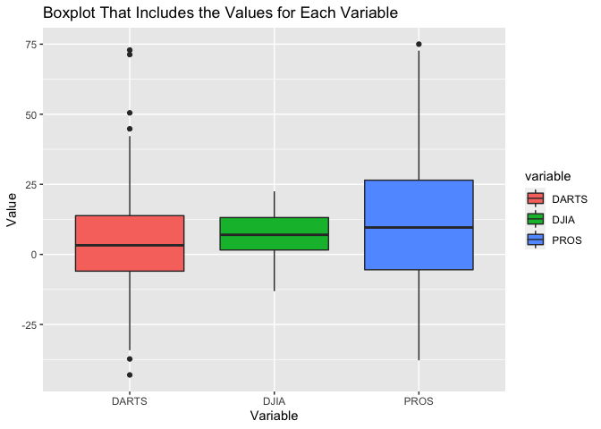
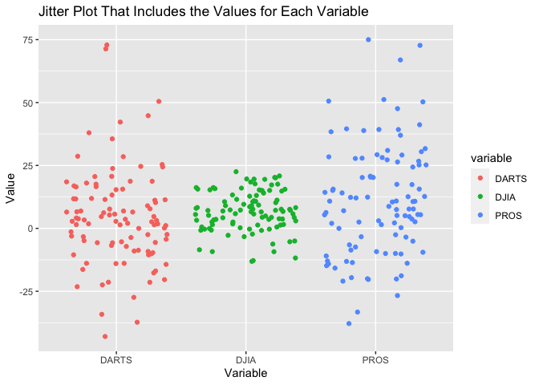
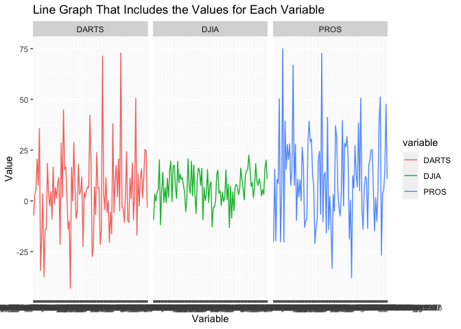
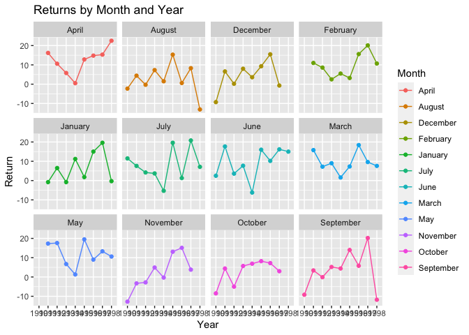

```r
library(readr) 
```

```
## Warning: package 'readr' was built under R version 4.0.5
```

```r
library(haven)
library(readxl)
library(ggplot2)
library(knitr)
library(tidyverse)
```

```
## ── Attaching packages ─────────────────────────────────────── tidyverse 1.3.2 ──
## ✔ tibble  3.1.8      ✔ dplyr   1.0.10
## ✔ tidyr   1.2.0      ✔ stringr 1.4.0 
## ✔ purrr   0.3.4      ✔ forcats 0.5.2
```

```
## Warning: package 'tidyr' was built under R version 4.0.5
```

```
## ── Conflicts ────────────────────────────────────────── tidyverse_conflicts() ──
## ✖ dplyr::filter() masks stats::filter()
## ✖ dplyr::lag()    masks stats::lag()
```

```r
library(dplyr)
library(forcats)
library(corrplot)
```

```
## corrplot 0.92 loaded
```

```r
library(downloader)
library(readr)
```


```r
data1rds <- tempfile()

download.file("https://github.com/WJC-Data-Science/DTS350/raw/master/Dart_Expert_Dow_6month_anova/Dart_Expert_Dow_6month_anova.RDS", data1rds)

data1 <- read_rds(data1rds)

str(data1)
```

```
## tibble [300 × 3] (S3: tbl_df/tbl/data.frame)
##  $ contest_period: chr [1:300] "January-June1990" "February-July1990" "March-August1990" "April-September1990" ...
##  $ variable      : chr [1:300] "PROS" "PROS" "PROS" "PROS" ...
##  $ value         : num [1:300] 12.7 26.4 2.5 -20 -37.8 -33.3 -10.2 -20.3 38.9 20.2 ...
##  - attr(*, "spec")=
##   .. cols(
##   ..   contest_period = col_character(),
##   ..   variable = col_character(),
##   ..   value = col_double()
##   .. )
```

```r
head(data1)
```

```
## # A tibble: 6 × 3
##   contest_period      variable value
##   <chr>               <chr>    <dbl>
## 1 January-June1990    PROS      12.7
## 2 February-July1990   PROS      26.4
## 3 March-August1990    PROS       2.5
## 4 April-September1990 PROS     -20  
## 5 May-October1990     PROS     -37.8
## 6 June-November1990   PROS     -33.3
```

```r
data2 <- read_csv(url("https://github.com/WJC-Data-Science/DTS350/raw/master/Dart_Expert_Dow_6month_anova/Dart_Expert_Dow_6month_anova.csv"))
```

```
## Rows: 300 Columns: 3
## ── Column specification ────────────────────────────────────────────────────────
## Delimiter: ","
## chr (2): contest_period, variable
## dbl (1): value
## 
## ℹ Use `spec()` to retrieve the full column specification for this data.
## ℹ Specify the column types or set `show_col_types = FALSE` to quiet this message.
```

```r
head(data2)
```

```
## # A tibble: 6 × 3
##   contest_period      variable value
##   <chr>               <chr>    <dbl>
## 1 January-June1990    PROS      12.7
## 2 February-July1990   PROS      26.4
## 3 March-August1990    PROS       2.5
## 4 April-September1990 PROS     -20  
## 5 May-October1990     PROS     -37.8
## 6 June-November1990   PROS     -33.3
```

```r
data3 <- read_dta(url("https://github.com/WJC-Data-Science/DTS350/raw/master/Dart_Expert_Dow_6month_anova/Dart_Expert_Dow_6month_anova.dta"))

head(data3)
```

```
## # A tibble: 6 × 3
##   contest_period      variable value
##   <chr>               <chr>    <dbl>
## 1 January-June1990    PROS      12.7
## 2 February-July1990   PROS      26.4
## 3 March-August1990    PROS       2.5
## 4 April-September1990 PROS     -20  
## 5 May-October1990     PROS     -37.8
## 6 June-November1990   PROS     -33.3
```

```r
data4 <- read_sav(url("https://github.com/WJC-Data-Science/DTS350/raw/master/Dart_Expert_Dow_6month_anova/Dart_Expert_Dow_6month_anova.sav"))

head(data4)
```

```
## # A tibble: 6 × 3
##   contest_period      variable value
##   <chr>               <chr>    <dbl>
## 1 January-June1990    PROS      12.7
## 2 February-July1990   PROS      26.4
## 3 March-August1990    PROS       2.5
## 4 April-September1990 PROS     -20  
## 5 May-October1990     PROS     -37.8
## 6 June-November1990   PROS     -33.3
```

```r
datatemp5 <- tempfile()

download.file("https://github.com/WJC-Data-Science/DTS350/raw/master/Dart_Expert_Dow_6month_anova/Dart_Expert_Dow_6month_anova.xlsx", datatemp5)

data5 <- read_xlsx(datatemp5)

head(data5)
```

```
## # A tibble: 6 × 3
##   contest_period      variable value
##   <chr>               <chr>    <dbl>
## 1 January-June1990    PROS      12.7
## 2 February-July1990   PROS      26.4
## 3 March-August1990    PROS       2.5
## 4 April-September1990 PROS     -20  
## 5 May-October1990     PROS     -37.8
## 6 June-November1990   PROS     -33.3
```

Check that all five files you have imported into R are in fact the same with all_equal()

```r
all_equal(data1, data2, data3, convert = TRUE)
```

```
## [1] TRUE
```

```r
all_equal(data1, data4, data5, convert = TRUE)
```

```
## [1] TRUE
```

Use one of the files to make a graphic showing the performance of the Dart, DJIA, and Pro stock selections.
Include a boxplot, the jittered returns, and the average return in your graphic

Boxplot

```r
plot1 <- ggplot(data = data2, mapping = aes(x = variable, y = value, fill = variable)) +
  geom_boxplot() +
  labs(x = "Variable", y = "Value", title = "Boxplot That Includes the Values for Each Variable")

plot1
```

<!-- -->
This boxplot looks at the values for each variable; DARTS, DIJA, and PROS. PROS is the most variable, followed by DARTS, and DIJA has the least variation. 


Jitter Plot

```r
plot2 <- ggplot(data = data2, mapping = aes(x = variable, y = value, color = variable)) +
  geom_jitter() +
  labs(x = "Variable", y = "Value", title = "Jitter Plot That Includes the Values for Each Variable")

plot2
```

<!-- -->
From this jitterplot, we can see that once again, PROS is the most variable, followed by DARTS and then DIJA. DIJA's data points are more condensed than the others. 

Line Graph, facet wrapped by variable name

```r
plot3 <- ggplot(data = data2, mapping = aes(x = contest_period, y = value, color = variable, group = variable)) +
  geom_line() +
  facet_wrap(~ variable) +
  labs(x = "Variable", y = "Value", title = "Line Graph That Includes the Values for Each Variable")

plot3
```

<!-- -->
From the line graph, we can see that DIJA is the most variable. DARTS has the lowest point out of all three variables while PROS has the highest. 

Create a table using code of the DJIA returns that matches the table shown below (“spread” the data).

```r
finaltable <- data2 %>%
  filter(variable == 'DJIA') %>%
  mutate(contest_period = str_replace_all(contest_period, '19', '_19'),
         contest_period = str_replace(contest_period, 'Febuary', 'February'),
         contest_period = str_replace(contest_period, 'Dec._1993', 'December_1993')) %>%
  separate(contest_period, into = c("Month", "year_end"), sep = '-') %>%
  separate(year_end, into = c("Month", "year"), sep = '_') %>%
  pivot_wider(names_from = "year", values_from = "value") %>%
  arrange(factor(Month, levels = month.name)) %>%
  select(-variable)

head(finaltable)
```

```
## # A tibble: 6 × 10
##   Month    `1990` `1991` `1992` `1993` `1994` `1995` `1996` `1997` `1998`
##   <chr>     <dbl>  <dbl>  <dbl>  <dbl>  <dbl>  <dbl>  <dbl>  <dbl>  <dbl>
## 1 January    NA     -0.8    6.5   -0.8   11.2    1.8   15     19.6   -0.3
## 2 February   NA     11      8.6    2.5    5.5    3.2   15.6   20.1   10.7
## 3 March      NA     15.8    7.2    9      1.6    7.3   18.4    9.6    7.6
## 4 April      NA     16.2   10.6    5.8    0.5   12.8   14.8   15.3   22.5
## 5 May        NA     17.3   17.6    6.7    1.3   19.5    9     13.3   10.6
## 6 June        2.5   17.7    3.6    7.7   -6.2   16     10.2   16.2   15
```


Save your “tidy” data as an .rds object.

```r
saveRDS(finaltable, file = "finaltable.rsd")
```


```r
finaldata <- finaltable %>%
  pivot_longer(2:10, names_to = "year", values_to = "return", values_drop_na = TRUE) 

print(finaldata, n = 100)
```

```
## # A tibble: 100 × 3
##     Month     year  return
##     <chr>     <chr>  <dbl>
##   1 January   1991    -0.8
##   2 January   1992     6.5
##   3 January   1993    -0.8
##   4 January   1994    11.2
##   5 January   1995     1.8
##   6 January   1996    15  
##   7 January   1997    19.6
##   8 January   1998    -0.3
##   9 February  1991    11  
##  10 February  1992     8.6
##  11 February  1993     2.5
##  12 February  1994     5.5
##  13 February  1995     3.2
##  14 February  1996    15.6
##  15 February  1997    20.1
##  16 February  1998    10.7
##  17 March     1991    15.8
##  18 March     1992     7.2
##  19 March     1993     9  
##  20 March     1994     1.6
##  21 March     1995     7.3
##  22 March     1996    18.4
##  23 March     1997     9.6
##  24 March     1998     7.6
##  25 April     1991    16.2
##  26 April     1992    10.6
##  27 April     1993     5.8
##  28 April     1994     0.5
##  29 April     1995    12.8
##  30 April     1996    14.8
##  31 April     1997    15.3
##  32 April     1998    22.5
##  33 May       1991    17.3
##  34 May       1992    17.6
##  35 May       1993     6.7
##  36 May       1994     1.3
##  37 May       1995    19.5
##  38 May       1996     9  
##  39 May       1997    13.3
##  40 May       1998    10.6
##  41 June      1990     2.5
##  42 June      1991    17.7
##  43 June      1992     3.6
##  44 June      1993     7.7
##  45 June      1994    -6.2
##  46 June      1995    16  
##  47 June      1996    10.2
##  48 June      1997    16.2
##  49 June      1998    15  
##  50 July      1990    11.5
##  51 July      1991     7.6
##  52 July      1992     4.2
##  53 July      1993     3.7
##  54 July      1994    -5.3
##  55 July      1995    19.6
##  56 July      1996     1.3
##  57 July      1997    20.8
##  58 July      1998     7.1
##  59 August    1990    -2.3
##  60 August    1991     4.4
##  61 August    1992    -0.3
##  62 August    1993     7.3
##  63 August    1994     1.5
##  64 August    1995    15.3
##  65 August    1996     0.6
##  66 August    1997     8.3
##  67 August    1998   -13.1
##  68 September 1990    -9.2
##  69 September 1991     3.4
##  70 September 1992    -0.1
##  71 September 1993     5.2
##  72 September 1994     4.4
##  73 September 1995    14  
##  74 September 1996     5.8
##  75 September 1997    20.2
##  76 September 1998   -11.8
##  77 October   1990    -8.5
##  78 October   1991     4.4
##  79 October   1992    -5  
##  80 October   1993     5.7
##  81 October   1994     6.9
##  82 October   1995     8.2
##  83 October   1996     7.2
##  84 October   1997     3  
##  85 November  1990   -12.8
##  86 November  1991    -3.3
##  87 November  1992    -2.8
##  88 November  1993     4.9
##  89 November  1994    -0.3
##  90 November  1995    13.1
##  91 November  1996    15.1
##  92 November  1997     3.8
##  93 December  1990    -9.3
##  94 December  1991     6.6
##  95 December  1992     0.2
##  96 December  1993     8  
##  97 December  1994     3.6
##  98 December  1995     9.3
##  99 December  1996    15.5
## 100 December  1997    -0.7
```


Create a plot that shows the six-month returns by the year in which the returns are collected.

```r
plot4 <- ggplot(data = finaldata, aes(x = year, y = return, group = Month)) +
    geom_point(aes(color = Month)) +
    geom_line(aes(color = Month)) +
    facet_wrap(~Month) +
    labs(x = 'Year', y = 'Return' , title = 'Returns by Month and Year')

plot4
```

<!-- -->
From this line graph, we can see each individual month of year, and see how it is correlated throughout the years. There is lots of variation in most of these graphs, but September, April and August all seem to have the biggest changes. Warmer months seem to have the most variation. 


