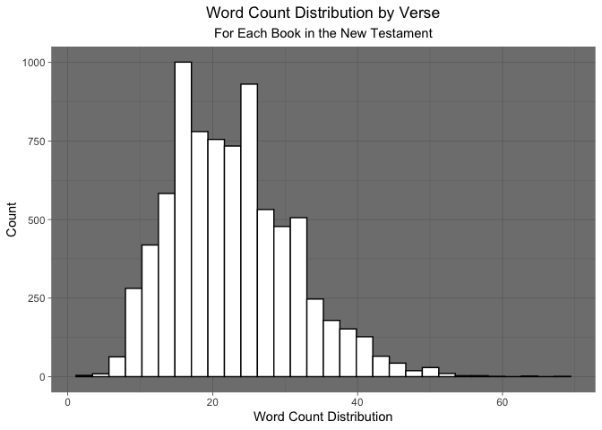

```r
library(knitr)
library(tidyverse)
```

```
## ── Attaching packages ─────────────────────────────────────── tidyverse 1.3.2 ──
## ✔ ggplot2 3.3.6      ✔ purrr   0.3.4 
## ✔ tibble  3.1.8      ✔ dplyr   1.0.10
## ✔ tidyr   1.2.0      ✔ stringr 1.4.0 
## ✔ readr   2.1.2      ✔ forcats 0.5.2
```

```
## Warning: package 'tidyr' was built under R version 4.0.5
```

```
## Warning: package 'readr' was built under R version 4.0.5
```

```
## ── Conflicts ────────────────────────────────────────── tidyverse_conflicts() ──
## ✖ dplyr::filter() masks stats::filter()
## ✖ dplyr::lag()    masks stats::lag()
```

```r
library(downloader)
library(corrplot)
```

```
## corrplot 0.92 loaded
```

```r
library(stringi)
```


```r
download.file("https://github.com/WJC-Data-Science/DTS350/raw/master/bible.csv", "bible")
```


```r
bible <- read.csv("bible")

tail(bible)
```

```
##       volume_id book_id chapter_id verse_id  volume_title book_title
## 31097         2      66       1189    31097 New Testament Revelation
## 31098         2      66       1189    31098 New Testament Revelation
## 31099         2      66       1189    31099 New Testament Revelation
## 31100         2      66       1189    31100 New Testament Revelation
## 31101         2      66       1189    31101 New Testament Revelation
## 31102         2      66       1189    31102 New Testament Revelation
##       volume_long_title                      book_long_title volume_subtitle
## 31097 The New Testament The Revelation of St John the Divine              NA
## 31098 The New Testament The Revelation of St John the Divine              NA
## 31099 The New Testament The Revelation of St John the Divine              NA
## 31100 The New Testament The Revelation of St John the Divine              NA
## 31101 The New Testament The Revelation of St John the Divine              NA
## 31102 The New Testament The Revelation of St John the Divine              NA
##       book_subtitle volume_short_title book_short_title chapter_number
## 31097            NA                 NT             Rev.             22
## 31098            NA                 NT             Rev.             22
## 31099            NA                 NT             Rev.             22
## 31100            NA                 NT             Rev.             22
## 31101            NA                 NT             Rev.             22
## 31102            NA                 NT             Rev.             22
##       verse_number
## 31097           16
## 31098           17
## 31099           18
## 31100           19
## 31101           20
## 31102           21
##                                                                                                                                                                                                        scripture_text
## 31097                                                       I Jesus have sent mine angel to testify unto you these things in the churches. I am the root and the offspring of David, and the bright and morning star.
## 31098                                        And the Spirit and the bride say, Come. And let him that heareth say, Come. And let him that is athirst come. And whosoever will, let him take the water of life freely.
## 31099                     For I testify unto every man that heareth the words of the prophecy of this book, If any man shall add unto these things, God shall add unto him the plagues that are written in this book:
## 31100 And if any man shall take away from the words of the book of this prophecy, God shall take away his part out of the book of life, and out of the holy city, and from the things which are written in this book.
## 31101                                                                                                                 He which testifieth these things saith, Surely I come quickly. Amen. Even so, come, Lord Jesus.
## 31102                                                                                                                                                       The grace of our Lord Jesus Christ be with you all. Amen.
##            verse_title verse_short_title
## 31097 Revelation 22:16        Rev. 22:16
## 31098 Revelation 22:17        Rev. 22:17
## 31099 Revelation 22:18        Rev. 22:18
## 31100 Revelation 22:19        Rev. 22:19
## 31101 Revelation 22:20        Rev. 22:20
## 31102 Revelation 22:21        Rev. 22:21
```

```r
head(bible)
```

```
##   volume_id book_id chapter_id verse_id  volume_title book_title
## 1         1       1          1        1 Old Testament    Genesis
## 2         1       1          1        2 Old Testament    Genesis
## 3         1       1          1        3 Old Testament    Genesis
## 4         1       1          1        4 Old Testament    Genesis
## 5         1       1          1        5 Old Testament    Genesis
## 6         1       1          1        6 Old Testament    Genesis
##   volume_long_title                        book_long_title volume_subtitle
## 1 The Old Testament The First Book of Moses called Genesis              NA
## 2 The Old Testament The First Book of Moses called Genesis              NA
## 3 The Old Testament The First Book of Moses called Genesis              NA
## 4 The Old Testament The First Book of Moses called Genesis              NA
## 5 The Old Testament The First Book of Moses called Genesis              NA
## 6 The Old Testament The First Book of Moses called Genesis              NA
##   book_subtitle volume_short_title book_short_title chapter_number verse_number
## 1            NA                 OT             Gen.              1            1
## 2            NA                 OT             Gen.              1            2
## 3            NA                 OT             Gen.              1            3
## 4            NA                 OT             Gen.              1            4
## 5            NA                 OT             Gen.              1            5
## 6            NA                 OT             Gen.              1            6
##                                                                                                                                   scripture_text
## 1                                                                                         IN the beginning God created the heaven and the earth.
## 2 And the earth was without form, and void; and darkness was upon the face of the deep. And the Spirit of God moved upon the face of the waters.
## 3                                                                                         And God said, Let there be light: and there was light.
## 4                                                          And God saw the light, that it was good: and God divided the light from the darkness.
## 5                            And God called the light Day, and the darkness he called Night. And the evening and the morning were the first day.
## 6                               And God said, Let there be a firmament in the midst of the waters, and let it divide the waters from the waters.
##   verse_title verse_short_title
## 1 Genesis 1:1          Gen. 1:1
## 2 Genesis 1:2          Gen. 1:2
## 3 Genesis 1:3          Gen. 1:3
## 4 Genesis 1:4          Gen. 1:4
## 5 Genesis 1:5          Gen. 1:5
## 6 Genesis 1:6          Gen. 1:6
```

What is the average verse length (number of words) in the Old Testament compared to the New Testament?

Data filtered to include only the old testament 

```r
oldtestament <- bible %>%
  filter(volume_title == "Old Testament") %>%
  select(scripture_text)

head(oldtestament)
```

```
##                                                                                                                                   scripture_text
## 1                                                                                         IN the beginning God created the heaven and the earth.
## 2 And the earth was without form, and void; and darkness was upon the face of the deep. And the Spirit of God moved upon the face of the waters.
## 3                                                                                         And God said, Let there be light: and there was light.
## 4                                                          And God saw the light, that it was good: and God divided the light from the darkness.
## 5                            And God called the light Day, and the darkness he called Night. And the evening and the morning were the first day.
## 6                               And God said, Let there be a firmament in the midst of the waters, and let it divide the waters from the waters.
```

Data filtered to include only the new testament 

```r
newtestament <- bible %>%
  filter(volume_title == "New Testament") %>%
  select(scripture_text)

head(newtestament)
```

```
##                                                                                             scripture_text
## 1                        THE book of the generation of Jesus Christ, the son of David, the son of Abraham.
## 2                      Abraham begat Isaac; and Isaac begat Jacob; and Jacob begat Judas and his brethren;
## 3                 And Judas begat Phares and Zara of Thamar; and Phares begat Esrom; and Esrom begat Aram;
## 4                           And Aram begat Aminadab; and Aminadab begat Naasson; and Naasson begat Salmon;
## 5                      And Salmon begat Booz of Rachab; and Booz begat Obed of Ruth; and Obed begat Jesse;
## 6 And Jesse begat David the king; and David the king begat Solomon of her that had been the wife of Urias;
```

Function that can be used to find verse length 

```r
average_verse_length <- vector("integer", nrow(newtestament))

for (i in seq(1,nrow(newtestament))) {average_verse_length[[i]] <- stri_stats_latex(newtestament$scripture_text[i]) [[4]]
}

mean(average_verse_length)
```

```
## [1] 22.70517
```
The average verse length in the oldtestament is 26.42074
The average in the newtestament is 22.70517 


How often is the word LORD (case insensitive) in the Old Testament compared to the New Testament?

```r
str_count(oldtestament, "(?i)lord")
```

```
## Warning in stri_count_regex(string, pattern, opts_regex = opts(pattern)):
## argument is not an atomic vector; coercing
```

```
## [1] 7273
```

```r
str_count(newtestament, "(?i)lord")
```

```
## Warning in stri_count_regex(string, pattern, opts_regex = opts(pattern)):
## argument is not an atomic vector; coercing
```

```
## [1] 736
```
(?i) = case insensitive modifier 
str_count finds how often lord is repeated

Lord appears in the Old Testament 7,273 times
Lord appears in the New Testament 736 times


Visualization
How does the word count distribution by verse look for each book in the New Testament?

```r
newtestament1 <- bible %>%
  filter(volume_title == "New Testament") %>%
  select(scripture_text, book_title, verse_number)

head(newtestament1)
```

```
##                                                                                             scripture_text
## 1                        THE book of the generation of Jesus Christ, the son of David, the son of Abraham.
## 2                      Abraham begat Isaac; and Isaac begat Jacob; and Jacob begat Judas and his brethren;
## 3                 And Judas begat Phares and Zara of Thamar; and Phares begat Esrom; and Esrom begat Aram;
## 4                           And Aram begat Aminadab; and Aminadab begat Naasson; and Naasson begat Salmon;
## 5                      And Salmon begat Booz of Rachab; and Booz begat Obed of Ruth; and Obed begat Jesse;
## 6 And Jesse begat David the king; and David the king begat Solomon of her that had been the wife of Urias;
##   book_title verse_number
## 1    Matthew            1
## 2    Matthew            2
## 3    Matthew            3
## 4    Matthew            4
## 5    Matthew            5
## 6    Matthew            6
```


```r
average_verse_lengthgraph <- vector("integer", nrow(newtestament1))

for (i in seq(1,nrow(newtestament1))) {average_verse_lengthgraph[[i]] <- stri_stats_latex(newtestament1$scripture_text[i]) [[4]]
}

average_verse_lengthgraph
```

```
##    [1] 16 14 16 12 16 21 12 12 12 12 16 14 12 12 12 17 35 32 24 46 23 20 27 22
##   [25] 18 26 26 16 24 17 31 19 34 32 11 40 23 50 17 31 53 12 27 19 28 18 39 27
##   [49] 13 12 32 26 16 10 33  7 31 30 37 30 14 18 25 36 18 17 15 23 27 19 46 16
##   [73] 25 19 26 13 15 22 13 21 25 19 28 15  9 33 12 31 45 23 20  9 13 10 10 15
##   [97]  9 11 13 16 24 22 39 18 27 22 22 28 43 29 27 50 19 24 38 20 17 24 39 39
##  [121] 18 33 27 18 21 17 18 19 25 21 13 18 17 31 37 19 19 14 27 40 16 19 44 35
##  [145] 24 21 16 14  7 10 25 14 15 35 12 27 21 24 11 22 29 35 42 31 13 23 20 34
##  [169] 20 22 20 26  7 23 24 27 29 29 20 20 19 12 32 26 29 21 18 17 17 17 16  8
##  [193] 29 33 18 25 28 27 27 18 13 12 19 21 31 15 14 11 28 38 28 29 21 29 21 17
##  [217] 30 21 17 17 29 18 14 12 23 15 30 20 38 28 15 21 40 27 26 15 38 12 13 17
##  [241] 36  8 18 32 27 19 22 28 22 38 32 34 35 11 24 16 32 19 20 20 10 21 34 14
##  [265] 17 14 16 22 14 30 25 16 17 33 29 19 10 27 12 13 18 10 21 22  9 24 26 26
##  [289] 22 21 20 29 17 32 23 35 13 38 21 24 31 21 10 12 19 19 20 29 12 29 16 20
##  [313] 16 38 37 27 18 16 19 31 11 28 24 20 24 36 23 10 14  9 21 22 14 31 19 35
##  [337] 22 37 24 34 11 36 17 25 10 29 25 23 33 25 15 22 12 11 30 39 21 24 16 20
##  [361] 10 13 31 16 21  8 27 15 23 29 17 22 20 30 18 29 38 27 23 28 23 16 19 32
##  [385] 32 31 42 20 26 43 20 18 19 17 22 15 25 17 19 23 18 13 17  8 15 28 28 21
##  [409] 29 51 14 39  8 38 23 28 32 32 24 17 16 27 24 19 40 29 37 30 19 34 29 17
##  [433] 24 22 21 26 17 23 37 14 20 21 23 23 17 16 36 15 32 23 17 27 12 12 26 23
##  [457] 14 20 17 13 19 26  9 20 17 31 21 37 14 14  7 42 20 14 26 27 19 16 24 17
##  [481] 19 23 20 23 11 21 13 28 22 12 20 19 21 24 26  9 22 14 12 22 20 18 23 12
##  [505]  9 23 19 15 18 13 35 23 19 10 21 18 31 23 30 33 42 23 19 11 26 22 13 16
##  [529] 20 22 39 31 16 19 14 24 21 15 31 26 25 21 11 16 30 29 37 17 40 22 34 25
##  [553] 21 29 27 27 21 21 12 36 34 15 13 15 29 16 16 33 13 21 25 13 28 20 16 47
##  [577] 11 22 19 23 38 15 48 19 16 25 18 13 37 25 43 37 33 13 37 29 22 29 29 33
##  [601] 28 35 19 23 17 18 18 30 20 18 36 22 17 23 26 17 21 23 25 10 26 24 25 20
##  [625] 20 27 33 22 18 52 23 22 10 22 29 27 14 20 32 17 23 32 15 20 20 45 35 14
##  [649] 27 19 16 23 13 25 28 29 17 21 14 26 23 18 22 17 18 29 24 22 35 43 54 15
##  [673] 29 20 12 24 11 30 27 18 11 20 22 30 23 16 26 10 18 24 32 16 13 35 25 16
##  [697] 33 31 16 12 41 17 54 13 39 33 36 18 25 26 13 20 39 38 39 24 15 15 16 27
##  [721] 14 15 29 39 24 22 18 20 12 17 19 34 18 13 24 18 17 28 22 20 30  8 15 41
##  [745] 16 13 12 11 30 15 18 24 27 10  8 17 18 21 21 28 12 18 16  9 25  7 14 11
##  [769]  9 18 14 19 11 23 10 10 24 29 24 14 13 18 18 12 11 17 34 26 33 31 17 23
##  [793] 17 15 16 19 43 12 29 22 32 18 22 26 17  9 14 38 36 13 39  8 26 24 32 39
##  [817] 14 15 30 22  7 26 16 10 12 13 25 25 11 18 14 17 16 24 24 17 28  6 26 26
##  [841] 12 36 42 32 24 19 16 13 19 18 29 23 16 17 12 34 19 24 14 15 16 15 26 21
##  [865] 22 10 13 11  9 18  9 18 28 26 12 14 17 25 27 20 12 18 14 31 36 26 35 34
##  [889] 20 28 24 15 29 17 27 25 16 29 27 21 23 15 13 35 26 20 25 32 30 14 17 22
##  [913] 26 12 16 13 25 16 14 22 14 17 31 13 26 10 30 34 15 12 19 19 20 37 19 28
##  [937] 19 19 31 15 34 13 21 21 22 24 20 20 36 23 19 30 13 17 35 14 31 21 13 21
##  [961] 31 25 22 13 41 22 24 24 20 20 21 20 34 34 26 12 20 12 21 13 28 13 27 19
##  [985] 27 23 18 29 24 18 28 16 12 36 13 26 14 15 14 18  9 25 10 38 17 21 24 21
## [1009] 40 16 18 21 11 38 15 28 21 19 19 35  7 17 18 10 27 13 27 23 14 16 29 16
## [1033] 26 15 14 26 14 19 32 16 20 20 18 15 30 14 20 20 43 18 15 29 30 11 14 22
## [1057] 19 32 20 27 23 26 19 15 16 23 16 11 19 24 26 12 22 19 17 29 26 25 16 22
## [1081] 22 19  9 24 20 20 26 19  9 29 22 18 21 16 32 13 19 35 13 23 18 24 23 10
## [1105] 26 23 11 15 23 13 26 21 17 10 35 41 19 30 16 38 19 14 14 26 28 25 17 31
## [1129] 20 30 34 30 34 35 30 22 32 37 29 19 27 40 17 11 18 18 13 30 42 19 21 31
## [1153] 23 20 20 12 19 19 12  5 23 22 13 16 22 23 18 12 12 17 29 22 19  8 16 21
## [1177] 12 19 18 42 15  9 25 24 18 18 27 14 18 32 31 18  5 32 23 28 14 26 30 27
## [1201] 22 10 30 24 19 20 22 18 19 27 33 18 21 21 27 21 29 25 18 24 17 23 17 32
## [1225] 20 12 33 13 20 16 14 18 40 29 30 23 12 24 32 22 25 24 33 13 12 23 15 14
## [1249] 23 25 18 13 24 21 28 23 18 23 24 38 24 24 21 17 48 34 26 22 15 24 24 11
## [1273] 22 48 10 17 34 20 19 29 18 16 30 25 39 22 22 31 25 23 21 20 23 34 10 26
## [1297] 33 27 26 31 22 15 11 42  8 14 13 27 14 20 36 19 28 24 14 18 13 24 42 16
## [1321] 22 21 37 25 31 14 28 20 20 34 15 22 23 29 10 18 28 20 14 15 11 11 32 21
## [1345] 24 29 21 19 21 25 26 22 16 18 26 24 23 20 24 19 13 39 18 20 14 17 20 31
## [1369] 15 20 20 13 29 16 23 20 13 19 37 12 24 22 31 16 23 12 37 15 37 34 27 19
## [1393] 11 40 36 30 18 14 33 12 24 19 32 19 14 35 25 20 18 10 21 35 25 25 21 30
## [1417] 16 20 35 26 14 20 17 18 37 12 24 19 30 26 25 29 26 11 30 33 35 11 36 11
## [1441] 34 11 16 26 34 22 12 16 18 13 16 17 11 13 18 17 20 33 22 16 32 19 26 16
## [1465] 42 16 23 34 26 15 22 16 39 31 12 43 37 26 25 14 26 32 36 29 16 34 19 13
## [1489] 24 33 26 26 27 11 29 26 23 37 27 25 16 15 18 22 23 20 33 13 38 21 39 14
## [1513] 31 28 11 18 19 10 49 23 25 17 27 21 30 13 22 22 28 44 24 12 26 17 20 21
## [1537] 14 23 20 13 31 19 47 29 22 29 17 35 16 16 16 22 22 25 42 19 29 21 32 22
## [1561] 25 39 31 22 27 20 25 13 16 25 17 33 25 26 26 23 20 14 15 28 31 38 10 45
## [1585] 31 26 36 25 18 17 11 26 29 21 23 11 20 17 18 30 24 23 17 13 24 14 35 27
## [1609]  7 11 33 16 41 19 24 18 23 17 30 17 23 31 31 30 17 24  9 24 23 20 37 25
## [1633] 22 18 29 15 30 13 14 27 25 23 21 16 24 26 20 19 12 21 36 13 32 26 19 10
## [1657] 23 23 20  7 25 11 24 26 21 13 11 25  8 24 27 27 15 18 34 18 21 24 20 33
## [1681] 18 36 32 20 13 17  9 13 24 18 17 12 15 26  7 20 23 18 18 10 21 27 25 17
## [1705] 15 19 10 14 19 14 25  8 19 26 18 29 16 35 12 16 30 26 24 19 27 24 14 38
## [1729] 14 27 23 18 17 25 30 26 28 26 16 18 19 13 34 18 17 22 28 23 21 24 18 26
## [1753] 14 35 18 19 21 24 15 20 13 30 14 34 15 41 24 31 33 16 31 22 14 22 19 23
## [1777] 25 23 16 19 27 20 16 42 27  7 23 19 10 27 23 16 22 22  9  9 20 16 13 18
## [1801] 15 16 11 14 14 17 21 27 14 17 13 18 16 24 29 13 15 17 17 17 14  9 22 12
## [1825] 25 14 16 24 22 24 12 12 34 12 18 29 19 25 24 19 21 17 14 45 17 19 17 12
## [1849] 24 31 26 23 25 33 24 28 13 13  7 10 13 14 34 19 33 27 25 23 20 14 18 26
## [1873] 24 14 29 12 31 24 11 25 14 42 21 19 34 29  9 29 38 30 11 28 16 14 33 23
## [1897] 40 30 12 24 12 22 33 25 30 30 30 30 30 30 30 30 30 30 30 30 30 30 24 20
## [1921] 23 21 22 24 32 10 29 31 15 20 17 16 25 10 31 27 49  8 31 16 26 29 16 36
## [1945] 22 23 15 31 11 16 13 23 32 32 29 15 31 21 32 34 32 21  8 25 21 37 23 27
## [1969] 17 33 23 20 29 15 38 22 30 28  9 48 29 38 16 23 17 17 40 22 22 26  9 27
## [1993] 20 19 11 28 20 22 44 25 13 17 35 22 27 36 16 27 23 29 32 29 17 25 22 16
## [2017] 12 14 50 12 19 22 21 35 28 13 22 20 17 13 28 20 16 20 23 27 40 10 22 40
## [2041] 21 18 24 63 18 25 45 15 20 43 40 18 17 25 21 12 40 21 39 36 17 27 39 17
## [2065] 24 18 28 17 11 25 28 26 45 11 33 27 21 23 36 19 17 20 36 18 25  8 26 30
## [2089] 36 41 20 19 22 22 44 21 17 26  9 20 14 31 21 21 21 31 21 15 32 11 34 12
## [2113] 29 32 33 27 34 22 30 18 20 23 38 28 34 36 14 35 38 43 20 16 30 28 23 40
## [2137] 19 36 24 34 22 33 24 24 17 31 17 39 19 26 19 29 17 11 17 16 18 20 15 23
## [2161] 11 26 15 30 19 23 32 30 44 34 22 10 30 21 27 22 18 14 29 26 23 19 38 25
## [2185] 27 18 13 15 29 45 20 17 30 22 24 26 13 23 32 28 21 26 13 16 37 25 18 25
## [2209] 22 17 30 18 23 26 27 20 19 24 24 28 32 12 14 13 22 28 18 20 23 33 20 38
## [2233] 16 14 23 19 13 28 22 47 37 21 36 20 13 35 15 14 32 23 22 21 32 39 16 19
## [2257] 26 17 34 17 20 35 32  8 27 28 20 30 33 25 20 35 13 30 29 16 11 25 22 22
## [2281] 21 13 27 17 32 10 33 38 17 36 20 44 33 31 35 13 32 22 16 30 17 18 38 18
## [2305] 27 17 31 16 22 23 22 30 26 27 18 42 17 30 26 29 17 22 24 15 30 29 16 20
## [2329] 16 27 18 20 27 25 26 15 30 13 28 14 20 31 34 19 23 17 17 29 11 10 30 38
## [2353] 23 32 18 16 31 14 18 32 40 25 44 18 18 18 18 44 28 19 25 12 46 16 21 22
## [2377] 13 26 13 26 32 22 17 12 26 21 16 46 33 27 27 17 37 12 20 13 17 24 49 21
## [2401] 22 31 28 17 23 33 24 38 38 28 13 19 16 29 10 24 28 26 45 15 43 15 21 30
## [2425] 15 21 36 22 13 48 17 26 18 14 32 15 24 23 12 33 20 19 16 26 14 15  8 35
## [2449] 13 27 28 29 28 21  9 27 27 21 22 22 27 22 18 34 26 29 16 22 23 13 25 17
## [2473] 39 24 18 27 30 30 27 22 24 23 29 28 25 27 20 23 35 15 33 23 18 23 19 17
## [2497] 24 27 21 36 28 36 18 20 14 18 24 22 29 18 28 10 40 31 32 17 30 20 20 14
## [2521] 27 20 17 14 14 15 28 18 31 18 31 13 22 30 23 21 15 38  4 19 25 15 16 25
## [2545] 20 15 19 21 18 10 21 23 18 18 28 14 30 32 21 27 23 17 18 25 12 36 14 24
## [2569] 26 11 14 11 33 18 34 18 18 22 23 11 10 13 28 20 20 13 23  7 19 21 21 32
## [2593] 11 23 37 22 16 30 20 19 22 43 12 24 12 12 19 25 39 22 22 10 30 20 13 28
## [2617] 32 24 17 18  9 19 11 41 21 16 23 14 28 27 33 19 22 24 18 35 23 17 11 21
## [2641] 22 11 16 32 32 20 15 28 26 22 23 28 21 32 36 28 12 13 16 24 22 19 34 15
## [2665] 11 19  7 16 17 24 25 31 18 12 12 14 21  7 11 13 30 17 15 13 21 28 18 29
## [2689] 25 32 28 14 23 34  9 14 21 26 13 10  7 17 34 16 31 36 31 27 18 22 15 20
## [2713] 22 15 13 30 19 30 29 18 13 17 14 20 10 17 13 17 11 33 28 13 17 15 19 21
## [2737] 17 22 30 21 15 21 17 16 24 29 29 11 14 22 20 19 19 24 23 34 31 17 21 18
## [2761] 16 19 11 25 19 15 29 15 21 17 17 32 26 21 23 25 10 22 26 19 31  7 11 23
## [2785]  9 28 19 15 16 21 18 12 29 21 18 22 13 27 39 13 11 27 19 16 38 20  8 12
## [2809] 17 16 10  8 32 24 11 26 33 18 21 29 18 17 15 30 21 29 13 12 23 20 19 20
## [2833] 14 19 20 16 28 18 21 18 19 30 11 27 11 22 17 30 10 13 20 25 19 23  5 18
## [2857] 26 14 31 21 11 20 11 23 34 31 19 28 17 25 27 19 14 20 20 27 24 16 29 23
## [2881] 11 21 21 14 17 28 14 19 14  9 44 11 24 19  7 28 19 19 11 11 17  8 17 12
## [2905] 12 11 19 14 14 18 11 25 22 30 29 12 15 24 22 13 23 24 24  9 23 18 21 12
## [2929] 24 22 21 20 41 13 12 14 11 29 27 17 22 31 18 11 29 21 19 29 19 27 30 19
## [2953] 11 16 18 13 24 17 20 36 34 21 24 13 19 34 21 17 20 18 22  9 30 26 13 16
## [2977] 14 37 25 28 27 19 12 33 11 17 24 22 24 20 12 25 22 31 24 20 22 21 22  8
## [3001] 16 32 16 20 33  7 29 16 15 21 13 28 19  8  8  7 25 25 17 12 35 39 25 22
## [3025] 14 35 19 11 21 21 13 20 24 17 28 17 24 11 27 18 18 11 11 15 15 21 33 24
## [3049] 11 21 27 23  9 32 11 14 31 26 36 15 12 27 18 26 28 18 15 22 20 35 14 27
## [3073] 31 11 22 24 19 18 22 26 16 22 11 30 39 27 19 14 27 34 31 20 16 22 25 35
## [3097] 11 21 11 17 20 36 26 18 20 12  6 14 25 20 23 15 13 16 19 14 10 28 15 22
## [3121] 12 21 26 35 19 27 26 26 13 24 12 29 11 19 50 23 24 22 31 32 17 21 21 20
## [3145] 29 18 11 28 14 23 20 33 35 18 29 11 25 29 19 14  6 11 18 42 17 31 21 12
## [3169] 16 24 29 12 20 19 16 24 26 24 15 11 18 17 16 22 21  9 23 29  8 17 20 22
## [3193] 13 23 13 26 12 15 13 15 24 28 22 15 15 25 36 10 16 22 18 38 14 20 25 23
## [3217] 22 17 29 26 26 20 30 18 15 23 11 15 21  9  9 12 10 15 15 21  8  7 25 22
## [3241] 15 16 30 29 10 36 27 20 30 16 38  9 22 15 18 30 27 27 17 24 27 24 32 11
## [3265] 40 24  9 22 13 24 17 15 13 22 21 27 25 24 30 14 56 11 19 20 21 17 14 17
## [3289] 35 19 26 35 15 18 15 29 15 20 22 22 15 28 26 23 17 10 37 13 10 15 29 39
## [3313] 24 29 21 19 30 34 10 25 26 16 25 15 18 28 24 20 11 22 26 14 18 10 27 20
## [3337] 23 30 14 23 22 20 19 19 17 24 30 14 35 14 14 20 31 18 36 12 16 22 14 10
## [3361] 27 25 16 13 22 24  6 10 22 26 15 18 25 12 28 14 18 22  6 18 22 15 27  9
## [3385] 21 14 19 28 17 26 12 19  9 24 20 16 10 16 22 16 17  9 18 24 13 23 25 13
## [3409] 18 36 31 23 15  2  9 26 20 31 21 31 28 15 32 20 18 21 25 21 23 22 23 15
## [3433] 30 24 26 29 23 22 35 15 15 26 16 14 33 13 16 21 28 15 15 33 23 18 19 15
## [3457] 21 12 17 29 23 29 25 22 20 15 17 16  9 34 36 28 16 30 10 30 13 29 13 19
## [3481] 10 18 27 29 27 23 41 21 23 16 26 17 18 24 17 27 15 29 14 20 17 25 12 32
## [3505] 21 24 27 12 14 18 13 34 18 15 36 13 21 18 33 23 18 27 20 29 14 26 28 11
## [3529] 18 22 22 13 38 37 22 34 21 13  7 21 32 11 22 20 36 22 34 25 12 35 31 38
## [3553] 21 20 27 11 27 13 30 30 31 24 16 16 25 21 14 17 11 37 43 10 15 34 37 22
## [3577] 23  8 32 23 30 15 13 23 17 38 20 14 38 18  8 14 10 15 40 16 23 25 42 18
## [3601] 42 30 40 25 29 19 32 23 20 22 14 28  7 35 31 28 23 21 18 23 30 15 36 22
## [3625] 15 41 39 23 27 21 14  9 18 16 18 34 21 35 38 23 28 28 17 24 19 22 20 14
## [3649] 20 19 27 25 16 23 22 30 32 25 30 13 31 21 28 20 11 28 27  9 36 15 21 33
## [3673] 17 22 17 22 38 52 32 28 16  8 22 14 27 21 34 24 11 20 26 29 34 30 22 31
## [3697] 18 23 18 23 30 27  9 35 47 23 23 21 19 27 22 44 20 18 19 23 19 13 43 27
## [3721] 25 25 18 27 39 13 18 17 17 22 18 16 10 20 25 29 21 41 18 40 22 43 25 21
## [3745] 19 19 15 50 31 30 12 24 20 27 22 26 33 21 14 36 42 28 22 13 33 24 12 21
## [3769] 39 34 51 42 23 28 13 21 39 21 36 18 26 31 31 19 23 26 39 23 20 39 19 43
## [3793] 23 26 31 13 26 29 26 22 30 13 22 24 20 18 24 18 22 15 24 19 14 19 20 16
## [3817] 16 10 36 18 11 44 22 21 22 19 38 22 23 26 18 19 20 29 36 24 11 32 24  7
## [3841] 24 29 34 27 17 22 18 16 11 17 27 22 19 36 14 13 12 29 21 20 10 33 29 42
## [3865] 40 18 17 37 16 23 26 12 29 37 22 23 33 25 21 16 20 19 15 28 22 19 22 42
## [3889] 20 23 33 16 17 33 24 19 28 13 32 16 23 36 21 20 29 14 20 23 32 37 22 30
## [3913] 20 25 15 13 26 27 38 23 15 20 22 39 32 16 27 16 15 32 30 25 14 18 16 50
## [3937] 16 28 26 24 23 18 34 17 16 25 24 16 34 21 39 34 29 20 31 21 18 31 28 26
## [3961] 15 37 17 28 15 30 16 18 25 22 24 23  9 27 24 32 44 30 28 29 15 33 22 16
## [3985] 21 18 12 28 22  8 27 20 19 19 21 20 21 32 21 10 20 29 25 29 22 37 39 28
## [4009] 32 35 21 32 23 46 30 30 32 16  6 15 26  8 22 34 15 19 28 20 19 27 14 27
## [4033] 39 14 22 12 14 22 27  8 30 21 17 26 24 24 16 21 13 21 18 24 20 20 17 24
## [4057] 26 29 38 11 14 20 25 33 22 23 16 28 27 25 32 20 19 31 19 19 27 36 16 28
## [4081] 13 28 33 24 23 17 31 16 49 22 21 15 39 21 14 19 17 30 43 12 23 17 33 22
## [4105] 22 20 15 28 26 34 40 33 22 13 17 18 24 26 33 15 23 28 15 27 19 29 21 12
## [4129] 18 19 13 35 13 16 17 31 46 24 22 18 14 16 46 25 32 19 35 34 19 15 20 22
## [4153] 32 28 11 28 29 20 17 30 13 21 21 20 17 12 16 40 29 13 19 17 14 20 24 31
## [4177] 14 18 26 29 24 32 25 19 29 28 23  9 39 10 34 20 17 17 11 22 32 19 30 40
## [4201] 30 26 46 43 28 17 25 24 17 46 20 35 41 20 19 27  8 22 39 25 17 19 26 25
## [4225] 27 22 17 32 46 18 23 24 35 20 35 14 20 21 29 44 17 18 36 24 34 19 24  7
## [4249] 24 17 36 32 17 26  9 21 23 14 31 24 31 17 25 43 31 26 12 31 15 12 35 17
## [4273] 30 19 27 22  6 24 18 15 32 14 25 21 46 13 28 17 29 26 24 27 25 11 14 22
## [4297] 32  9 26 37 30 30 31 13 45 20 13 26 19 26 16 22 13 31 28 13 18 23 21 36
## [4321] 31 36 22 14 17 22 31 21 10 17 20  8 19 33 12 24 25 16 10 34 14 33 27 14
## [4345] 25 18  9 26 29 18 27 33 36 34 29 27 37 27 16 16 20 21 20 17 30 34 17 19
## [4369] 14 17 18 22 23 15 26 38 19 19 26 20 21 26 27 46 31 22 16 16 23 29 18 28
## [4393] 23 27 23 25 41 21 17 25 25 30 25 24 33 26 26 32 18 40 23  6 24 11 33 21
## [4417] 15 24 33 25 26 22 23 16 24 12 36 27  8 27 40 21 13 32 19 26 20 32 31 31
## [4441] 17 25 31 18 31 14 22  7 25 33 28 10 27 33 18 18 30 29 11 33  9 33 24 12
## [4465] 21 23 35 41 21 30 15 25 24 28 27 45 19 19 29 17 28 10 22 18 27 28  8 26
## [4489] 32 14 41 21 26 13 26 16 32 34 14 33 25 25 20 20 16 44 24 18 14 34 19 17
## [4513] 23 34 11 19 37 14 14 25 34 14 30 23 41 18 23 36 11 17 49 21 35 17 14 27
## [4537] 12 17 20 33 35 18 18 45 37 38 31 39 23 28 24 26 28 30 23 12 27 24 34 37
## [4561] 14 21 51 17 42 30 19 20 25 36 27 21 23 30 16 21 25 24 19 29 16 33 16 30
## [4585] 30 24 18 21 32 43 22 17 31 12 28 45 21 18 43 43 33 30 11 29 42 23 28 37
## [4609] 26 31 50 26 33 18  8 10 30 19 25 37 17 16 18 24 24 25 33 14 23 30 20 19
## [4633] 23 11 37 21 25 11 35 25 19 14 17 16 22 28 34 29 27 32 28 22 17 17 21 18
## [4657] 25 30 28 27 28 29 42 20 14 27 24 43 26 17 23 25 26 20 38 45 26 37 20 22
## [4681] 27 26 22 23 19 28 16 20 38 26 14 29 38 16 44 15 40 12 36 16 32 28 24 19
## [4705] 35 11 13 31 21 21 20 27 26 25 16 20 17 27 21 22 29 21 46 21 13 18 19 27
## [4729] 15 16 28 35 27 18 22 20  9 28 23 22 35 19 15 31 28 29 13 14 18 34 31 34
## [4753] 18 30 27 14 29 28 36 13 39 26 36 17 20 23  9 27 19 33 31 56 20 24 30 28
## [4777] 24 46 12 28 23 48 22 16 19 22 17 12 19 22 19 10 27 21 29 24 22 19 34 19
## [4801] 21 33 22 22 19 35 27  8 25 22 25 25 39 29 17 14  8 29 27 19 25 23 25 10
## [4825] 18 18 20 20  9 28 20 28 28 18 17 18 20 22 20 21 15 16 23 18 25 20 33 13
## [4849] 14 17 31 24 10 24 27 26 11 12 22 21  8  7  7  9  9 34 25 19 25 12 14 31
## [4873] 23 19 16 20 16 16 16 16 16 15 20 17 13 12 24 19 45 34 29 21 14 50 35 26
## [4897] 30 19 15  9 15 24 13 15 23 15  6 25 15 21 18 17 28 23 26 19 31 43 31 33
## [4921] 32 22 18 22 14 14 19 36 23 25  9 16 18 19 20 18 33 18 17 30 26 12 40 13
## [4945] 21 23 20 27 35 44 40 27 31 36 21 18 14 14 13 37 15 23 18 16 33 19 22 16
## [4969] 12 30 16 28 23 22 34 21 26 16 22 11 37 21 37 14 26 17 25 15 28 25 16 22
## [4993] 22 15 31 25 17 33 27 25 27 25 18 26 17 31 23 22 15 22 26 19 11 19 28 22
## [5017] 21 20 28 19 17 32 11 13 12 26 20 35 16 18 27 22 25 23 16 24 32 25 23 26
## [5041] 24 17 24 24 17 17 25 15 21 29 17 26 29 17 12 25 13 34 33 17 13 25 31 27
## [5065] 20 27 28 21 28 18 35 22 29 22 16 29 27 19 20 25 21 34 18 15 18 16 30 23
## [5089] 43 39 26 14 22 10 18 17 15 25 15 15 19 27 32 44 17 16 24 14 26 16 14 10
## [5113] 10  9  9 12 26 16 15 24 26 10 25 19 35 46 15 20 24 19 47 15 26 28 23 20
## [5137] 14 15 26 31 22 52 13 29 22 27 23 13 29 31 24  9 20 16 18 24 25 22 23 18
## [5161] 13 21 23 19 19 15 25 30 10 14 27 27 27 29 33 17 28 30 23 23 13 21 40 11
## [5185] 22 33 20 24 32 28 19 10 18 35  9 25 21  8 23  7 10 12 18 19 11 13 18 13
## [5209] 23 28 32 23 13 11 22 12 35 30 12 18 40 16 20 16 10 17 21 18 44 26 26 17
## [5233] 13 12 17 28 24 22 25 28 12 15 20 18 23 31 27  8 22 15 24 16 14 24 17 27
## [5257] 23 23 31 22 32 31 25 29 16 21 21 25 24 18 22 10 19 23 17 34 15 15 35 16
## [5281] 23 19 23 27 22 14 12 23 10 20 12 28 20 39 46 34 30 33 27 21 16 23 16 26
## [5305]  9 40 13 26 12 20 31 24 27 24 26 16 26 27 12 28 44 21 16 20 28 17 22 29
## [5329] 12 34 10 30 16 32 29 34 18 29 23 11 22 29 21 20 19 17 27 35 10 28 19 17
## [5353] 20 24 32 24 28 27 24 26 21 15 12 20 28 13 12 27 23 21 30 23 27 18 26 20
## [5377] 49 33 37 33 20 34 22 20 19 12 34 22 33 35 25 19 37 13 17 24 25 25 10  9
## [5401] 25 12 35 15 29 37 20 32 30 17 39 29 25 30 22 36 30 29 17 23 26 17 28 25
## [5425] 13  8 23 17 20 26 19 16 15 25 12 49  7 11 32 19 17 22 29 28 12 23 12 14
## [5449] 11 30 37 21 21 17 17 24 12 22 30 12 25 30 29 14 14 16 17 22 13 20 22 18
## [5473] 24 24 19 17 19 40 28 28 36 22 25 19 19 13 11 20 13 28 11 17 34 10 10 17
## [5497] 14 22 17 26 18 27 33  9 24 25 20 19 11 10 27 16 28 24 21 22 11 26 14 14
## [5521] 16 25 34 28 17 16  9 12 26 10 18 31 29 15 13 27 13 16 34 33 29 15 29 20
## [5545] 29 22 14 16 32 32 12 12 30 17 33 31 34 25 31 35 27 22 12 16 17 11 18 30
## [5569] 26 15 28 10 12  9 22 22 24 17 11 26 12 18 24 43 14 24 14 17 33 11 16 11
## [5593] 17 16 15 15 19 30 13  9 33 32 26  8 16 32  8 20 18 12 26 18 27 24 28 18
## [5617] 20 23 22 19 16 23 19 20 17 30 14 34 12 14 15 30 21 30 21 14 18 24 23  8
## [5641] 15 25 26 38 13  8 29 16 23 15 23 13  9 15 10 10 33 16 21 30 16 38 24 33
## [5665] 23 21 30 40 24 26 19 27 34 14 31 21 15 15 21 20 16 23 37 36 21 13 24 12
## [5689] 23 31 16 21 26 26 20 28 29 24 14 39 10 20 28 40 11 18 20 16 13 28 29 15
## [5713] 14 17 34 14 37 14 35 17 34 22 16  9 25 26 10 25 22 23 21 22 35 29 18 12
## [5737] 29 23 21  8 21 14 34 27 33 20 21 26 26 23 24 27 27 25 20 34 12 20 12 15
## [5761] 23 15 17 19 13 14 17 22 17 44 24 19 25 17 24 27 25 16 36 35 33 20 52 40
## [5785] 27 38 25 12 18 24 17 23 25 21 31 21 30 28 28 25 12 34 21 18 18 18 37 16
## [5809] 19 31 32 21 17 32 26 27 43 21 24 26 19 26 15 23 30 18  8 27 37 14 20 26
## [5833] 14 39 28 13 19 30 31 31 31 34 25 10 13 18 28 28 38 13 23 24 12 48 21  8
## [5857] 30 14 13 25 25 21 11 10 34 23 21 28 11 25 42 18 18 15 15 19 21 18 19 37
## [5881] 20 22 18 44 38 14 38 27 34 20 26 43 23 17 16 31 25 40 38 23 40 22 35 29
## [5905] 12 30 12 20 30 27  7  5 24 23 13 16 25  9 21 18 26 27 29 17 19 27 24 19
## [5929] 22 23 18 14 14 10 14 21  6 18 38 15 31 22 36 24 22 42 18 19 30 18 51 12
## [5953] 57 25 15 16 44 21 27 23 17 14 28 13 16 26 12 41 24 17 29 24 27 30 36 22
## [5977] 34 13 32 23 20 18 13 13 15 26 18 24 13 16 22 16 20 21 18 32  9 14 21 17
## [6001] 25 33 12 17 22 16 20 16 19 20 24 22 14 31 11 23 28 14 22 16 20 21 13 17
## [6025] 15  9  7 27 22 10 24 19 18 18 32 14 15  9 36 14  8 15 13 14 29 13 16 21
## [6049]  8 17 17 27 20 22 15 29 23 29 15 21 19 13 25 16 24 26 21 18 19 11 21 32
## [6073] 27 15 34 20 19 14 27 31 22 24 29 21 13 12 33 38 15 18 17 23 19  8 23 29
## [6097] 31 19 21 28 19 17 13 20 19 16 15 13 19 18 14 27 21 25 27 32 24 13 14 16
## [6121] 15 11 24 17 18 21 25 17 20 12 13 18  6 17 18 18 20 20 16 20 34 34 20 39
## [6145] 24 25 16  7 20 19  9 18 18 15  6 31 27 17 20 21  9 27 18 16 28 23  7 18
## [6169] 14  7 14 18 19 18 12  8 14 15 20 19 10 11 26 20 16 15 28 18 20 14 25 13
## [6193] 24 11 12 15 21 25 19 13 22 27 15 20 28 26 16 12 21 18 21 25 19 29 23 18
## [6217] 14 24 16  9 13 12 25 42 18 19 21 19 24 17 23 15 15 16 23 22 40 12 22 22
## [6241] 11 22 18 47 25 24 16 24 19 20 17 12 16 23 22 17 23 18 30 18  7 31 26 21
## [6265] 12 26 13 13 22 19 13 28 21 30 24 14 23 26 11 23 26 25 14 13 41 32 23 13
## [6289] 30 29 17 27 19 19 26 20 18 31 21 16 33 10 13 22 18 43 25 28 21 37 10 12
## [6313] 30 12 16 32 17 13 14 13 12 15 27 17 20 24 37 18 10 38 24 16 21 20 13 13
## [6337] 38 12 28 12 32 19 19 42 32 25 20 28 23 14 31 36 11 13 29 14 20 26 11 15
## [6361] 28 27 24 27 18 27 14 32 26 25  6 15 28 22 12 13 17 20 14 13 18 17 20 22
## [6385] 20 24 14 24 33 26 14 10 15 11 23 15 19 21 20 10 28 11 11 21 22 20 24 24
## [6409] 28 32 23  8 17 29 20 16 38 16 28  7 37 23 13 38 30 24 15 34 13 29 20 24
## [6433] 13 31 31 19 20 16 49 35 25 28 27 17 26  7 17 27 17 25 30 39 16 11 24 21
## [6457] 16 24 28 36 12 16 16 14 30 11 18 24 25 24 18 26 23 32 31 33  7 17 18 26
## [6481] 16 22 15 18 26 17 16 13 22 19 21 24  2  3 17  4  3  9  6 31 11  4  8 16
## [6505] 11 20 14 33 26 27 16 22 22 20 29 33 29 20 32 32 32 15 14 23 27 18 24 16
## [6529] 16 37 18 19 26 12 24 17 14 22 18 33 17 29 17 21 19 24  9 25 13 19 18 12
## [6553] 21 21 25 21 22 11 16 14 38 29 15 22 21 18 25 32 20 26 16 19 19 23 13 17
## [6577] 16 13 27 16 26  9  9 20  7 14 18 19 22 18 15 22 17 23 18 10 19 14 17 28
## [6601] 12 35 35 25 12 26 18 11 34 13 27 10 27  5 26 11 24 16 25 16 12  6 30 21
## [6625] 11 11 27 20 38 18 10 28 22  8 29 21 23 13 11 28 17 18 17 18 28 35 28 20
## [6649] 21  7 16 10 26 29 18 25 25 16 22 30 31 17 22 22 13 22 19 26 17 31 25 21
## [6673] 32 35 28 15 40 22 17 21 21 15 31 14 27 11 25 17 11 13 18 19 25 18 18 12
## [6697] 28 21 13 15 19 30 30 29 22 12 19 20 22 12 18 14 11 14 23 13 22 19 15 25
## [6721] 13 14 22 27 21 14 25 18 26 16 20 17 16 37  8 21 21  7 22 15 13 26 36 27
## [6745]  9 12 20 13 29 15 23 24 30 18 27 14 26 15 20 19 16 15 26 22  9 15 24 18
## [6769] 21  8 16 25 20 20 13 19 18 24 15 21 18 24 14 28 11 18 36 19 13 14 24 16
## [6793] 17 21 17 16 14 12 17 23 21 16 25 14 16 14 23 21 15 29 11 14 30 17 19 20
## [6817]  9  6 12 19 26 43 20 38 22 18 25 23 22 16 25 23 18 25 20 31 25 17 26 26
## [6841] 40 36 31 25 21 21 37 15 20 38 18 19 17 25 16 24 29 14 16 13 23 13 21 22
## [6865] 19 20 18 22 19 12 25 30 37 25 12 23 32 17 10 21 19 44 30 26 30 24 27 25
## [6889] 18 18 28 18 37 15 17 11 19 42 18 28 30 21  8 25 16 28 29 20 18 31 22 17
## [6913] 18 13 11 20 22 34 22 20 25 29 27 19 44 20 11 20 15 14 40 16 21 19 18 19
## [6937] 14 17 23 11 37 12 17 11 26 21 33 29 34 17 24 24 43 27 18 32 45 50 29 19
## [6961] 25 15 23 14 36 17 20 27 26 32 21 31 27 25 30 40 16 22  9 40 14 15 19 26
## [6985] 33 23 34 15 28 36 24 14 17 22 12 23 27 23 19 18 21 10 13 17 32 10 13 14
## [7009] 21 10 28 17 14 28 22 16 13 45 25 14 20 24 31 12 20 16 21 22 15  9 28 34
## [7033] 32 32 42 31 29 15 29 33 35 13 23 29 23 13 22 11 23 22 32 19 20 22 21 20
## [7057] 20 15 20 34 14 29 22 15 25 21 14 17 42 38 20 10 31 14 21 17 31 26 27 12
## [7081] 24 15 25 19 30 24 28 29 14 25 30 23 36 24 30 24  7  4 13 22 16 27 22 26
## [7105] 11 35 15 24 17 13 13 25 17 40 18 18 27 33 21 20 18  6 20 12 10 16 26 25
## [7129] 15 10 12 20 41 29 25 16 18  6 27 23 17 11 23 15 26 17 32 25 28 19 27 36
## [7153] 14 30 19 13 20 18 18 31 17 17 21 12 32 12 29 16 13 18 15 26 16 23 16 14
## [7177] 28 20 30 21 39 25 16 20 18 13 23 25 19 11 13 29 14 21 26 17 31 18 18 14
## [7201] 23 18 14 44 18 30 30 18 12 17 17  9 35 39 22 13 35 15 17 23 33 35 15 30
## [7225] 27 26 36 16 14 28 17 31 34 16 20 19 36 25 12 20 31 48 31 14 18 11 28 26
## [7249] 16 19 27 30 21 26 22 16 15 11 18 25 29 29 25 35 25 18 32 20 25 21 18 11
## [7273] 21 15 37 22 11 22 30 19 31  9 24 35 25 25 35 19 24 25 14 30 17 21 35 26
## [7297] 21 32 12 32 36 23 30 25 32 21 16 33 17 17  7 24 49 22 26 38 26 21 35 15
## [7321] 27 32 27 14 18 33 17 11 20 21 31 11 28 18 20 30 17 30 32 15 12 10 28 24
## [7345] 23 21 26 22 19 19 29 33 18 39 14 27 38 20 26 27 26 26 12 23 24 29 18 29
## [7369] 35 24 25 20 22 31 27 38 30 32 22 29 17 27 30 11 30 27 32 47 23 29 17 24
## [7393] 28 40 27 25 32 30 33 13 27 20 32 18 22 20 29 22 14 21 22 17 31 28 18 18
## [7417] 26 17 40 42 27 33 20 31 43 14 25 23 20 37 13 12 50 25 19 31 39 16 15 18
## [7441] 15 18 33 25 29 17 29  9 24 19 26 30 18 17 16 13 23 26 30 24 22 42 25 16
## [7465] 31 23 11 27 24 13 24 20 20 18 29 26 25  8 36 16 27 19 18 21 18 34 22 23
## [7489] 27 35 20 19 39 23 23 46 12 26 15 46  7 28 16 26 21 29 27 26 20 29 22 13
## [7513] 33  9 12 19 24 14 13 26 15 14 18 41 28 26 17 28 26  9 41 38 32 29 35 15
## [7537] 30 25 29 39 22 21 37 25 18 21 11 16 19  8 19 25 19 35 22 28 37 40 23 31
## [7561] 25 40 21 50 19 32 22 23 30 32 25 19 39 32 38 18 13 34 16 39 24 33 45 26
## [7585] 22 44 41 16 20 52 34 25 36 14 24 37 38 11 20 29  8 15 40 23 39 26 38 15
## [7609] 41 36 41 34 16 63 15 28 18 19 30 45 14 33 29 15 44 21 30 34 29 34 34 41
## [7633] 23 31 27 26 24 22 21 35 50 19 38 43 17 36 27 54 23 30 32 17 40 39 38 20
## [7657] 52 32 30 42 32 26 23 41 30 16 40 39 23 30 27 27 27 27 40 20 28 24 22 37
## [7681] 28 19 33 20 17 41 24 31 13 36 29 25 35 30 52 45 27 38 25 36 35 24 33 18
## [7705] 28 23 32 12 22 21 29 21 47 27 27 49 18 37 26 21 37 20 44 33 38 43 37 18
## [7729] 31 34 23 17 31 39 29 26 33 32 31 28 40 12 37 20 29 53 35 29 14 25 43 30
## [7753] 28 21 12 35 45 26 42 22 41 27 25 32 39 43 27 31 25 22 28 30  9 31 25 31
## [7777] 22 53 39 26 26 31 30 32 41 38 18 34 36 29 31 47 35 21 39 34 43 19 18 48
## [7801] 29 30 27 49 37 31 19 27 26 36 31 37 29 19 26 22 20 22 27 28 19 32 33 36
## [7825] 24 14 30 31 39 11 37 38 26 33 34 21 31 34 59 19 28 22 27 14 35 22 32 29
## [7849] 18 23 39 40 30 13 27 35 30 31 27 20 46 31 33 24 26 32 19 42 18 38 51 51
## [7873] 21 28 33 14 23 25 34 26 25 31 45 30 28 19 19 40 20 40 45 30 48 31 23 22
## [7897] 42 68 20 38 15 37 34 34 31 46 33 16 18 27 24 41 35 27 35 19 37 38 29 23
## [7921] 34 21 21 22 37 25 21 33 28 28 19 32 29 20 13 33 25 46 26 14 32 34 17 32
## [7945] 33 21 39 21 15 27 19 30 33 37 44 16 12
```


```r
new_avg_length <- bind_cols(newtestament1, average_verse_lengthgraph) %>%
  mutate(word_count = ...4) %>%
  select(book_title, verse_number, word_count)
```

```
## New names:
## • `` -> `...4`
```

```r
head(new_avg_length)
```

```
##   book_title verse_number word_count
## 1    Matthew            1         16
## 2    Matthew            2         14
## 3    Matthew            3         16
## 4    Matthew            4         12
## 5    Matthew            5         16
## 6    Matthew            6         21
```


```r
ggplot(data = new_avg_length, mapping = aes(x = word_count)) +
  geom_histogram(color = "black", fill = "white") +
  theme_dark() +
  labs(title = "Word Count Distribution by Verse", subtitle = "For Each Book in the New Testament",
       x = "Word Count Distribution", y = "Count") +
  theme(plot.title = element_text(hjust = .5)) +
  theme(plot.subtitle = element_text(hjust = .5)) 
```

```
## `stat_bin()` using `bins = 30`. Pick better value with `binwidth`.
```

<!-- -->

```r
  #stat_bin(geom = "text", aes(label = ..count..), vjust = 1.5, size = 2.5)
```


```r
plot1 <- ggplot(data = new_avg_length, mapping = aes(y = word_count, x = verse_number, fill = book_title)) +
  geom_col() +
  facet_wrap(~book_title) +
  labs(title = "Word Count Distribution by Verse", subtitle = "For Each Book in the New Testament",
       x = "Word Count Distribution", y = "Count") +
  theme(plot.title = element_text(hjust = .5)) +
  theme(plot.subtitle = element_text(hjust = .5)) 

plot1
```

<!-- -->


```r
plot2 <- ggplot(data = new_avg_length, mapping = aes(x = word_count, fill = book_title)) +
  geom_bar(color = 'black') +
  labs(title = "Word Count Distribution by Verse", subtitle = "For Each Book in the New Testament",
       x = "Word Count Distribution", y = "Count") +
  theme(plot.title = element_text(hjust = .5)) +
  theme(plot.subtitle = element_text(hjust = .5)) 

plot2
```

<!-- -->


```r
plot3 <- ggplot(data = new_avg_length, mapping = aes(x = word_count, y = verse_number, color = book_title)) +
  geom_point() +
  labs(title = "Word Count Distribution by Verse", subtitle = "For Each Book in the New Testament",
       x = "Word Count Distribution", y = "Count") +
  theme(plot.title = element_text(hjust = .5)) +
  theme(plot.subtitle = element_text(hjust = .5)) 

plot3
```

<!-- -->


```r
plot4 <- ggplot(data = new_avg_length, mapping = aes(x = word_count, y = verse_number, color = book_title)) +
  geom_point() +
  facet_wrap(~book_title) +
  labs(title = "Word Count Distribution by Verse", subtitle = "For Each Book in the New Testament",
       x = "Word Count Distribution", y = "Count") +
  theme(plot.title = element_text(hjust = .5)) +
  theme(plot.subtitle = element_text(hjust = .5)) 

plot4
```

<!-- -->


```r
plot5 <- ggplot(data = new_avg_length, mapping = aes(x = word_count, fill = book_title)) +
  geom_histogram() +
  labs(title = "Word Count Distribution by Verse", subtitle = "For Each Book in the New Testament",
       x = "Word Count Distribution", y = "Count") +
  theme(plot.title = element_text(hjust = .5)) +
  theme(plot.subtitle = element_text(hjust = .5)) 

plot5
```

```
## `stat_bin()` using `bins = 30`. Pick better value with `binwidth`.
```

<!-- -->


