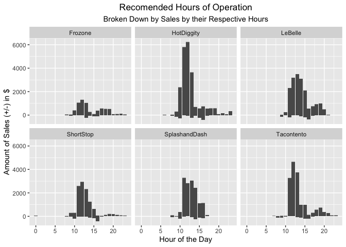

```r
library(knitr)
library(tidyverse)
```

```
## ── Attaching packages ─────────────────────────────────────── tidyverse 1.3.2 ──
## ✔ ggplot2 3.3.6      ✔ purrr   0.3.4 
## ✔ tibble  3.1.8      ✔ dplyr   1.0.10
## ✔ tidyr   1.2.0      ✔ stringr 1.4.0 
## ✔ readr   2.1.2      ✔ forcats 0.5.2
```

```
## Warning: package 'tidyr' was built under R version 4.0.5
```

```
## Warning: package 'readr' was built under R version 4.0.5
```

```
## ── Conflicts ────────────────────────────────────────── tidyverse_conflicts() ──
## ✖ dplyr::filter() masks stats::filter()
## ✖ dplyr::lag()    masks stats::lag()
```

```r
library(downloader)
library(corrplot)
```

```
## corrplot 0.92 loaded
```

```r
library(stringi)
library(lubridate)
```

```
## 
## Attaching package: 'lubridate'
## 
## The following objects are masked from 'package:base':
## 
##     date, intersect, setdiff, union
```

```r
library(riem)
```

```
## Warning: package 'riem' was built under R version 4.0.5
```


```r
tempsales <- tempfile()

download("https://github.com/WJC-Data-Science/DTS350/raw/master/sales.csv", tempsales, mode = "wb")

sales <- read_csv(tempsales)
```

```
## Rows: 15656 Columns: 4
## ── Column specification ────────────────────────────────────────────────────────
## Delimiter: ","
## chr  (2): Name, Type
## dbl  (1): Amount
## dttm (1): Time
## 
## ℹ Use `spec()` to retrieve the full column specification for this data.
## ℹ Specify the column types or set `show_col_types = FALSE` to quiet this message.
```

```r
head(sales)
```

```
## # A tibble: 6 × 4
##   Name       Type           Time                Amount
##   <chr>      <chr>          <dttm>               <dbl>
## 1 Tacontento Food(prepared) 2016-05-16 19:01:00    3  
## 2 Tacontento Food(prepared) 2016-05-16 19:01:00    1.5
## 3 Tacontento Food(prepared) 2016-05-16 19:04:00    3  
## 4 Tacontento Food(prepared) 2016-05-16 19:04:00    3  
## 5 Tacontento Food(prepared) 2016-05-16 19:04:00    1.5
## 6 Tacontento Food(prepared) 2016-05-16 19:04:00    1
```

The data are for businesses in the mountain time zone. Make sure you read in times correctly.

```r
salestz <- with_tz(sales, tzone = "US/Mountain")

head(salestz)
```

```
## # A tibble: 6 × 4
##   Name       Type           Time                Amount
##   <chr>      <chr>          <dttm>               <dbl>
## 1 Tacontento Food(prepared) 2016-05-16 13:01:00    3  
## 2 Tacontento Food(prepared) 2016-05-16 13:01:00    1.5
## 3 Tacontento Food(prepared) 2016-05-16 13:04:00    3  
## 4 Tacontento Food(prepared) 2016-05-16 13:04:00    3  
## 5 Tacontento Food(prepared) 2016-05-16 13:04:00    1.5
## 6 Tacontento Food(prepared) 2016-05-16 13:04:00    1
```

```r
tail(salestz)
```

```
## # A tibble: 6 × 4
##   Name    Type               Time                Amount
##   <chr>   <chr>              <dttm>               <dbl>
## 1 Frozone Food(pre-packaged) 2016-07-09 17:58:00   5   
## 2 Frozone Food(pre-packaged) 2016-07-09 18:33:00   5   
## 3 Frozone Food(pre-packaged) 2016-07-09 18:37:00   5   
## 4 Frozone Food(pre-packaged) 2016-07-09 18:47:00   5   
## 5 Missing Missing            2016-06-17 15:12:00 150   
## 6 Missing Missing            2016-04-20 13:01:00  -3.07
```

This is point of sale (pos) data, so you will need to use library(lubridate) to create the correct time aggregations.

```r
timedata <- salestz %>%
  mutate(hourofday = hour(Time)) %>%
  mutate(dayofweek = wday(Time, label = TRUE, abbr = FALSE)) %>%
  mutate(weekofyear = week(Time)) %>%
  mutate(monthofyear = month(Time)) 

tail(timedata)
```

```
## # A tibble: 6 × 8
##   Name    Type        Time                Amount houro…¹ dayof…² weeko…³ month…⁴
##   <chr>   <chr>       <dttm>               <dbl>   <int> <ord>     <dbl>   <dbl>
## 1 Frozone Food(pre-p… 2016-07-09 17:58:00   5         17 Saturd…      28       7
## 2 Frozone Food(pre-p… 2016-07-09 18:33:00   5         18 Saturd…      28       7
## 3 Frozone Food(pre-p… 2016-07-09 18:37:00   5         18 Saturd…      28       7
## 4 Frozone Food(pre-p… 2016-07-09 18:47:00   5         18 Saturd…      28       7
## 5 Missing Missing     2016-06-17 15:12:00 150         15 Friday       25       6
## 6 Missing Missing     2016-04-20 13:01:00  -3.07      13 Wednes…      16       4
## # … with abbreviated variable names ¹​hourofday, ²​dayofweek, ³​weekofyear,
## #   ⁴​monthofyear
```


Help your boss understand which business is the best investment through visualizations.

Provide an understanding and recommendation for hours of operation.

```r
hourofoperation <- timedata %>%
  group_by(Name, hourofday) %>%
  select(Name, Amount, hourofday)

head(hourofoperation)
```

```
## # A tibble: 6 × 3
## # Groups:   Name, hourofday [1]
##   Name       Amount hourofday
##   <chr>       <dbl>     <int>
## 1 Tacontento    3          13
## 2 Tacontento    1.5        13
## 3 Tacontento    3          13
## 4 Tacontento    3          13
## 5 Tacontento    1.5        13
## 6 Tacontento    1          13
```

```r
ggplot(data = hourofoperation, mapping = aes(x = hourofday, y = Amount)) +
  geom_col() +
  labs(title = "Recommended Hours of Operation", subtitle = "Broken Down by Sales by their Respective Hours", x = "Hour of the Day", y = "Amount of Sales (+/-) in $") +
  theme(plot.title = element_text(hjust = .5)) +
  theme(plot.subtitle = element_text(hjust = .5))
```

<!-- -->

We can see here, that the optimal hours of operation would be from 9am-8pm. There are some hour-intervals included that go below the x-axis, but it is negated by the height on the y. They ultimately make money, but incur some sort of costs along the way. 

Customer traffic is greatest between the hours of 11am and 2pm. It is virtually none between the hours of 12am and 7 am, and sees more traffic between 8am and 11pm. 


Provide a final comparison of the six companies and a final recommendation.

```r
ex <- hourofoperation %>% filter(Name != "Missing")
tail(ex)
```

```
## # A tibble: 6 × 3
## # Groups:   Name, hourofday [3]
##   Name    Amount hourofday
##   <chr>    <dbl>     <int>
## 1 Frozone      3        16
## 2 Frozone      5        17
## 3 Frozone      5        17
## 4 Frozone      5        18
## 5 Frozone      5        18
## 6 Frozone      5        18
```

```r
ggplot(data = ex, mapping = aes(x = hourofday, y = Amount)) +
  geom_col() +
  facet_wrap(~Name) +
  labs(title = "Recomended Hours of Operation", subtitle = "Broken Down by Sales by their Respective Hours", x = "Hour of the Day", y = "Amount of Sales (+/-) in $") +
  theme(plot.title = element_text(hjust = .5)) +
  theme(plot.subtitle = element_text(hjust = .5))
```

<!-- -->

Here, we can see that HotDiggity overall has the most sales while Frozone has the least.
All follow the same trend with regards to hours of operation - they should operate between the hours of 9am-8pm. 
There is slight variation... LeBelle and Tacontento should stay open later, say until 10 or 11 pm, and SplashandDash should close earlier, say around 5pm. 
All companies have periods during the day where the fall below the x-axis, however, with the exception of ShortStop at 4pm, they are all negated by larger profits than costs. 


