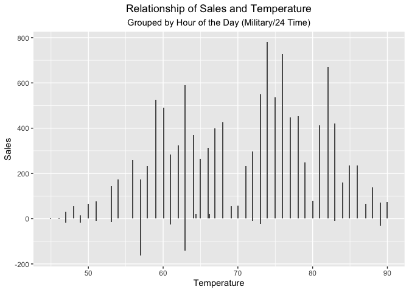

```r
library(knitr)
library(tidyverse)
```

```
## ── Attaching packages ─────────────────────────────────────── tidyverse 1.3.2 ──
## ✔ ggplot2 3.3.6      ✔ purrr   0.3.4 
## ✔ tibble  3.1.8      ✔ dplyr   1.0.10
## ✔ tidyr   1.2.0      ✔ stringr 1.4.0 
## ✔ readr   2.1.2      ✔ forcats 0.5.2
```

```
## Warning: package 'tidyr' was built under R version 4.0.5
```

```
## Warning: package 'readr' was built under R version 4.0.5
```

```
## ── Conflicts ────────────────────────────────────────── tidyverse_conflicts() ──
## ✖ dplyr::filter() masks stats::filter()
## ✖ dplyr::lag()    masks stats::lag()
```

```r
library(downloader)
library(corrplot)
```

```
## corrplot 0.92 loaded
```

```r
library(stringi)
library(lubridate)
```

```
## 
## Attaching package: 'lubridate'
## 
## The following objects are masked from 'package:base':
## 
##     date, intersect, setdiff, union
```

```r
library(riem)
```

```
## Warning: package 'riem' was built under R version 4.0.5
```


```r
tempcarwash <- tempfile()

download("https://github.com/WJC-Data-Science/DTS350/raw/master/carwash.csv", tempcarwash, mode = "wb")

carwash <- read_csv(tempcarwash)
```

```
## Rows: 533 Columns: 4
## ── Column specification ────────────────────────────────────────────────────────
## Delimiter: ","
## chr  (2): name, type
## dbl  (1): amount
## dttm (1): time
## 
## ℹ Use `spec()` to retrieve the full column specification for this data.
## ℹ Specify the column types or set `show_col_types = FALSE` to quiet this message.
```

```r
head(carwash)
```

```
## # A tibble: 6 × 4
##   name          type     time                amount
##   <chr>         <chr>    <dttm>               <dbl>
## 1 SplashandDash Services 2016-05-13 20:27:00    1  
## 2 SplashandDash Services 2016-05-13 20:27:00    0  
## 3 SplashandDash Services 2016-05-16 19:31:00   23.6
## 4 SplashandDash Services 2016-05-16 17:09:00   18.9
## 5 SplashandDash Services 2016-05-16 17:47:00   23.6
## 6 SplashandDash Services 2016-05-16 17:50:00   23.6
```

```r
str(carwash)
```

```
## spec_tbl_df [533 × 4] (S3: spec_tbl_df/tbl_df/tbl/data.frame)
##  $ name  : chr [1:533] "SplashandDash" "SplashandDash" "SplashandDash" "SplashandDash" ...
##  $ type  : chr [1:533] "Services" "Services" "Services" "Services" ...
##  $ time  : POSIXct[1:533], format: "2016-05-13 20:27:00" "2016-05-13 20:27:00" ...
##  $ amount: num [1:533] 1 0 23.6 18.9 23.6 ...
##  - attr(*, "spec")=
##   .. cols(
##   ..   name = col_character(),
##   ..   type = col_character(),
##   ..   time = col_datetime(format = ""),
##   ..   amount = col_double()
##   .. )
##  - attr(*, "problems")=<externalptr>
```

Convert the times from UTC time to mountain time 

```r
carwash_tz <- with_tz(carwash, tzone = "US/Mountain")

head(carwash_tz)
```

```
## # A tibble: 6 × 4
##   name          type     time                amount
##   <chr>         <chr>    <dttm>               <dbl>
## 1 SplashandDash Services 2016-05-13 14:27:00    1  
## 2 SplashandDash Services 2016-05-13 14:27:00    0  
## 3 SplashandDash Services 2016-05-16 13:31:00   23.6
## 4 SplashandDash Services 2016-05-16 11:09:00   18.9
## 5 SplashandDash Services 2016-05-16 11:47:00   23.6
## 6 SplashandDash Services 2016-05-16 11:50:00   23.6
```

Create a new hourly grouping variable using ceiling_date()

```r
newcarwash <- carwash_tz %>%
  mutate(hour = ceiling_date(time, "hour"))

head(newcarwash)
```

```
## # A tibble: 6 × 5
##   name          type     time                amount hour               
##   <chr>         <chr>    <dttm>               <dbl> <dttm>             
## 1 SplashandDash Services 2016-05-13 14:27:00    1   2016-05-13 15:00:00
## 2 SplashandDash Services 2016-05-13 14:27:00    0   2016-05-13 15:00:00
## 3 SplashandDash Services 2016-05-16 13:31:00   23.6 2016-05-16 14:00:00
## 4 SplashandDash Services 2016-05-16 11:09:00   18.9 2016-05-16 12:00:00
## 5 SplashandDash Services 2016-05-16 11:47:00   23.6 2016-05-16 12:00:00
## 6 SplashandDash Services 2016-05-16 11:50:00   23.6 2016-05-16 12:00:00
```

Aggregate the point of sale data into hour sales totals.

```r
head(carwash_tz)
```

```
## # A tibble: 6 × 4
##   name          type     time                amount
##   <chr>         <chr>    <dttm>               <dbl>
## 1 SplashandDash Services 2016-05-13 14:27:00    1  
## 2 SplashandDash Services 2016-05-13 14:27:00    0  
## 3 SplashandDash Services 2016-05-16 13:31:00   23.6
## 4 SplashandDash Services 2016-05-16 11:09:00   18.9
## 5 SplashandDash Services 2016-05-16 11:47:00   23.6
## 6 SplashandDash Services 2016-05-16 11:50:00   23.6
```

```r
sales_hour <- newcarwash %>%
  group_by(hour) %>%
  summarise(across(amount, sum))

head(sales_hour)
```

```
## # A tibble: 6 × 2
##   hour                amount
##   <dttm>               <dbl>
## 1 2016-05-13 15:00:00    1  
## 2 2016-05-16 09:00:00   -1  
## 3 2016-05-16 12:00:00   66.0
## 4 2016-05-16 14:00:00   23.6
## 5 2016-05-16 16:00:00  127. 
## 6 2016-05-17 10:00:00    5
```


Use riem_measures(station = "RXE",  date_start  = ,  date_end  =  ) for station RXE from library(riem) to get the matching temperatures.

```r
#head(pos_carwash)
#tail(pos_carwash)

weather_match <- riem_measures(station = "RXE",  date_start ="2016-05-13" ,  date_end  ="2016-07-08") %>%
  with_tz(tzone = "US/Mountain") %>%
  drop_na(tmpf) %>%
  mutate(hour = ceiling_date(valid, "hour"))


head(weather_match)
```

```
## # A tibble: 6 × 33
##   station valid                 lon   lat  tmpf  dwpf  relh  drct  sknt  p01i
##   <chr>   <dttm>              <dbl> <dbl> <dbl> <dbl> <dbl> <dbl> <dbl> <dbl>
## 1 RXE     2016-05-12 18:53:00 -112.  43.8  68    30.0  24.1   210    10     0
## 2 RXE     2016-05-12 19:53:00 -112.  43.8  66.0  32    28.0   210    12     0
## 3 RXE     2016-05-12 20:53:00 -112.  43.8  63.0  34.0  33.8   210    10     0
## 4 RXE     2016-05-12 21:53:00 -112.  43.8  59    35.1  40.5   170     7     0
## 5 RXE     2016-05-12 22:53:00 -112.  43.8  57.9  32    37.3   190     8     0
## 6 RXE     2016-05-12 23:53:00 -112.  43.8  55.0  32    41.4   200     9     0
## # … with 23 more variables: alti <dbl>, mslp <dbl>, vsby <dbl>, gust <dbl>,
## #   skyc1 <chr>, skyc2 <chr>, skyc3 <chr>, skyc4 <lgl>, skyl1 <dbl>,
## #   skyl2 <dbl>, skyl3 <dbl>, skyl4 <lgl>, wxcodes <chr>,
## #   ice_accretion_1hr <lgl>, ice_accretion_3hr <lgl>, ice_accretion_6hr <lgl>,
## #   peak_wind_gust <dbl>, peak_wind_drct <dbl>, peak_wind_time <chr>,
## #   feel <dbl>, metar <chr>, snowdepth <lgl>, hour <dttm>
```


Create a new hourly variable that matches your car wash hourly variable.

```r
hour_var_match <- weather_match %>%
  with_tz(tzone = "US/Mountain") %>%
  filter(tmpf != "") %>%
  select(hour, tmpf)


head(hour_var_match)
```

```
## # A tibble: 6 × 2
##   hour                 tmpf
##   <dttm>              <dbl>
## 1 2016-05-12 19:00:00  68  
## 2 2016-05-12 20:00:00  66.0
## 3 2016-05-12 21:00:00  63.0
## 4 2016-05-12 22:00:00  59  
## 5 2016-05-12 23:00:00  57.9
## 6 2016-05-13 00:00:00  55.0
```

Merge the two datasets together

```r
combined <- merge(hour_var_match, sales_hour, by = "hour") %>%
  arrange(hour) %>%
  mutate(newhour = hour(hour)) %>%
  group_by(newhour)


head(combined)
```

```
## # A tibble: 6 × 4
## # Groups:   newhour [5]
##   hour                 tmpf amount newhour
##   <dttm>              <dbl>  <dbl>   <int>
## 1 2016-05-13 15:00:00  73.9    1        15
## 2 2016-05-16 09:00:00  46.0   -1         9
## 3 2016-05-16 09:00:00  45.0   -1         9
## 4 2016-05-16 12:00:00  50     66.0      12
## 5 2016-05-16 14:00:00  54.0   23.6      14
## 6 2016-05-16 16:00:00  57.0  127.       16
```

Graph that looks at sales by day/hour

```r
hoursales <- ggplot(data = combined, mapping = aes(x = tmpf, y = amount)) +
  geom_col() +
  labs(title = "Relationship of Sales and Temperature", subtitle = "Grouped by Hour of the Day (Military/24 Time)", x = "Temperature", y = "Sales") +
  theme(plot.title = element_text(hjust = .5)) +
  theme(plot.subtitle = element_text(hjust = .5))
  
hoursales
```

<!-- -->

We can see, that when temperatures at the extremes (hottest vs coldest) that there are less sales, less people using the carwash than when the temprature is moderate. Temps between 70 and 80 yield the highest sales, and those below 55 yield the lowest. 


